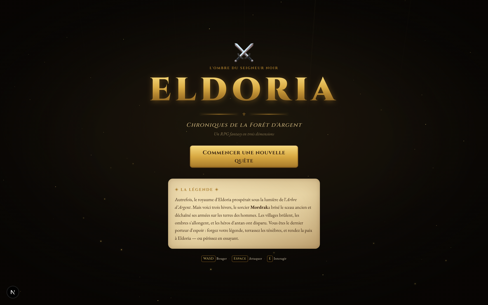
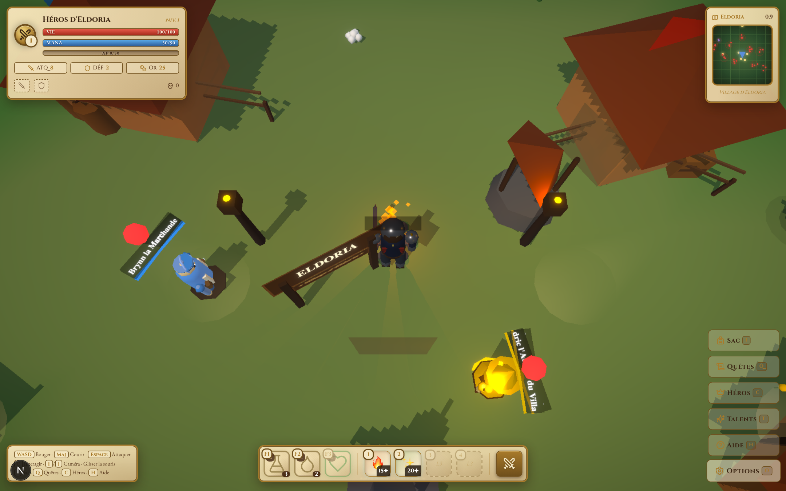
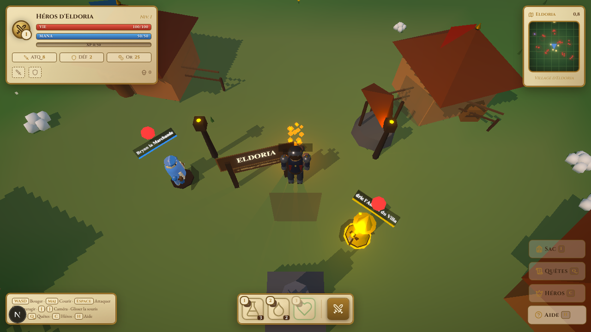

<!-- TOP-LEVEL HERO BANNER : bannière cinématique dawn -->
<p align="center">
  <a href="public/banner/eldoria-banner.svg">
    <picture>
      
    </picture>
  </a>
</p>

<!-- Animated typing / sub-title SVG -->
<p align="center">
  <svg viewBox="0 0 720 80" xmlns="http://www.w3.org/2000/svg" width="720" style="max-width:100%;height:auto;">
    <defs>
      <linearGradient id="tGold" x1="0" y1="0" x2="0" y2="1">
        <stop offset="0%" stop-color="#fff4c2"/>
        <stop offset="50%" stop-color="#f6d97c"/>
        <stop offset="100%" stop-color="#a07c3a"/>
      </linearGradient>
    </defs>
    <text x="360" y="38" text-anchor="middle"
          font-family="Georgia, 'Times New Roman', serif" font-style="italic" font-size="22" fill="url(#tGold)">
      &gt; Explorez le monde d'Eldoria...
      <animate attributeName="opacity" values="0;1;1;0;1" keyTimes="0;0.4;0.7;0.85;1" dur="4s" repeatCount="indefinite"/>
    </text>
    <text x="360" y="62" text-anchor="middle"
          font-family="Georgia, serif" font-size="12" fill="#a07c3a" letter-spacing="3">
      ◆ AFFRONTEZ LES OMBRES ◆ PURIFIEZ LE SANCTUAIRE ◆
    </text>
  </svg>
</p>

<!-- Tech stack badges row with subtle pulse -->
<p align="center">
  <svg width="0" height="0" style="position:absolute">
    <defs>
      <filter id="badgePulse" x="-20%" y="-20%" width="140%" height="140%">
        <feGaussianBlur stdDeviation="0.6"/>
      </filter>
    </defs>
  </svg>
  
  
  
  
  
  <br/>
  
  
  
  
  
</p>

<br/>

<!-- =====================  LORE  ===================== -->
<div align="center">
  <svg viewBox="0 0 1000 220" xmlns="http://www.w3.org/2000/svg" width="100%" style="max-width:1000px">
    <defs>
      <linearGradient id="paraLore" x1="0" y1="0" x2="0" y2="1">
        <stop offset="0%" stop-color="#f8e9c5"/>
        <stop offset="50%" stop-color="#ead7a8"/>
        <stop offset="100%" stop-color="#d8be83"/>
      </linearGradient>
      <linearGradient id="inkLore" x1="0" y1="0" x2="0" y2="1">
        <stop offset="0%" stop-color="#fff4c2"/>
        <stop offset="100%" stop-color="#a07c3a"/>
      </linearGradient>
    </defs>
    <!-- Parchment background -->
    <path d="M30,20 L970,20 Q980,20 980,30 L980,190 Q980,200 970,200 L30,200 Q20,200 20,190 L20,30 Q20,20 30,20 Z"
          fill="url(#paraLore)" stroke="#a07c3a" stroke-width="2"/>
    <path d="M40,30 L960,30 Q965,30 965,35 L965,185 Q965,190 960,190 L40,190 Q35,190 35,185 L35,35 Q35,30 40,30 Z"
          fill="none" stroke="#a07c3a" stroke-width="0.6" opacity="0.6"/>
    <!-- Corners ornaments -->
    <text x="46" y="50" font-size="22" fill="#a07c3a" font-family="Georgia, serif">❦</text>
    <text x="954" y="50" font-size="22" fill="#a07c3a" font-family="Georgia, serif" text-anchor="end">❧</text>
    <text x="46" y="190" font-size="22" fill="#a07c3a" font-family="Georgia, serif">❧</text>
    <text x="954" y="190" font-size="22" fill="#a07c3a" font-family="Georgia, serif" text-anchor="end">❦</text>
    <!-- Eyebrow -->
    <text x="500" y="68" text-anchor="middle" font-family="Georgia, serif" font-size="13"
          fill="#a13a2a" letter-spacing="6" font-weight="bold">◈ LA LÉGENDE ◈</text>
    <!-- Animated gold line -->
    <line x1="200" y1="78" x2="800" y2="78" stroke="url(#inkLore)" stroke-width="1.4" opacity="0.85"/>
    <circle cx="200" cy="78" r="3" fill="#f6d97c"/>
    <circle cx="800" cy="78" r="3" fill="#f6d97c"/>
    <!-- Lore text -->
    <g font-family="Georgia, 'Times New Roman', serif" fill="#3a2412" text-anchor="middle">
      <text x="500" y="108" font-size="16" font-style="italic">
        Autrefois, le royaume d'Eldoria prospérait sous la lumière de l'<tspan font-weight="bold">Arbre d'Argent</tspan>.
      </text>
      <text x="500" y="132" font-size="16" font-style="italic">
        Mais voici trois hivers, le sorcier <tspan font-weight="bold" fill="#a13a2a">Mordrak</tspan> a brisé le sceau ancien
        et déchaîné ses armées sur les terres des hommes.
      </text>
      <text x="500" y="156" font-size="16" font-style="italic">
        Les héros d'antan ont disparu — <tspan font-weight="bold" fill="#a13a2a">vous êtes le dernier porteur d'espoir</tspan>.
      </text>
      <text x="500" y="180" font-size="15" fill="#5a3a1f">
        Forgez votre légende. Terrassez les ténèbres. Rendez la paix à Eldoria.
      </text>
    </g>
    <!-- Glow dancing circles -->
    <circle cx="500" cy="40" r="3" fill="#f6d97c">
      <animate attributeName="opacity" values="0.2;1;0.2" dur="3.2s" repeatCount="indefinite"/>
    </circle>
    <circle cx="60" cy="110" r="2" fill="#a07c3a">
      <animate attributeName="opacity" values="0.2;0.8;0.2" dur="2.6s" begin="0.6s" repeatCount="indefinite"/>
    </circle>
    <circle cx="940" cy="110" r="2" fill="#a07c3a">
      <animate attributeName="opacity" values="0.2;0.8;0.2" dur="2.6s" begin="1.2s" repeatCount="indefinite"/>
    </circle>
  </svg>
</div>

<br/>

---

## ⚔️ Galerie en action

<!-- Animated cinebar — cinematic intro -->
<p align="center">
  <svg viewBox="0 0 920 100" xmlns="http://www.w3.org/2000/svg" width="100%" style="max-width:920px">
    <defs>
      <linearGradient id="cineGold" x1="0" y1="0" x2="0" y2="1">
        <stop offset="0%" stop-color="#fff4c2"/>
        <stop offset="50%" stop-color="#f6d97c"/>
        <stop offset="100%" stop-color="#a07c3a"/>
      </linearGradient>
      <linearGradient id="cineDark" x1="0" y1="0" x2="0" y2="1">
        <stop offset="0%" stop-color="#1a0e2e"/>
        <stop offset="100%" stop-color="#3a2412"/>
      </linearGradient>
    </defs>
    <!-- Cartouche background with subtle glow -->
    <rect x="80" y="20" width="760" height="68" fill="url(#cineDark)" stroke="url(#cineGold)" stroke-width="2" rx="8"/>
    <rect x="86" y="26" width="748" height="56" fill="none" stroke="#f6d97c" stroke-width="0.5" rx="6" opacity="0.5"/>
    <!-- Decorative side ornaments -->
    <text x="100" y="62" fill="#f6d97c" font-family="Georgia, serif" font-size="22" opacity="0.9">❦</text>
    <text x="820" y="62" fill="#f6d97c" font-family="Georgia, serif" font-size="22" opacity="0.9" text-anchor="end">❧</text>
    <!-- Eyebrow -->
    <text x="460" y="40" text-anchor="middle" fill="#f6d97c" font-family="Georgia, serif" font-size="11" letter-spacing="6" font-weight="bold">◈ UNE PLONGÉE EN IMAGES ◈</text>
    <!-- Subtitle with cinematic fade-in -->
    <text x="460" y="66" text-anchor="middle" fill="#fff4c2" font-family="Georgia, serif" font-size="17" font-style="italic">
      Quatre instants saisis dans le royaume d'Eldoria…
      <animate attributeName="opacity" values="0;1" dur="1.6s" fill="freeze"/>
    </text>
    <!-- Twinkling corner sparkles -->
    <circle cx="100" cy="34" r="3" fill="#f6d97c"><animate attributeName="opacity" values="0.3;1;0.3" dur="2.4s" repeatCount="indefinite"/></circle>
    <circle cx="820" cy="34" r="3" fill="#f6d97c"><animate attributeName="opacity" values="0.3;1;0.3" dur="2.4s" begin="0.6s" repeatCount="indefinite"/></circle>
    <circle cx="100" cy="86" r="3" fill="#f6d97c"><animate attributeName="opacity" values="0.3;1;0.3" dur="2.4s" begin="1.2s" repeatCount="indefinite"/></circle>
    <circle cx="820" cy="86" r="3" fill="#f6d97c"><animate attributeName="opacity" values="0.3;1;0.3" dur="2.4s" begin="1.8s" repeatCount="indefinite"/></circle>
  </svg>
</p>

<br/>

<!-- 2×2 grid of "tableaux" — framed parchment cards -->
<table align="center" cellpadding="0" cellspacing="0">
<tr>
<td width="50%" align="center" valign="top">

<a href="public/screenshots/01-main-menu.png">
  
</a>

<!-- Animated title cartouche (gaM) -->
<svg viewBox="0 0 600 54" xmlns="http://www.w3.org/2000/svg" width="100%" style="max-width:600px">
  <defs>
    <linearGradient id="gaMBg" x1="0" y1="0" x2="0" y2="1">
      <stop offset="0%" stop-color="#1a0e2e"/>
      <stop offset="100%" stop-color="#3a2412"/>
    </linearGradient>
    <linearGradient id="gaMGold" x1="0" y1="0" x2="0" y2="1">
      <stop offset="0%" stop-color="#fff4c2"/>
      <stop offset="50%" stop-color="#f6d97c"/>
      <stop offset="100%" stop-color="#a07c3a"/>
    </linearGradient>
  </defs>
  <rect x="2" y="2" width="596" height="50" fill="url(#gaMBg)" stroke="url(#gaMGold)" stroke-width="2" rx="4">
    <animate attributeName="stroke-opacity" values="0.55;1;0.55" dur="3.6s" repeatCount="indefinite"/>
  </rect>
  <rect x="8" y="8" width="584" height="38" fill="none" stroke="#f6d97c" stroke-width="0.4" rx="2" opacity="0.45"/>
  <text x="14" y="20" fill="#a07c3a" font-family="Georgia, serif" font-size="11">❦</text>
  <text x="586" y="20" text-anchor="end" fill="#a07c3a" font-family="Georgia, serif" font-size="11">❧</text>
  <text x="300" y="34" text-anchor="middle" fill="#f6d97c" font-family="Georgia, serif" font-size="13" font-weight="bold" letter-spacing="4">❦ ⚔ MENU PRINCIPAL ❦</text>
  <circle cx="14" cy="46" r="2" fill="#f6d97c"><animate attributeName="opacity" values="0.3;1;0.3" dur="2.4s" begin="0s" repeatCount="indefinite"/></circle>
  <circle cx="586" cy="46" r="2" fill="#f6d97c"><animate attributeName="opacity" values="0.3;1;0.3" dur="2.4s" begin="0.6s" repeatCount="indefinite"/></circle>
  <circle cx="14" cy="10" r="2" fill="#f6d97c"><animate attributeName="opacity" values="0.3;1;0.3" dur="2.4s" begin="1.2s" repeatCount="indefinite"/></circle>
  <circle cx="586" cy="10" r="2" fill="#f6d97c"><animate attributeName="opacity" values="0.3;1;0.3" dur="2.4s" begin="1.8s" repeatCount="indefinite"/></circle>
</svg>

<p align="center" style="max-width:600px"><em>🏰 Le portail de l'aventure — fond cinématique, ambres flottants, rayons divins.</em></p>
<p align="center" style="max-width:600px"><em>🏰 Le portail de l'aventure — fond cinématique, ambres flottants, rayons divins.</em></p>

</td>
<td width="50%" align="center" valign="top">

<a href="public/screenshots/03-game-world.png">
  
</a>

<!-- Animated title cartouche (gaW) -->
<svg viewBox="0 0 600 54" xmlns="http://www.w3.org/2000/svg" width="100%" style="max-width:600px">
  <defs>
    <linearGradient id="gaWBg" x1="0" y1="0" x2="0" y2="1">
      <stop offset="0%" stop-color="#1a0e2e"/>
      <stop offset="100%" stop-color="#3a2412"/>
    </linearGradient>
    <linearGradient id="gaWGold" x1="0" y1="0" x2="0" y2="1">
      <stop offset="0%" stop-color="#fff4c2"/>
      <stop offset="50%" stop-color="#f6d97c"/>
      <stop offset="100%" stop-color="#a07c3a"/>
    </linearGradient>
  </defs>
  <rect x="2" y="2" width="596" height="50" fill="url(#gaWBg)" stroke="url(#gaWGold)" stroke-width="2" rx="4">
    <animate attributeName="stroke-opacity" values="0.55;1;0.55" dur="3.6s" repeatCount="indefinite"/>
  </rect>
  <rect x="8" y="8" width="584" height="38" fill="none" stroke="#f6d97c" stroke-width="0.4" rx="2" opacity="0.45"/>
  <text x="14" y="20" fill="#a07c3a" font-family="Georgia, serif" font-size="11">❦</text>
  <text x="586" y="20" text-anchor="end" fill="#a07c3a" font-family="Georgia, serif" font-size="11">❧</text>
  <text x="300" y="34" text-anchor="middle" fill="#f6d97c" font-family="Georgia, serif" font-size="13" font-weight="bold" letter-spacing="4">❦ 🌲 LE MONDE ❦</text>
  <circle cx="14" cy="46" r="2" fill="#f6d97c"><animate attributeName="opacity" values="0.3;1;0.3" dur="2.4s" begin="0s" repeatCount="indefinite"/></circle>
  <circle cx="586" cy="46" r="2" fill="#f6d97c"><animate attributeName="opacity" values="0.3;1;0.3" dur="2.4s" begin="0.6s" repeatCount="indefinite"/></circle>
  <circle cx="14" cy="10" r="2" fill="#f6d97c"><animate attributeName="opacity" values="0.3;1;0.3" dur="2.4s" begin="1.2s" repeatCount="indefinite"/></circle>
  <circle cx="586" cy="10" r="2" fill="#f6d97c"><animate attributeName="opacity" values="0.3;1;0.3" dur="2.4s" begin="1.8s" repeatCount="indefinite"/></circle>
</svg>

<p align="center" style="max-width:600px"><em>🌲 Terrain procédural 200×200, cycle jour/nuit, brouillard atmosphérique.</em></p>
<p align="center" style="max-width:600px"><em>🌲 Terrain procédural 200×200, cycle jour/nuit, brouillard atmosphérique.</em></p>

</td>
</tr>
<tr><td colspan="2" height="20"></td></tr>
<tr>
<td width="50%" align="center" valign="top">

<a href="public/screenshots/04-gameplay-hud.png">
  
</a>

<!-- Animated title cartouche (gaC) -->
<svg viewBox="0 0 600 54" xmlns="http://www.w3.org/2000/svg" width="100%" style="max-width:600px">
  <defs>
    <linearGradient id="gaCBg" x1="0" y1="0" x2="0" y2="1">
      <stop offset="0%" stop-color="#1a0e2e"/>
      <stop offset="100%" stop-color="#3a2412"/>
    </linearGradient>
    <linearGradient id="gaCGold" x1="0" y1="0" x2="0" y2="1">
      <stop offset="0%" stop-color="#fff4c2"/>
      <stop offset="50%" stop-color="#f6d97c"/>
      <stop offset="100%" stop-color="#a07c3a"/>
    </linearGradient>
  </defs>
  <rect x="2" y="2" width="596" height="50" fill="url(#gaCBg)" stroke="url(#gaCGold)" stroke-width="2" rx="4">
    <animate attributeName="stroke-opacity" values="0.55;1;0.55" dur="3.6s" repeatCount="indefinite"/>
  </rect>
  <rect x="8" y="8" width="584" height="38" fill="none" stroke="#f6d97c" stroke-width="0.4" rx="2" opacity="0.45"/>
  <text x="14" y="20" fill="#a07c3a" font-family="Georgia, serif" font-size="11">❦</text>
  <text x="586" y="20" text-anchor="end" fill="#a07c3a" font-family="Georgia, serif" font-size="11">❧</text>
  <text x="300" y="34" text-anchor="middle" fill="#f6d97c" font-family="Georgia, serif" font-size="13" font-weight="bold" letter-spacing="4">❦ ⚔ COMBAT &amp; HUD ❦</text>
  <circle cx="14" cy="46" r="2" fill="#f6d97c"><animate attributeName="opacity" values="0.3;1;0.3" dur="2.4s" begin="0s" repeatCount="indefinite"/></circle>
  <circle cx="586" cy="46" r="2" fill="#f6d97c"><animate attributeName="opacity" values="0.3;1;0.3" dur="2.4s" begin="0.6s" repeatCount="indefinite"/></circle>
  <circle cx="14" cy="10" r="2" fill="#f6d97c"><animate attributeName="opacity" values="0.3;1;0.3" dur="2.4s" begin="1.2s" repeatCount="indefinite"/></circle>
  <circle cx="586" cy="10" r="2" fill="#f6d97c"><animate attributeName="opacity" values="0.3;1;0.3" dur="2.4s" begin="1.8s" repeatCount="indefinite"/></circle>
</svg>

<p align="center" style="max-width:600px"><em>⚔️ HUD parchemin, barres de vie/mana/XP, minimap, barre rapide.</em></p>
<p align="center" style="max-width:600px"><em>⚔️ HUD parchemin, barres de vie/mana/XP, minimap, barre rapide.</em></p>

</td>
<td width="50%" align="center" valign="top">

<a href="public/screenshots/02-intro-sequence.png">
  
</a>

<!-- Animated title cartouche (gaT) -->
<svg viewBox="0 0 600 54" xmlns="http://www.w3.org/2000/svg" width="100%" style="max-width:600px">
  <defs>
    <linearGradient id="gaTBg" x1="0" y1="0" x2="0" y2="1">
      <stop offset="0%" stop-color="#1a0e2e"/>
      <stop offset="100%" stop-color="#3a2412"/>
    </linearGradient>
    <linearGradient id="gaTGold" x1="0" y1="0" x2="0" y2="1">
      <stop offset="0%" stop-color="#fff4c2"/>
      <stop offset="50%" stop-color="#f6d97c"/>
      <stop offset="100%" stop-color="#a07c3a"/>
    </linearGradient>
  </defs>
  <rect x="2" y="2" width="596" height="50" fill="url(#gaTBg)" stroke="url(#gaTGold)" stroke-width="2" rx="4">
    <animate attributeName="stroke-opacity" values="0.55;1;0.55" dur="3.6s" repeatCount="indefinite"/>
  </rect>
  <rect x="8" y="8" width="584" height="38" fill="none" stroke="#f6d97c" stroke-width="0.4" rx="2" opacity="0.45"/>
  <text x="14" y="20" fill="#a07c3a" font-family="Georgia, serif" font-size="11">❦</text>
  <text x="586" y="20" text-anchor="end" fill="#a07c3a" font-family="Georgia, serif" font-size="11">❧</text>
  <text x="300" y="34" text-anchor="middle" fill="#f6d97c" font-family="Georgia, serif" font-size="13" font-weight="bold" letter-spacing="4">❦ 🎬 CINÉMATIQUE ❦</text>
  <circle cx="14" cy="46" r="2" fill="#f6d97c"><animate attributeName="opacity" values="0.3;1;0.3" dur="2.4s" begin="0s" repeatCount="indefinite"/></circle>
  <circle cx="586" cy="46" r="2" fill="#f6d97c"><animate attributeName="opacity" values="0.3;1;0.3" dur="2.4s" begin="0.6s" repeatCount="indefinite"/></circle>
  <circle cx="14" cy="10" r="2" fill="#f6d97c"><animate attributeName="opacity" values="0.3;1;0.3" dur="2.4s" begin="1.2s" repeatCount="indefinite"/></circle>
  <circle cx="586" cy="10" r="2" fill="#f6d97c"><animate attributeName="opacity" values="0.3;1;0.3" dur="2.4s" begin="1.8s" repeatCount="indefinite"/></circle>
</svg>

<p align="center" style="max-width:600px"><em>🎬 L'histoire de Mordrak et des ténèbres contée en travelling 3D.</em></p>
<p align="center" style="max-width:600px"><em>🎬 L'histoire de Mordrak et des ténèbres contée en travelling 3D.</em></p>

</td>
</tr>
</table>

---

## 🗡️ Ce qu'Eldoria a sous le capot

<!-- Animated cinebar — grand opening -->
<p align="center">
  <svg viewBox="0 0 940 110" xmlns="http://www.w3.org/2000/svg" width="100%" style="max-width:940px">
    <defs>
      <linearGradient id="capGold" x1="0" y1="0" x2="0" y2="1">
        <stop offset="0%" stop-color="#fff4c2"/><stop offset="50%" stop-color="#f6d97c"/><stop offset="100%" stop-color="#a07c3a"/>
      </linearGradient>
      <linearGradient id="capDark" x1="0" y1="0" x2="0" y2="1">
        <stop offset="0%" stop-color="#1a0e2e"/><stop offset="100%" stop-color="#3a2412"/>
      </linearGradient>
    </defs>
    <rect x="80" y="20" width="780" height="78" fill="url(#capDark)" stroke="url(#capGold)" stroke-width="2" rx="8"/>
    <rect x="86" y="26" width="768" height="66" fill="none" stroke="#f6d97c" stroke-width="0.5" rx="6" opacity="0.5"/>
    <text x="100" y="68" fill="#f6d97c" font-family="Georgia, serif" font-size="24" opacity="0.9">❦</text>
    <text x="840" y="68" fill="#f6d97c" font-family="Georgia, serif" font-size="24" opacity="0.9" text-anchor="end">❧</text>
    <text x="470" y="44" text-anchor="middle" fill="#f6d97c" font-family="Georgia, serif" font-size="11" letter-spacing="6" font-weight="bold">◈ LE GRAND GRIMOIRE D'ELDORIA ◈</text>
    <text x="470" y="76" text-anchor="middle" fill="#fff4c2" font-family="Georgia, serif" font-size="18" font-style="italic">
      Sous le capot — un royaume tissé de chiffres, de sorts et de cendres…
      <animate attributeName="opacity" values="0;1" dur="1.6s" fill="freeze"/>
    </text>
    <circle cx="100" cy="36" r="3" fill="#f6d97c"><animate attributeName="opacity" values="0.3;1;0.3" dur="2.4s" repeatCount="indefinite"/></circle>
    <circle cx="840" cy="36" r="3" fill="#f6d97c"><animate attributeName="opacity" values="0.3;1;0.3" dur="2.4s" begin="0.6s" repeatCount="indefinite"/></circle>
    <circle cx="100" cy="106" r="3" fill="#f6d97c"><animate attributeName="opacity" values="0.3;1;0.3" dur="2.4s" begin="1.2s" repeatCount="indefinite"/></circle>
    <circle cx="840" cy="106" r="3" fill="#f6d97c"><animate attributeName="opacity" values="0.3;1;0.3" dur="2.4s" begin="1.8s" repeatCount="indefinite"/></circle>
  </svg>
</p>

<br/>

<!-- ============== THE GRAND SCEAU ============== : central rotating emblem with 6 radiating "rayons" -->
<p align="center">
  <a href="public/banner/sceau-capot.svg">
    <picture>
      
    </picture>
  </a>
</p>

<br/>

<!-- ============ LES CARRÉS DU SAVOIR ============ : 6 thematic knowledge tiles ============ -->
<table align="center" cellpadding="0" cellspacing="0">
<tr>
<td width="33%" align="center" valign="top" style="padding:8px">

<svg viewBox="0 0 320 200" xmlns="http://www.w3.org/2000/svg" width="100%" style="max-width:320px">
  <defs>
    <linearGradient id="cs1Bg" x1="0" y1="0" x2="0" y2="1"><stop offset="0%" stop-color="#fff4c2"/><stop offset="100%" stop-color="#d8be83"/></linearGradient>
    <linearGradient id="cs1Dark" x1="0" y1="0" x2="0" y2="1"><stop offset="0%" stop-color="#1a0e2e"/><stop offset="100%" stop-color="#3a2412"/></linearGradient>
  </defs>
  <rect x="4" y="4" width="312" height="192" rx="10" fill="url(#cs1Bg)" stroke="#a07c3a" stroke-width="1.5">
    <animate attributeName="stroke-opacity" values="0.55;1;0.55" dur="3.6s" begin="0s" repeatCount="indefinite"/>
  </rect>
  <rect x="10" y="10" width="300" height="180" rx="8" fill="none" stroke="#a07c3a" stroke-width="0.5" opacity="0.4"/>
  <text x="160" y="34" text-anchor="middle" font-family="Georgia, serif" font-size="11" fill="#a13a2a" letter-spacing="5" font-weight="bold">I · LE MONDE</text>
  <line x1="80" y1="44" x2="240" y2="44" stroke="url(#capGold)" stroke-width="0.8" opacity="0.7"/>
  <text x="160" y="74" text-anchor="middle" font-family="Georgia, serif" font-size="26" font-weight="900" fill="#3a2412">200 × 200</text>
  <text x="160" y="96" text-anchor="middle" font-family="Georgia, serif" font-size="11" fill="#5a3a1f" font-style="italic">unités de monde ouvert</text>
  <g font-family="Georgia, serif" font-size="10" fill="#5a3a1f">
    <text x="160" y="124" text-anchor="middle">☀ cycle jour/nuit · 180 s</text>
    <text x="160" y="142" text-anchor="middle">🌫 brouillard exponentiel</text>
    <text x="160" y="160" text-anchor="middle">🏞 six biomes reliés au village</text>
  </g>
  <rect x="14" y="170" width="292" height="22" fill="url(#cs1Dark)" stroke="#f6d97c" stroke-width="1" rx="3">
    <animate attributeName="fill-opacity" values="0;1" dur="1.6s" begin="0.2s" fill="freeze"/>
  </rect>
  <text x="160" y="185" text-anchor="middle" font-family="Georgia, serif" font-size="10" font-weight="bold" fill="#f6d97c" letter-spacing="3">❦ UN SANCTUAIRE À EXPLORER ❦</text>
</svg>

</td>
<td width="33%" align="center" valign="top" style="padding:8px">

<svg viewBox="0 0 320 200" xmlns="http://www.w3.org/2000/svg" width="100%" style="max-width:320px">
  <defs>
    <linearGradient id="cs2Bg" x1="0" y1="0" x2="0" y2="1"><stop offset="0%" stop-color="#fff4c2"/><stop offset="100%" stop-color="#d8be83"/></linearGradient>
    <linearGradient id="cs2Dark" x1="0" y1="0" x2="0" y2="1"><stop offset="0%" stop-color="#1a0e2e"/><stop offset="100%" stop-color="#3a2412"/></linearGradient>
  </defs>
  <rect x="4" y="4" width="312" height="192" rx="10" fill="url(#cs2Bg)" stroke="#a07c3a" stroke-width="1.5">
    <animate attributeName="stroke-opacity" values="0.55;1;0.55" dur="3.6s" begin="0.3s" repeatCount="indefinite"/>
  </rect>
  <rect x="10" y="10" width="300" height="180" rx="8" fill="none" stroke="#a07c3a" stroke-width="0.5" opacity="0.4"/>
  <text x="160" y="34" text-anchor="middle" font-family="Georgia, serif" font-size="11" fill="#a13a2a" letter-spacing="5" font-weight="bold">II · L'ARSENAL</text>
  <line x1="80" y1="44" x2="240" y2="44" stroke="url(#capGold)" stroke-width="0.8" opacity="0.7"/>
  <!-- Mini sword silhouette -->
  <g transform="translate(160 76)">
    <line x1="0" y1="-32" x2="0" y2="20" stroke="#3a2412" stroke-width="3"/>
    <polygon points="-7,20 7,20 4,30 -4,30" fill="#a07c3a"/>
    <rect x="-16" y="-6" width="32" height="6" fill="#a07c3a"/>
    <circle cx="0" cy="-6" r="3" fill="#f6d97c"/>
  </g>
  <text x="160" y="124" text-anchor="middle" font-family="Georgia, serif" font-size="22" font-weight="900" fill="#3a2412">17 objets</text>
  <g font-family="Georgia, serif" font-size="10" fill="#5a3a1f">
    <text x="160" y="144" text-anchor="middle">⚔ 5 armes · 🛡 3 armures · 🧪 3 potions</text>
    <text x="160" y="160" text-anchor="middle">🦴 5 matériaux · 🗝 1 clé de quête</text>
  </g>
  <rect x="14" y="170" width="292" height="22" fill="url(#cs2Dark)" stroke="#f6d97c" stroke-width="1" rx="3">
    <animate attributeName="fill-opacity" values="0;1" dur="1.6s" begin="0.5s" fill="freeze"/>
  </rect>
  <text x="160" y="185" text-anchor="middle" font-family="Georgia, serif" font-size="10" font-weight="bold" fill="#f6d97c" letter-spacing="3">❦ DU COMMUN AU LÉGENDAIRE ❦</text>
</svg>

</td>
<td width="33%" align="center" valign="top" style="padding:8px">

<svg viewBox="0 0 320 200" xmlns="http://www.w3.org/2000/svg" width="100%" style="max-width:320px">
  <defs>
    <linearGradient id="cs3Bg" x1="0" y1="0" x2="0" y2="1"><stop offset="0%" stop-color="#fff4c2"/><stop offset="100%" stop-color="#d8be83"/></linearGradient>
    <linearGradient id="cs3Dark" x1="0" y1="0" x2="0" y2="1"><stop offset="0%" stop-color="#1a0e2e"/><stop offset="100%" stop-color="#3a2412"/></linearGradient>
    <radialGradient id="cs3Fire" cx="0.5" cy="0.5" r="0.5"><stop offset="0%" stop-color="#fff"/><stop offset="60%" stop-color="#ff8a96"/><stop offset="100%" stop-color="#7a1c0a" stop-opacity="0"/></radialGradient>
  </defs>
  <rect x="4" y="4" width="312" height="192" rx="10" fill="url(#cs3Bg)" stroke="#a07c3a" stroke-width="1.5">
    <animate attributeName="stroke-opacity" values="0.55;1;0.55" dur="3.6s" begin="0.6s" repeatCount="indefinite"/>
  </rect>
  <rect x="10" y="10" width="300" height="180" rx="8" fill="none" stroke="#a07c3a" stroke-width="0.5" opacity="0.4"/>
  <text x="160" y="34" text-anchor="middle" font-family="Georgia, serif" font-size="11" fill="#a13a2a" letter-spacing="5" font-weight="bold">III · LE COMBAT</text>
  <line x1="80" y1="44" x2="240" y2="44" stroke="url(#capGold)" stroke-width="0.8" opacity="0.7"/>
  <!-- Mini fireball glow -->
  <circle cx="160" cy="78" r="32" fill="url(#cs3Fire)" opacity="0.8">
    <animate attributeName="r" values="28;36;28" dur="2.4s" repeatCount="indefinite"/>
  </circle>
  <text x="160" y="84" text-anchor="middle" font-size="22">🔥</text>
  <g font-family="Georgia, serif" fill="#5a3a1f">
    <text x="160" y="124" text-anchor="middle" font-size="11">arc d'attaque · combo · i-frames</text>
    <text x="160" y="142" text-anchor="middle" font-size="11" font-style="italic">particules &amp; screen-shake sur impact</text>
    <text x="160" y="160" text-anchor="middle" font-size="11">5 sorts cycliques · mana &amp; cooldown</text>
  </g>
  <rect x="14" y="170" width="292" height="22" fill="url(#cs3Dark)" stroke="#f6d97c" stroke-width="1" rx="3">
    <animate attributeName="fill-opacity" values="0;1" dur="1.6s" begin="0.8s" fill="freeze"/>
  </rect>
  <text x="160" y="185" text-anchor="middle" font-family="Georgia, serif" font-size="10" font-weight="bold" fill="#f6d97c" letter-spacing="3">❦ MORT OU GLOIRE ❦</text>
</svg>

</td>
</tr>
<tr><td colspan="3" height="6"></td></tr>
<tr>
<td width="33%" align="center" valign="top" style="padding:8px">

<svg viewBox="0 0 320 200" xmlns="http://www.w3.org/2000/svg" width="100%" style="max-width:320px">
  <defs>
    <linearGradient id="cs4Bg" x1="0" y1="0" x2="0" y2="1"><stop offset="0%" stop-color="#fff4c2"/><stop offset="100%" stop-color="#d8be83"/></linearGradient>
    <linearGradient id="cs4Dark" x1="0" y1="0" x2="0" y2="1"><stop offset="0%" stop-color="#1a0e2e"/><stop offset="100%" stop-color="#3a2412"/></linearGradient>
    <radialGradient id="cs4Loot" cx="0.5" cy="0.5" r="0.5"><stop offset="0%" stop-color="#f6d97c"/><stop offset="100%" stop-color="#a07c3a" stop-opacity="0"/></radialGradient>
  </defs>
  <rect x="4" y="4" width="312" height="192" rx="10" fill="url(#cs4Bg)" stroke="#a07c3a" stroke-width="1.5">
    <animate attributeName="stroke-opacity" values="0.55;1;0.55" dur="3.6s" begin="0.9s" repeatCount="indefinite"/>
  </rect>
  <rect x="10" y="10" width="300" height="180" rx="8" fill="none" stroke="#a07c3a" stroke-width="0.5" opacity="0.4"/>
  <text x="160" y="34" text-anchor="middle" font-family="Georgia, serif" font-size="11" fill="#a13a2a" letter-spacing="5" font-weight="bold">IV · LE BUTIN</text>
  <line x1="80" y1="44" x2="240" y2="44" stroke="url(#capGold)" stroke-width="0.8" opacity="0.7"/>
  <!-- Mini chest icon -->
  <g transform="translate(160 80)">
    <rect x="-26" y="-2" width="52" height="32" fill="#7a4f2b" stroke="#3a2412" stroke-width="1.5"/>
    <path d="M-26,-2 Q0,-30 26,-2 L26,8 L-26,8 Z" fill="#a07c3a" stroke="#3a2412" stroke-width="1.5"/>
    <rect x="-6" y="6" width="12" height="12" fill="#f6d97c"/>
    <circle cx="0" cy="12" r="3" fill="#a13a2a"/>
    <circle cx="0" cy="-14" r="18" fill="url(#cs4Loot)" opacity="0.85">
      <animate attributeName="r" values="14;22;14" dur="2.4s" repeatCount="indefinite"/>
      <animate attributeName="opacity" values="0.5;1;0.5" dur="2.4s" repeatCount="indefinite"/>
    </circle>
  </g>
  <g font-family="Georgia, serif" font-size="10" fill="#5a3a1f">
    <text x="160" y="124" text-anchor="middle">7 coffres · 5 raretés · tables de loot</text>
    <text x="160" y="142" text-anchor="middle" font-style="italic">or de coffre + jet aléatoire</text>
    <text x="160" y="160" text-anchor="middle">revente boutique à 50 % de la valeur</text>
  </g>
  <rect x="14" y="170" width="292" height="22" fill="url(#cs4Dark)" stroke="#f6d97c" stroke-width="1" rx="3">
    <animate attributeName="fill-opacity" values="0;1" dur="1.6s" begin="1.1s" fill="freeze"/>
  </rect>
  <text x="160" y="185" text-anchor="middle" font-family="Georgia, serif" font-size="10" font-weight="bold" fill="#f6d97c" letter-spacing="3">❦ À CHACUN SON TRÉSOR ❦</text>
</svg>

</td>
<td width="33%" align="center" valign="top" style="padding:8px">

<svg viewBox="0 0 320 200" xmlns="http://www.w3.org/2000/svg" width="100%" style="max-width:320px">
  <defs>
    <linearGradient id="cs5Bg" x1="0" y1="0" x2="0" y2="1"><stop offset="0%" stop-color="#fff4c2"/><stop offset="100%" stop-color="#d8be83"/></linearGradient>
    <linearGradient id="cs5Dark" x1="0" y1="0" x2="0" y2="1"><stop offset="0%" stop-color="#1a0e2e"/><stop offset="100%" stop-color="#3a2412"/></linearGradient>
  </defs>
  <rect x="4" y="4" width="312" height="192" rx="10" fill="url(#cs5Bg)" stroke="#a07c3a" stroke-width="1.5">
    <animate attributeName="stroke-opacity" values="0.55;1;0.55" dur="3.6s" begin="1.2s" repeatCount="indefinite"/>
  </rect>
  <rect x="10" y="10" width="300" height="180" rx="8" fill="none" stroke="#a07c3a" stroke-width="0.5" opacity="0.4"/>
  <text x="160" y="34" text-anchor="middle" font-family="Georgia, serif" font-size="11" fill="#a13a2a" letter-spacing="5" font-weight="bold">V · LA PROUESSE</text>
  <line x1="80" y1="44" x2="240" y2="44" stroke="url(#capGold)" stroke-width="0.8" opacity="0.7"/>
  <!-- Progression chart -->
  <g transform="translate(36 78)">
    <polyline points="0,80 28,68 56,54 84,42 112,30 140,20 168,12 196,6" fill="none" stroke="#a13a2a" stroke-width="2.5"/>
    <polyline points="0,80 28,68 56,54 84,42 112,30 140,20 168,12 196,6" fill="none" stroke="#f6d97c" stroke-width="1" opacity="0.7"/>
    <circle cx="0" cy="80" r="3" fill="#a13a2a"/>
    <circle cx="56" cy="54" r="3" fill="#a13a2a"/>
    <circle cx="112" cy="30" r="3" fill="#a13a2a"/>
    <circle cx="196" cy="6" r="4" fill="#f6d97c">
      <animate attributeName="r" values="3;5;3" dur="2.4s" repeatCount="indefinite"/>
    </circle>
    <line x1="0" y1="86" x2="196" y2="86" stroke="#a07c3a" stroke-width="0.6"/>
    <line x1="0" y1="86" x2="0" y2="-4" stroke="#a07c3a" stroke-width="0.6"/>
  </g>
  <g font-family="Georgia, serif" font-size="10" fill="#5a3a1f">
    <text x="160" y="124" text-anchor="middle" font-weight="bold">XP = ⌊50 × level<sup>1.6</sup>⌋</text>
    <text x="160" y="142" text-anchor="middle" font-style="italic">3 points de stats allouables par palier</text>
    <text x="160" y="160" text-anchor="middle">sauvegarde auto · reprise locale &amp; Prisma</text>
  </g>
  <rect x="14" y="170" width="292" height="22" fill="url(#cs5Dark)" stroke="#f6d97c" stroke-width="1" rx="3">
    <animate attributeName="fill-opacity" values="0;1" dur="1.6s" begin="1.4s" fill="freeze"/>
  </rect>
  <text x="160" y="185" text-anchor="middle" font-family="Georgia, serif" font-size="10" font-weight="bold" fill="#f6d97c" letter-spacing="3">❦ L'ASCENSION DU HÉROS ❦</text>
</svg>

</td>
<td width="33%" align="center" valign="top" style="padding:8px">

<svg viewBox="0 0 320 200" xmlns="http://www.w3.org/2000/svg" width="100%" style="max-width:320px">
  <defs>
    <linearGradient id="cs6Bg" x1="0" y1="0" x2="0" y2="1"><stop offset="0%" stop-color="#fff4c2"/><stop offset="100%" stop-color="#d8be83"/></linearGradient>
    <linearGradient id="cs6Dark" x1="0" y1="0" x2="0" y2="1"><stop offset="0%" stop-color="#1a0e2e"/><stop offset="100%" stop-color="#3a2412"/></linearGradient>
  </defs>
  <rect x="4" y="4" width="312" height="192" rx="10" fill="url(#cs6Bg)" stroke="#a07c3a" stroke-width="1.5">
    <animate attributeName="stroke-opacity" values="0.55;1;0.55" dur="3.6s" begin="1.5s" repeatCount="indefinite"/>
  </rect>
  <rect x="10" y="10" width="300" height="180" rx="8" fill="none" stroke="#a07c3a" stroke-width="0.5" opacity="0.4"/>
  <text x="160" y="34" text-anchor="middle" font-family="Georgia, serif" font-size="11" fill="#a13a2a" letter-spacing="5" font-weight="bold">VI · LA SCÈNE</text>
  <line x1="80" y1="44" x2="240" y2="44" stroke="url(#capGold)" stroke-width="0.8" opacity="0.7"/>
  <!-- Triple platform dots representing Web/Desktop/Stack -->
  <g transform="translate(160 78)">
    <rect x="-58" y="-16" width="36" height="32" rx="6" fill="none" stroke="#a07c3a" stroke-width="1.5"/>
    <text x="-40" y="6" text-anchor="middle" font-size="16">🌐</text>
    <rect x="-18" y="-16" width="36" height="32" rx="6" fill="none" stroke="#a07c3a" stroke-width="1.5"/>
    <text x="0" y="6" text-anchor="middle" font-size="16">🖥</text>
    <rect x="22" y="-16" width="36" height="32" rx="6" fill="none" stroke="#a07c3a" stroke-width="1.5"/>
    <text x="40" y="6" text-anchor="middle" font-size="16">⚙</text>
    <line x1="-58" y1="32" x2="58" y2="32" stroke="#f6d97c" stroke-width="1" opacity="0.6"/>
    <text font-family="Georgia, serif" font-size="9" fill="#5a3a1f" letter-spacing="2">
      <text x="-40" y="46" text-anchor="middle">Web</text>
      <text x="0" y="46" text-anchor="middle">Electron</text>
      <text x="40" y="46" text-anchor="middle">R3F</text>
    </text>
  </g>
  <g font-family="Georgia, serif" font-size="10" fill="#5a3a1f">
    <text x="160" y="142" text-anchor="middle">Next.js · Three.js · Zustand · Prisma</text>
    <text x="160" y="160" text-anchor="middle" font-style="italic">Bloom, God Rays, vignette, audio FM</text>
  </g>
  <rect x="14" y="170" width="292" height="22" fill="url(#cs6Dark)" stroke="#f6d97c" stroke-width="1" rx="3">
    <animate attributeName="fill-opacity" values="0;1" dur="1.6s" begin="1.7s" fill="freeze"/>
  </rect>
  <text x="160" y="185" text-anchor="middle" font-family="Georgia, serif" font-size="10" font-weight="bold" fill="#f6d97c" letter-spacing="3">❦ UN SEUL DéPÔT, TOUTES LES PORTES ❦</text>
</svg>

</td>
</tr>
</table>

<p align="center"><em>🗝 Chaque pilier — monde, arsenal, combat, butin, prouesse, scène — rayonne vers le sceau central ; le héros, lui, rayonne vers chacun d'eux.</em></p>

---

## 🌍 Le monde d'Eldoria

<!-- Animated cinebar — cinematic intro -->
<p align="center">
  <svg viewBox="0 0 940 110" xmlns="http://www.w3.org/2000/svg" width="100%" style="max-width:940px">
    <defs>
      <linearGradient id="wmGoldCine" x1="0" y1="0" x2="0" y2="1">
        <stop offset="0%" stop-color="#fff4c2"/><stop offset="50%" stop-color="#f6d97c"/><stop offset="100%" stop-color="#a07c3a"/>
      </linearGradient>
      <linearGradient id="wmDarkCine" x1="0" y1="0" x2="0" y2="1">
        <stop offset="0%" stop-color="#1a0e2e"/><stop offset="100%" stop-color="#3a2412"/>
      </linearGradient>
    </defs>
    <rect x="80" y="20" width="780" height="78" fill="url(#wmDarkCine)" stroke="url(#wmGoldCine)" stroke-width="2" rx="8"/>
    <rect x="86" y="26" width="768" height="66" fill="none" stroke="#f6d97c" stroke-width="0.5" rx="6" opacity="0.5"/>
    <text x="100" y="68" fill="#f6d97c" font-family="Georgia, serif" font-size="24" opacity="0.9">❦</text>
    <text x="840" y="68" fill="#f6d97c" font-family="Georgia, serif" font-size="24" opacity="0.9" text-anchor="end">❧</text>
    <text x="470" y="44" text-anchor="middle" fill="#f6d97c" font-family="Georgia, serif" font-size="11" letter-spacing="6" font-weight="bold">◈ LA CARTE D'ELDORIA ◈</text>
    <text x="470" y="76" text-anchor="middle" fill="#fff4c2" font-family="Georgia, serif" font-size="18" font-style="italic">
      Deux cents unités de mystère — du foyer du joueur au trône de Mordrak…
      <animate attributeName="opacity" values="0;1" dur="1.6s" fill="freeze"/>
    </text>
    <circle cx="100" cy="36" r="3" fill="#f6d97c"><animate attributeName="opacity" values="0.3;1;0.3" dur="2.4s" repeatCount="indefinite"/></circle>
    <circle cx="840" cy="36" r="3" fill="#f6d97c"><animate attributeName="opacity" values="0.3;1;0.3" dur="2.4s" begin="0.6s" repeatCount="indefinite"/></circle>
    <circle cx="100" cy="106" r="3" fill="#f6d97c"><animate attributeName="opacity" values="0.3;1;0.3" dur="2.4s" begin="1.2s" repeatCount="indefinite"/></circle>
    <circle cx="840" cy="106" r="3" fill="#f6d97c"><animate attributeName="opacity" values="0.3;1;0.3" dur="2.4s" begin="1.8s" repeatCount="indefinite"/></circle>
  </svg>
</p>

<br/>

<!-- ============ LA CARTE CINEMATIQUE ============ : top-down 1100x720 SVG with compass, paths, 7 medallions -->
<p align="center">
  <a href="public/banner/carte-monde.svg">
    
  </a>
</p>

<p align="center"><em>🗺️ Chaque biome rayonne depuis le <strong>Village central</strong>, foyer du porteur d'espoir ; plus l'aura s'assombrit, plus l'ennemi gagne en férocité. Le <strong>Donjon de Mordrak</strong>, au nord, attend le héros qui aura purifié les cinq territoires.</em></p>

---

## 📜 La Quête du Héros

<p align="center">
  <a href="public/banner/quest-chain.svg">
    <picture>
      
    </picture>
  </a>
</p>

Le destin du porteur d'espoir est tracé en cinq chapitres — chacun se conclut par une récompense rare et la rencontre d'une nouvelle menace.

| # | Quête | Donneur | Objectif | Récompense |
|---|---|---|---|---|
| 1 | 🟢 **Chasse aux Slimes** | Aldric l'Ancien | Tuer 5 slimes | 50 XP, 30 po, Potion |
| 2 | 🟤 **La Menace Gobeline** | Brynn la Marchande | Tuer 6 gobelins | 120 XP, 80 po, Épée de Fer |
| 3 | 🐺 **Chasse aux Loups** | Saela la Chasseuse | Tuer 5 loups | 180 XP, 100 po, Cotte de Mailles |
| 4 | 💀 **Repos des Os** | Mireille la Sage | Tuer 6 squelettes | 300 XP, 200 po, Hache d'Acier |
| 5 | ⚔️ **Le Seigneur des Ombres** | Mireille la Sage | Vaincre Mordrak | 1000 XP, 1000 po, <strong>Tueuse de Dragon</strong> |

---

## ⚡ Les Compétences du Héros

<!-- Animated cinebar — cinematic intro -->
<p align="center">
  <svg viewBox="0 0 920 100" xmlns="http://www.w3.org/2000/svg" width="100%" style="max-width:920px">
    <defs>
      <linearGradient id="skillCineGold" x1="0" y1="0" x2="0" y2="1">
        <stop offset="0%" stop-color="#fff4c2"/>
        <stop offset="50%" stop-color="#f6d97c"/>
        <stop offset="100%" stop-color="#a07c3a"/>
      </linearGradient>
      <linearGradient id="skillCineDark" x1="0" y1="0" x2="0" y2="1">
        <stop offset="0%" stop-color="#1a0e2e"/>
        <stop offset="100%" stop-color="#3a2412"/>
      </linearGradient>
    </defs>
    <rect x="80" y="20" width="760" height="68" fill="url(#skillCineDark)" stroke="url(#skillCineGold)" stroke-width="2" rx="8"/>
    <rect x="86" y="26" width="748" height="56" fill="none" stroke="#f6d97c" stroke-width="0.5" rx="6" opacity="0.5"/>
    <text x="100" y="62" fill="#f6d97c" font-family="Georgia, serif" font-size="22" opacity="0.9">❦</text>
    <text x="820" y="62" fill="#f6d97c" font-family="Georgia, serif" font-size="22" opacity="0.9" text-anchor="end">❧</text>
    <text x="460" y="40" text-anchor="middle" fill="#f6d97c" font-family="Georgia, serif" font-size="11" letter-spacing="6" font-weight="bold">◆ CINQ ARTS ARCANIQUES ◆</text>
    <text x="460" y="66" text-anchor="middle" fill="#fff4c2" font-family="Georgia, serif" font-size="17" font-style="italic">
      Cinq sorts canalisent votre mana — débloqués au fil de votre ascension…
      <animate attributeName="opacity" values="0;1" dur="1.6s" fill="freeze"/>
    </text>
    <circle cx="100" cy="34" r="3" fill="#f6d97c"><animate attributeName="opacity" values="0.3;1;0.3" dur="2.4s" repeatCount="indefinite"/></circle>
    <circle cx="820" cy="34" r="3" fill="#f6d97c"><animate attributeName="opacity" values="0.3;1;0.3" dur="2.4s" begin="0.6s" repeatCount="indefinite"/></circle>
    <circle cx="100" cy="86" r="3" fill="#f6d97c"><animate attributeName="opacity" values="0.3;1;0.3" dur="2.4s" begin="1.2s" repeatCount="indefinite"/></circle>
    <circle cx="820" cy="86" r="3" fill="#f6d97c"><animate attributeName="opacity" values="0.3;1;0.3" dur="2.4s" begin="1.8s" repeatCount="indefinite"/></circle>
  </svg>
</p>


<table>
  <tr>
    <td align="center" width="20%">
      <svg viewBox="0 0 200 220" xmlns="http://www.w3.org/2000/svg" width="100%">
        <defs>
          <radialGradient id="sFire" cx="0.5" cy="0.5" r="0.5">
            <stop offset="0%" stop-color="#fff4a0"/>
            <stop offset="50%" stop-color="#ff5722"/>
            <stop offset="100%" stop-color="#7a1c0a" stop-opacity="0"/>
          </radialGradient>
          <linearGradient id="cardBg" x1="0" y1="0" x2="0" y2="1"><stop offset="0%" stop-color="#fff4c2"/><stop offset="100%" stop-color="#d8be83"/></linearGradient>
        </defs>
        <rect x="6" y="6" width="188" height="208" rx="10" fill="url(#cardBg)" stroke="#a07c3a" stroke-width="2"><animate attributeName="stroke-opacity" values="0.55;1;0.55" dur="3.6s" begin="0s" repeatCount="indefinite"/></rect>
        <rect x="10" y="10" width="180" height="200" rx="8" fill="none" stroke="#a07c3a" stroke-width="0.5" opacity="0.4"/>
        <!-- Flames -->
        <circle cx="100" cy="80" r="70" fill="url(#sFire)" opacity="0.6">
          <animate attributeName="r" values="60;75;60" dur="2.4s" repeatCount="indefinite"/>
          <animate attributeName="opacity" values="0.4;0.8;0.4" dur="2.4s" repeatCount="indefinite"/>
        </circle>
        <circle cx="100" cy="80" r="30" fill="#ffd24a">
          <animate attributeName="r" values="28;36;28" dur="2.4s" repeatCount="indefinite"/>
        </circle>
        <text x="100" y="92" font-size="40" text-anchor="middle">🔥</text>
        <rect x="10" y="135" width="180" height="28" fill="#3a2412" stroke="#f6d97c" stroke-width="1.5" rx="3"><animate attributeName="fill-opacity" values="0;1" dur="1.6s" begin="0.4s" fill="freeze"/></rect>
        <text x="100" y="155" font-size="15" text-anchor="middle" font-family="Georgia, serif" font-weight="bold" fill="#f6d97c" letter-spacing="2">❦ BOULE DE FEU ❦</text>
        <text x="100" y="170" font-size="12" text-anchor="middle" font-family="Georgia, serif" fill="#5a3a1f">♦ 15 mana</text>
        <text x="100" y="190" font-size="11" text-anchor="middle" font-family="Georgia, serif" fill="#a07c3a" font-style="italic">dégâts AoE</text>
      </svg>
    </td>
    <td align="center" width="20%">
      <svg viewBox="0 0 200 220" xmlns="http://www.w3.org/2000/svg" width="100%">
        <defs>
          <radialGradient id="sHeal" cx="0.5" cy="0.5" r="0.5">
            <stop offset="0%" stop-color="#fff"/>
            <stop offset="50%" stop-color="#a3e635"/>
            <stop offset="100%" stop-color="#1a4a1a" stop-opacity="0"/>
          </radialGradient>
          <linearGradient id="cardBg2" x1="0" y1="0" x2="0" y2="1"><stop offset="0%" stop-color="#fff4c2"/><stop offset="100%" stop-color="#d8be83"/></linearGradient>
        </defs>
        <rect x="6" y="6" width="188" height="208" rx="10" fill="url(#cardBg2)" stroke="#a07c3a" stroke-width="2"><animate attributeName="stroke-opacity" values="0.55;1;0.55" dur="3.6s" begin="0.2s" repeatCount="indefinite"/></rect>
        <rect x="10" y="10" width="180" height="200" rx="8" fill="none" stroke="#a07c3a" stroke-width="0.5" opacity="0.4"/>
        <circle cx="100" cy="80" r="60" fill="url(#sHeal)" opacity="0.7">
          <animate attributeName="r" values="50;65;50" dur="3s" repeatCount="indefinite"/>
        </circle>
        <g transform="translate(100 80)">
          <line x1="0" y1="-32" x2="0" y2="-12" stroke="#1a4a1a" stroke-width="3"><animate attributeName="opacity" values="0;1;0" dur="2s" repeatCount="indefinite"/></line>
          <line x1="0" y1="12" x2="0" y2="32" stroke="#1a4a1a" stroke-width="3"><animate attributeName="opacity" values="0;1;0" dur="2s" begin="0.5s" repeatCount="indefinite"/></line>
          <line x1="-32" y1="0" x2="-12" y2="0" stroke="#1a4a1a" stroke-width="3"><animate attributeName="opacity" values="0;1;0" dur="2s" begin="1s" repeatCount="indefinite"/></line>
          <line x1="12" y1="0" x2="32" y2="0" stroke="#1a4a1a" stroke-width="3"><animate attributeName="opacity" values="0;1;0" dur="2s" begin="1.5s" repeatCount="indefinite"/></line>
          <circle r="8" fill="#a3e635">
            <animate attributeName="r" values="6;10;6" dur="2s" repeatCount="indefinite"/>
          </circle>
        </g>
        <text x="100" y="92" font-size="36" text-anchor="middle">✨</text>
        <rect x="10" y="135" width="180" height="28" fill="#3a2412" stroke="#f6d97c" stroke-width="1.5" rx="3"><animate attributeName="fill-opacity" values="0;1" dur="1.6s" begin="0.6s" fill="freeze"/></rect>
        <text x="100" y="155" font-size="15" text-anchor="middle" font-family="Georgia, serif" font-weight="bold" fill="#f6d97c" letter-spacing="2">❦ SOIN LÉGER ❦</text>
        <text x="100" y="170" font-size="12" text-anchor="middle" font-family="Georgia, serif" fill="#5a3a1f">♦ 20 mana</text>
        <text x="100" y="190" font-size="11" text-anchor="middle" font-family="Georgia, serif" fill="#a07c3a" font-style="italic">+50 PV instantanés</text>
      </svg>
    </td>
    <td align="center" width="20%">
      <svg viewBox="0 0 200 220" xmlns="http://www.w3.org/2000/svg" width="100%">
        <defs>
          <linearGradient id="cardBg3" x1="0" y1="0" x2="0" y2="1"><stop offset="0%" stop-color="#fff4c2"/><stop offset="100%" stop-color="#d8be83"/></linearGradient>
          <filter id="lyGlow" x="-50%" y="-50%" width="200%" height="200%"><feGaussianBlur stdDeviation="2"/></filter>
        </defs>
        <rect x="6" y="6" width="188" height="208" rx="10" fill="url(#cardBg3)" stroke="#a07c3a" stroke-width="2"><animate attributeName="stroke-opacity" values="0.55;1;0.55" dur="3.6s" begin="0.4s" repeatCount="indefinite"/></rect>
        <rect x="10" y="10" width="180" height="200" rx="8" fill="none" stroke="#a07c3a" stroke-width="0.5" opacity="0.4"/>
        <!-- Lightning zigzag -->
        <path d="M70,30 L120,80 L80,100 L130,140" fill="none" stroke="#fbbf24" stroke-width="6" stroke-linejoin="round" filter="url(#lyGlow)">
          <animate attributeName="opacity" values="0.4;1;0.4" dur="1.4s" repeatCount="indefinite"/>
        </path>
        <path d="M70,30 L120,80 L80,100 L130,140" fill="none" stroke="#fff" stroke-width="2.5" stroke-linejoin="round"/>
        <rect x="10" y="186" width="180" height="28" fill="#3a2412" stroke="#f6d97c" stroke-width="1.5" rx="3"><animate attributeName="fill-opacity" values="0;1" dur="1.6s" begin="0.8s" fill="freeze"/></rect>
        <text x="100" y="180" font-size="22" text-anchor="middle">⚡</text>
        <text x="100" y="207" font-size="13" text-anchor="middle" font-family="Georgia, serif" font-weight="bold" fill="#f6d97c" letter-spacing="2">ÉCLAIR</text>
      </svg>
    </td>
    <td align="center" width="20%">
      <svg viewBox="0 0 200 220" xmlns="http://www.w3.org/2000/svg" width="100%">
        <defs>
          <linearGradient id="cardBg4" x1="0" y1="0" x2="0" y2="1"><stop offset="0%" stop-color="#fff4c2"/><stop offset="100%" stop-color="#d8be83"/></linearGradient>
        </defs>
        <rect x="6" y="6" width="188" height="208" rx="10" fill="url(#cardBg4)" stroke="#a07c3a" stroke-width="2"><animate attributeName="stroke-opacity" values="0.55;1;0.55" dur="3.6s" begin="0.6s" repeatCount="indefinite"/></rect>
        <rect x="10" y="10" width="180" height="200" rx="8" fill="none" stroke="#a07c3a" stroke-width="0.5" opacity="0.4"/>
        <!-- Shield -->
        <path d="M100,30 L150,55 L150,110 Q150,140 100,162 Q50,140 50,110 L50,55 Z" fill="#38bdf8" opacity="0.85">
          <animate attributeName="opacity" values="0.6;1;0.6" dur="2s" repeatCount="indefinite"/>
        </path>
        <path d="M100,30 L150,55 L150,110 Q150,140 100,162 Q50,140 50,110 L50,55 Z" fill="none" stroke="#0a3a5a" stroke-width="2"/>
        <path d="M76,100 L94,118 L130,80" fill="none" stroke="#fff" stroke-width="6" stroke-linecap="round" stroke-linejoin="round"/>
        <rect x="10" y="186" width="180" height="28" fill="#3a2412" stroke="#f6d97c" stroke-width="1.5" rx="3"><animate attributeName="fill-opacity" values="0;1" dur="1.6s" begin="1.0s" fill="freeze"/></rect>
        <text x="100" y="207" font-size="13" text-anchor="middle" font-family="Georgia, serif" font-weight="bold" fill="#f6d97c" letter-spacing="2">BOUCLIER</text>
      </svg>
    </td>
    <td align="center" width="20%">
      <svg viewBox="0 0 200 220" xmlns="http://www.w3.org/2000/svg" width="100%">
        <defs>
          <linearGradient id="cardBg5" x1="0" y1="0" x2="0" y2="1"><stop offset="0%" stop-color="#fff4c2"/><stop offset="100%" stop-color="#d8be83"/></linearGradient>
          <radialGradient id="sFrost" cx="0.5" cy="0.5" r="0.5">
            <stop offset="0%" stop-color="#fff"/>
            <stop offset="60%" stop-color="#7dd3fc"/>
            <stop offset="100%" stop-color="#0a3a5a" stop-opacity="0"/>
          </radialGradient>
        </defs>
        <rect x="6" y="6" width="188" height="208" rx="10" fill="url(#cardBg5)" stroke="#a07c3a" stroke-width="2"><animate attributeName="stroke-opacity" values="0.55;1;0.55" dur="3.6s" begin="0.8s" repeatCount="indefinite"/></rect>
        <rect x="10" y="10" width="180" height="200" rx="8" fill="none" stroke="#a07c3a" stroke-width="0.5" opacity="0.4"/>
        <circle cx="100" cy="100" r="65" fill="url(#sFrost)" opacity="0.6">
          <animate attributeName="r" values="55;72;55" dur="3s" repeatCount="indefinite"/>
        </circle>
        <!-- Snowflake -->
        <g transform="translate(100 100)" stroke="#0a3a5a" stroke-width="2.5" stroke-linecap="round">
          <line x1="-30" y1="0" x2="30" y2="0"/>
          <line x1="0" y1="-30" x2="0" y2="30"/>
          <line x1="-22" y1="-22" x2="22" y2="22"/>
          <line x1="-22" y1="22" x2="22" y2="-22"/>
          <line x1="-10" y1="0" x2="-15" y2="-5"/>
          <line x1="-10" y1="0" x2="-15" y2="5"/>
          <line x1="10" y1="0" x2="15" y2="-5"/>
          <line x1="10" y1="0" x2="15" y2="5"/>
          <animateTransform attributeName="transform" type="rotate" values="0;360" dur="12s" repeatCount="indefinite" additive="sum"/>
        </g>
        <rect x="10" y="186" width="180" height="28" fill="#3a2412" stroke="#f6d97c" stroke-width="1.5" rx="3"><animate attributeName="fill-opacity" values="0;1" dur="1.6s" begin="1.2s" fill="freeze"/></rect>
        <text x="100" y="207" font-size="13" text-anchor="middle" font-family="Georgia, serif" font-weight="bold" fill="#f6d97c" letter-spacing="2">GIVRE</text>
      </svg>
    </td>
  </tr>
</table>

---

## 👹 Le bestiaire

<!-- Animated cinebar — cinematic intro -->
<p align="center">
  <svg viewBox="0 0 920 100" xmlns="http://www.w3.org/2000/svg" width="100%" style="max-width:920px">
    <defs>
      <linearGradient id="bestCineGold" x1="0" y1="0" x2="0" y2="1">
        <stop offset="0%" stop-color="#fff4c2"/>
        <stop offset="50%" stop-color="#f6d97c"/>
        <stop offset="100%" stop-color="#a07c3a"/>
      </linearGradient>
      <linearGradient id="bestCineDark" x1="0" y1="0" x2="0" y2="1">
        <stop offset="0%" stop-color="#1a0e2e"/>
        <stop offset="100%" stop-color="#3a2412"/>
      </linearGradient>
    </defs>
    <rect x="80" y="20" width="760" height="68" fill="url(#bestCineDark)" stroke="url(#bestCineGold)" stroke-width="2" rx="8"/>
    <rect x="86" y="26" width="748" height="56" fill="none" stroke="#f6d97c" stroke-width="0.5" rx="6" opacity="0.5"/>
    <text x="100" y="62" fill="#f6d97c" font-family="Georgia, serif" font-size="22" opacity="0.9">❦</text>
    <text x="820" y="62" fill="#f6d97c" font-family="Georgia, serif" font-size="22" opacity="0.9" text-anchor="end">❧</text>
    <text x="460" y="40" text-anchor="middle" fill="#f6d97c" font-family="Georgia, serif" font-size="11" letter-spacing="6" font-weight="bold">◆ BESTIAIRE D'ELDORIA ◆</text>
    <text x="460" y="66" text-anchor="middle" fill="#fff4c2" font-family="Georgia, serif" font-size="17" font-style="italic">
      Six créatures rampent dans les terres — et un seigneur les guide…
      <animate attributeName="opacity" values="0;1" dur="1.6s" fill="freeze"/>
    </text>
    <circle cx="100" cy="34" r="3" fill="#f6d97c"><animate attributeName="opacity" values="0.3;1;0.3" dur="2.4s" repeatCount="indefinite"/></circle>
    <circle cx="820" cy="34" r="3" fill="#f6d97c"><animate attributeName="opacity" values="0.3;1;0.3" dur="2.4s" begin="0.6s" repeatCount="indefinite"/></circle>
    <circle cx="100" cy="86" r="3" fill="#f6d97c"><animate attributeName="opacity" values="0.3;1;0.3" dur="2.4s" begin="1.2s" repeatCount="indefinite"/></circle>
    <circle cx="820" cy="86" r="3" fill="#f6d97c"><animate attributeName="opacity" values="0.3;1;0.3" dur="2.4s" begin="1.8s" repeatCount="indefinite"/></circle>
  </svg>
</p>

<p align="center">
  <svg viewBox="0 0 1100 380" xmlns="http://www.w3.org/2000/svg" width="100%" style="max-width:1100px">
    <defs>
      <linearGradient id="enemyCard" x1="0" y1="0" x2="0" y2="1"><stop offset="0%" stop-color="#fff4c2"/><stop offset="100%" stop-color="#d8be83"/></linearGradient>
      <radialGradient id="slimeGlow" cx="0.5" cy="0.5" r="0.5"><stop offset="0%" stop-color="#5fd35f"/><stop offset="100%" stop-color="#3a8a3a" stop-opacity="0"/></radialGradient>
      <radialGradient id="bossAuraCard" cx="0.5" cy="0.5" r="0.5"><stop offset="0%" stop-color="#ff3344" stop-opacity="0.7"/><stop offset="100%" stop-color="#ff3344" stop-opacity="0"/></radialGradient>
    </defs>

    <!-- Slime -->
    <g transform="translate(80 60)">
      <rect x="-50" y="-20" width="160" height="280" rx="10" fill="url(#enemyCard)" stroke="#a07c3a" stroke-width="2"><animate attributeName="stroke-opacity" values="0.55;1;0.55" dur="3.6s" begin="0s" repeatCount="indefinite"/></rect>
      <circle r="55" cx="30" cy="60" fill="url(#slimeGlow)" opacity="0.6">
        <animate attributeName="r" values="50;60;50" dur="2s" repeatCount="indefinite"/>
      </circle>
      <ellipse cx="30" cy="60" rx="38" ry="40" fill="#5fd35f" opacity="0.85"/>
      <ellipse cx="30" cy="50" rx="30" ry="10" fill="#fff" opacity="0.6"/>
      <ellipse cx="20" cy="58" rx="6" ry="9" fill="#1a1a1a"/>
      <ellipse cx="40" cy="58" rx="6" ry="9" fill="#1a1a1a"/>
      <ellipse cx="30" cy="80" rx="4" ry="2" fill="#1a1a1a"/>
      <rect x="-50" y="140" width="160" height="26" fill="#3a2412" stroke="#f6d97c" stroke-width="1.5" rx="3"><animate attributeName="fill-opacity" values="0;1" dur="1.6s" begin="0.2s" fill="freeze"/></rect>
      <text x="30" y="159" text-anchor="middle" font-family="Georgia, serif" font-size="14" font-weight="bold" fill="#f6d97c" letter-spacing="2">SLIME VERT</text>
      <text x="30" y="180" text-anchor="middle" font-family="Georgia, serif" font-size="11" fill="#5a3a1f">PV 25 • ATQ 4</text>
      <text x="30" y="200" text-anchor="middle" font-family="Georgia, serif" font-size="10" font-style="italic" fill="#a07c3a">★☆☆☆☆</text>
      <text x="30" y="230" text-anchor="middle" font-family="Georgia, serif" font-size="10" fill="#a07c3a">XP 8 • Or 2-5</text>
    </g>

    <!-- Goblin -->
    <g transform="translate(280 60)">
      <rect x="-50" y="-20" width="160" height="280" rx="10" fill="url(#enemyCard)" stroke="#a07c3a" stroke-width="2"><animate attributeName="stroke-opacity" values="0.55;1;0.55" dur="3.6s" begin="0.3s" repeatCount="indefinite"/></rect>
      <ellipse cx="30" cy="120" rx="35" ry="80" fill="#8b5a2b"/>
      <ellipse cx="30" cy="55" rx="22" ry="24" fill="#a87f4a"/>
      <polygon points="10,38 18,30 20,45" fill="#a87f4a"/>
      <polygon points="50,38 42,30 40,45" fill="#a87f4a"/>
      <circle cx="22" cy="55" r="3.5" fill="#fff" />
      <circle cx="22" cy="56" r="2" fill="#c00"/>
      <circle cx="38" cy="55" r="3.5" fill="#fff" />
      <circle cx="38" cy="56" r="2" fill="#c00"/>
      <line x1="28" y1="66" x2="36" y2="64" stroke="#3a2412" stroke-width="2"/>
      <rect x="60" y="100" width="6" height="50" fill="#7a6a4a"/>
      <rect x="-50" y="185" width="160" height="26" fill="#3a2412" stroke="#f6d97c" stroke-width="1.5" rx="3"><animate attributeName="fill-opacity" values="0;1" dur="1.6s" begin="0.4s" fill="freeze"/></rect>
      <text x="30" y="204" text-anchor="middle" font-family="Georgia, serif" font-size="14" font-weight="bold" fill="#f6d97c" letter-spacing="2">PILLARD GOBELIN</text>
      <text x="30" y="222" text-anchor="middle" font-family="Georgia, serif" font-size="11" fill="#5a3a1f">PV 45 • ATQ 8</text>
      <text x="30" y="248" text-anchor="middle" font-family="Georgia, serif" font-size="10" font-style="italic" fill="#a07c3a">★★☆☆☆</text>
    </g>

    <!-- Wolf -->
    <g transform="translate(480 60)">
      <rect x="-50" y="-20" width="160" height="280" rx="10" fill="url(#enemyCard)" stroke="#a07c3a" stroke-width="2"><animate attributeName="stroke-opacity" values="0.55;1;0.55" dur="3.6s" begin="0.6s" repeatCount="indefinite"/></rect>
      <ellipse cx="30" cy="100" rx="35" ry="25" fill="#6b6b6b"/>
      <ellipse cx="55" cy="95" rx="22" ry="20" fill="#6b6b6b"/>
      <polygon points="40,80 45,72 50,82" fill="#5a5a5a"/>
      <polygon points="60,78 68,68 72,80" fill="#5a5a5a"/>
      <circle cx="63" cy="92" r="2.5" fill="#fbbf24">
        <animate attributeName="opacity" values="0.6;1;0.6" dur="1.6s" repeatCount="indefinite"/>
      </circle>
      <path d="M70,100 L78,98 L70,104 Z" fill="#1a1a1a"/>
      <line x1="40" y1="125" x2="35" y2="155" stroke="#5a5a5a" stroke-width="4"/>
      <line x1="50" y1="125" x2="55" y2="155" stroke="#5a5a5a" stroke-width="4"/>
      <line x1="20" y1="125" x2="15" y2="155" stroke="#5a5a5a" stroke-width="4"/>
      <line x1="10" y1="125" x2="5" y2="155" stroke="#5a5a5a" stroke-width="4"/>
      <rect x="-50" y="180" width="160" height="26" fill="#3a2412" stroke="#f6d97c" stroke-width="1.5" rx="3"><animate attributeName="fill-opacity" values="0;1" dur="1.6s" begin="0.6s" fill="freeze"/></rect>
      <text x="30" y="199" text-anchor="middle" font-family="Georgia, serif" font-size="14" font-weight="bold" fill="#f6d97c" letter-spacing="2">LOUP SINISTRE</text>
      <text x="30" y="220" text-anchor="middle" font-family="Georgia, serif" font-size="11" fill="#5a3a1f">PV 60 • ATQ 12</text>
      <text x="30" y="245" text-anchor="middle" font-family="Georgia, serif" font-size="10" font-style="italic" fill="#a07c3a">★★★☆☆</text>
    </g>

    <!-- Skeleton -->
    <g transform="translate(680 60)">
      <rect x="-50" y="-20" width="160" height="280" rx="10" fill="url(#enemyCard)" stroke="#a07c3a" stroke-width="2"><animate attributeName="stroke-opacity" values="0.55;1;0.55" dur="3.6s" begin="0.9s" repeatCount="indefinite"/></rect>
      <ellipse cx="30" cy="55" rx="20" ry="22" fill="#e8e8e8"/>
      <circle cx="22" cy="52" r="6" fill="#1a1a1a"/>
      <circle cx="38" cy="52" r="6" fill="#1a1a1a"/>
      <circle cx="22" cy="52" r="2.5" fill="#c2563a">
        <animate attributeName="opacity" values="0.5;1;0.5" dur="1.4s" repeatCount="indefinite"/>
      </circle>
      <circle cx="38" cy="52" r="2.5" fill="#c2563a">
        <animate attributeName="opacity" values="0.5;1;0.5" dur="1.4s" begin="0.3s" repeatCount="indefinite"/>
      </circle>
      <path d="M24,68 L36,68" stroke="#1a1a1a" stroke-width="2"/>
      <rect x="20" y="80" width="20" height="40" fill="#d8d8d8"/>
      <line x1="22" y1="80" x2="22" y2="120" stroke="#a0a0a0"/>
      <line x1="28" y1="80" x2="28" y2="120" stroke="#a0a0a0"/>
      <line x1="34" y1="80" x2="34" y2="120" stroke="#a0a0a0"/>
      <line x1="14" y1="125" x2="46" y2="125" stroke="#a0a0a0" stroke-width="3"/>
      <line x1="22" y1="125" x2="20" y2="155" stroke="#a0a0a0" stroke-width="4"/>
      <line x1="38" y1="125" x2="40" y2="155" stroke="#a0a0a0" stroke-width="4"/>
      <line x1="60" y1="95" x2="80" y2="60" stroke="#a0a0a0" stroke-width="3"/>
      <rect x="78" y="56" width="14" height="14" fill="#a07c3a"/>
      <rect x="-50" y="180" width="160" height="26" fill="#3a2412" stroke="#f6d97c" stroke-width="1.5" rx="3"><animate attributeName="fill-opacity" values="0;1" dur="1.6s" begin="0.8s" fill="freeze"/></rect>
      <text x="30" y="199" text-anchor="middle" font-family="Georgia, serif" font-size="14" font-weight="bold" fill="#f6d97c" letter-spacing="2">SQUELETTE</text>
      <text x="30" y="218" text-anchor="middle" font-family="Georgia, serif" font-size="11" fill="#5a3a1f">PV 80 • ATQ 16</text>
      <text x="30" y="245" text-anchor="middle" font-family="Georgia, serif" font-size="10" font-style="italic" fill="#a07c3a">★★★★☆</text>
    </g>

    <!-- Ogre -->
    <g transform="translate(880 60)">
      <rect x="-50" y="-20" width="190" height="280" rx="10" fill="url(#enemyCard)" stroke="#a07c3a" stroke-width="2"><animate attributeName="stroke-opacity" values="0.55;1;0.55" dur="3.6s" begin="1.2s" repeatCount="indefinite"/></rect>
      <ellipse cx="50" cy="100" rx="50" ry="70" fill="#7a4f8b"/>
      <ellipse cx="50" cy="60" rx="28" ry="28" fill="#9b6fc6"/>
      <circle cx="42" cy="58" r="4" fill="#fff"/>
      <circle cx="42" cy="59" r="2.5" fill="#a13a2a"/>
      <circle cx="58" cy="58" r="4" fill="#fff"/>
      <circle cx="58" cy="59" r="2.5" fill="#a13a2a"/>
      <path d="M40,72 L60,72" stroke="#3a2412" stroke-width="2"/>
      <polygon points="48,72 50,80 52,72" fill="#fff"/>
      <rect x="78" y="80" width="10" height="60" fill="#b8860b"/>
      <rect x="78" y="125" width="35" height="14" fill="#5a3e10"/>
      <rect x="-50" y="185" width="190" height="26" fill="#3a2412" stroke="#f6d97c" stroke-width="1.5" rx="3"><animate attributeName="fill-opacity" values="0;1" dur="1.6s" begin="1.0s" fill="freeze"/></rect>
      <text x="50" y="204" text-anchor="middle" font-family="Georgia, serif" font-size="14" font-weight="bold" fill="#f6d97c" letter-spacing="2">OGRE DES CAVERNES</text>
      <text x="50" y="222" text-anchor="middle" font-family="Georgia, serif" font-size="11" fill="#5a3a1f">PV 160 • ATQ 26</text>
      <text x="50" y="245" text-anchor="middle" font-family="Georgia, serif" font-size="10" font-style="italic" fill="#a07c3a">★★★★★</text>
    </g>

    <!-- Boss Mordrak -->
    <g transform="translate(1050 60)">
      <rect x="-15" y="-20" width="220" height="320" rx="10" fill="#1a0838" stroke="#ff3344" stroke-width="3"><animate attributeName="stroke-opacity" values="0.55;1;0.55" dur="2.4s" begin="0s" repeatCount="indefinite"/></rect>
      <rect x="-12" y="-17" width="214" height="314" rx="8" fill="none" stroke="#ff3344" stroke-width="0.6" opacity="0.5"/>
      <circle cx="100" cy="100" r="100" fill="url(#bossAuraCard)">
        <animate attributeName="r" values="80;110;80" dur="2.2s" repeatCount="indefinite"/>
        <animate attributeName="opacity" values="0.5;1;0.5" dur="2.2s" repeatCount="indefinite"/>
      </circle>
      <!-- Boss robe silhouette -->
      <ellipse cx="100" cy="170" rx="80" ry="100" fill="#2b0a3d"/>
      <ellipse cx="100" cy="100" rx="38" ry="42" fill="#1a0808"/>
      <ellipse cx="100" cy="100" rx="38" ry="42" fill="none" stroke="#ff3344" stroke-width="2"/>
      <!-- Skull -->
      <ellipse cx="100" cy="95" rx="18" ry="22" fill="#f5e6c8"/>
      <ellipse cx="92" cy="93" rx="5" ry="6" fill="#ff3344">
        <animate attributeName="opacity" values="0.5;1;0.5" dur="1.1s" repeatCount="indefinite"/>
      </ellipse>
      <ellipse cx="108" cy="93" rx="5" ry="6" fill="#ff3344">
        <animate attributeName="opacity" values="0.5;1;0.5" dur="1.1s" begin="0.3s" repeatCount="indefinite"/>
      </ellipse>
      <path d="M94,110 L106,110" stroke="#3a2412" stroke-width="2"/>
      <path d="M96,114 L96,120 M100,114 L100,120 M104,114 L104,120" stroke="#3a2412" stroke-width="1.5"/>
      <!-- Hood -->
      <path d="M62,90 Q100,40 138,90 L138,120 L62,120 Z" fill="#1a0808" opacity="0.85"/>
      <rect x="-15" y="232" width="220" height="28" fill="#1a0808" stroke="#ff3344" stroke-width="2" rx="3"><animate attributeName="fill-opacity" values="0;1" dur="1.6s" begin="0.3s" fill="freeze"/></rect>
      <text x="100" y="252" text-anchor="middle" font-family="Georgia, serif" font-size="16" font-weight="bold" fill="#ff8a96" letter-spacing="3">⚔ MORDRAK ⚔</text>
      <text x="100" y="265" text-anchor="middle" font-family="Georgia, serif" font-size="12" fill="#ff8a96">PV 600 • ATQ 40</text>
      <text x="100" y="285" text-anchor="middle" font-family="Georgia, serif" font-size="11" font-style="italic" fill="#ff5468">✦✦✦ BOSS FINAL ✦✦✦</text>
    </g>
  </svg>
</p>

---

## 👥 Les PNJ d'Eldoria

Quatre marchands, mentors et gardiens du village — chacun avec son dialogue, sa quête, ses marchandises :

| Portrait | Nom | Rôle | Particularité |
|:--:|---|---|---|
| 🎩 | **Aldric l'Ancien du Village** | Mentor | Offre la première quête — Chasse aux Slimes |
| 🛒 | **Brynn la Marchande** | Commerçante | Boutique d'armes, armures & potions + Quête Gobelins |
| 🏹 | **Saela la Chasseuse** | Éclaireuse | Guide des Bois Sinistres + Quête Loups |
| 🔮 | **Mireille la Sage** | Prophétesse | Révèle l'origine de Mordrak + Quêtes Squelettes & Boss |

---

## 🎮 Les commandes du héros

<p align="center">
  <svg viewBox="0 0 900 360" xmlns="http://www.w3.org/2000/svg" width="100%" style="max-width:900px">
    <defs>
      <linearGradient id="kbd" x1="0" y1="0" x2="0" y2="1"><stop offset="0%" stop-color="#fff4c2"/><stop offset="100%" stop-color="#a07c3a"/></linearGradient>
    </defs>
    <rect x="10" y="10" width="880" height="340" rx="14" fill="#3a2412" stroke="#f6d97c" stroke-width="2"/>
    <rect x="14" y="14" width="872" height="332" rx="11" fill="none" stroke="#f6d97c" stroke-width="0.6" opacity="0.6"/>

    <text x="450" y="40" text-anchor="middle" font-family="Georgia, serif" font-size="20" font-weight="bold"
          fill="#f6d97c" letter-spacing="3">◈  CONTRÔLES DU HÉROS  ◈</text>

    <!-- Movement row -->
    <g transform="translate(40 80)">
      <rect x="0"   y="0" width="60" height="44" rx="6" fill="url(#kbd)" stroke="#fff4c2" stroke-width="0.6"/>
      <text x="30"  y="30" text-anchor="middle" font-family="Georgia, serif" font-size="18" font-weight="bold" fill="#3a2412">W</text>
      <rect x="65"  y="0" width="60" height="44" rx="6" fill="url(#kbd)" stroke="#fff4c2" stroke-width="0.6"/>
      <text x="95"  y="30" text-anchor="middle" font-family="Georgia, serif" font-size="18" font-weight="bold" fill="#3a2412">A</text>
      <rect x="130" y="0" width="60" height="44" rx="6" fill="url(#kbd)" stroke="#fff4c2" stroke-width="0.6"/>
      <text x="160" y="30" text-anchor="middle" font-family="Georgia, serif" font-size="18" font-weight="bold" fill="#3a2412">S</text>
      <rect x="195" y="0" width="60" height="44" rx="6" fill="url(#kbd)" stroke="#fff4c2" stroke-width="0.6"/>
      <text x="225" y="30" text-anchor="middle" font-family="Georgia, serif" font-size="18" font-weight="bold" fill="#3a2412">D</text>
      <text x="320" y="30" font-family="Georgia, serif" font-size="14" fill="#ead7a8" font-style="italic">Se déplacer</text>
    </g>

    <!-- Run -->
    <g transform="translate(40 140)">
      <rect x="0" y="0" width="120" height="44" rx="6" fill="url(#kbd)" stroke="#fff4c2" stroke-width="0.6"/>
      <text x="60" y="30" text-anchor="middle" font-family="Georgia, serif" font-size="14" font-weight="bold" fill="#3a2412">Maj</text>
      <text x="180" y="30" font-family="Georgia, serif" font-size="14" fill="#ead7a8" font-style="italic">Courir</text>
    </g>

    <!-- Attack -->
    <g transform="translate(40 200)">
      <rect x="0" y="0" width="160" height="44" rx="6" fill="#c2563a" stroke="#fff4c2" stroke-width="0.6"/>
      <text x="80" y="30" text-anchor="middle" font-family="Georgia, serif" font-size="14" font-weight="bold" fill="#fff4c2">Espace / J</text>
      <text x="220" y="30" font-family="Georgia, serif" font-size="14" fill="#ead7a8" font-style="italic">Attaquer avec votre arme</text>
    </g>

    <!-- Camera -->
    <g transform="translate(40 260)">
      <rect x="0" y="0" width="60" height="44" rx="6" fill="url(#kbd)" stroke="#fff4c2" stroke-width="0.6"/>
      <text x="30" y="30" text-anchor="middle" font-family="Georgia, serif" font-size="18" font-weight="bold" fill="#3a2412">[</text>
      <rect x="65" y="0" width="60" height="44" rx="6" fill="url(#kbd)" stroke="#fff4c2" stroke-width="0.6"/>
      <text x="95" y="30" text-anchor="middle" font-family="Georgia, serif" font-size="18" font-weight="bold" fill="#3a2412">]</text>
      <text x="180" y="30" font-family="Georgia, serif" font-size="14" fill="#ead7a8" font-style="italic">Tourner la caméra au clavier</text>
    </g>

    <!-- Right column -->
    <g transform="translate(520 80)">
      <text x="0" y="-4" font-family="Georgia, serif" font-size="11" fill="#f6d97c" letter-spacing="4">◈ INTERACTIONS</text>
      <rect x="0"   y="8"  width="50" height="34" rx="5" fill="#3a7a3a" stroke="#f6d97c" stroke-width="0.5"/>
      <text x="25"  y="30" text-anchor="middle" font-family="Georgia, serif" font-size="13" font-weight="bold" fill="#fff4c2">E</text>
      <text x="68" y="30" font-family="Georgia, serif" font-size="13" fill="#ead7a8">Parler à un PNJ / ouvrir</text>

      <rect x="0"   y="50" width="50" height="34" rx="5" fill="url(#kbd)" stroke="#fff4c2" stroke-width="0.6"/>
      <text x="25"  y="72" text-anchor="middle" font-family="Georgia, serif" font-size="13" font-weight="bold" fill="#3a2412">I</text>
      <text x="68" y="72" font-family="Georgia, serif" font-size="13" fill="#ead7a8">Inventaire (sac)</text>

      <rect x="0"   y="92" width="50" height="34" rx="5" fill="url(#kbd)" stroke="#fff4c2" stroke-width="0.6"/>
      <text x="25"  y="114" text-anchor="middle" font-family="Georgia, serif" font-size="13" font-weight="bold" fill="#3a2412">Q</text>
      <text x="68" y="114" font-family="Georgia, serif" font-size="13" fill="#ead7a8">Journal de quêtes</text>

      <rect x="0"   y="134" width="50" height="34" rx="5" fill="url(#kbd)" stroke="#fff4c2" stroke-width="0.6"/>
      <text x="25"  y="156" text-anchor="middle" font-family="Georgia, serif" font-size="13" font-weight="bold" fill="#3a2412">C</text>
      <text x="68" y="156" font-family="Georgia, serif" font-size="13" fill="#ead7a8">Fiche du héros</text>

      <rect x="0"   y="176" width="50" height="34" rx="5" fill="url(#kbd)" stroke="#fff4c2" stroke-width="0.6"/>
      <text x="25"  y="198" text-anchor="middle" font-family="Georgia, serif" font-size="13" font-weight="bold" fill="#3a2412">H</text>
      <text x="68" y="198" font-family="Georgia, serif" font-size="13" fill="#ead7a8">Aide</text>
    </g>

    <!-- Hotbar -->
    <g transform="translate(520 270)">
      <text x="0" y="-4" font-family="Georgia, serif" font-size="11" fill="#f6d97c" letter-spacing="4">◈ BARRE RAPIDE</text>
      <rect x="0"   y="8" width="44" height="44" rx="6" fill="url(#kbd)" stroke="#fff4c2" stroke-width="0.6"/>
      <text x="22" y="36" text-anchor="middle" font-family="Georgia, serif" font-size="14" font-weight="bold" fill="#3a2412">1</text>
      <text x="34" y="22" text-anchor="middle" font-family="Georgia, serif" font-size="9" fill="#c2563a">🧪</text>
      <rect x="55"  y="8" width="44" height="44" rx="6" fill="url(#kbd)" stroke="#fff4c2" stroke-width="0.6"/>
      <text x="77" y="36" text-anchor="middle" font-family="Georgia, serif" font-size="14" font-weight="bold" fill="#3a2412">2</text>
      <text x="89" y="22" text-anchor="middle" font-family="Georgia, serif" font-size="9" fill="#3a7aa0">🔵</text>
      <rect x="110" y="8" width="44" height="44" rx="6" fill="url(#kbd)" stroke="#fff4c2" stroke-width="0.6"/>
      <text x="132" y="36" text-anchor="middle" font-family="Georgia, serif" font-size="14" font-weight="bold" fill="#3a2412">3</text>
      <text x="144" y="22" text-anchor="middle" font-family="Georgia, serif" font-size="9" fill="#a13a2a">🍷</text>
      <text x="170" y="36" font-family="Georgia, serif" font-size="12" fill="#ead7a8" font-style="italic">Potions de la barre rapide</text>
    </g>

    <!-- Animated "key press" indicators -->
    <circle cx="320" cy="80" r="3" fill="#f6d97c">
      <animate attributeName="opacity" values="0;1;0" dur="2.5s" repeatCount="indefinite"/>
    </circle>
    <circle cx="320" cy="140" r="3" fill="#f6d97c">
      <animate attributeName="opacity" values="0;1;0" dur="2.5s" begin="0.4s" repeatCount="indefinite"/>
    </circle>
    <circle cx="320" cy="200" r="3" fill="#c2563a">
      <animate attributeName="opacity" values="0;1;0" dur="2.5s" begin="0.8s" repeatCount="indefinite"/>
    </circle>
  </svg>
</p>

---

## 💎 Fonctionnalités

<!-- Animated cinebar — features intro -->
<p align="center">
<svg viewBox="0 0 920 80" xmlns="http://www.w3.org/2000/svg" width="100%" style="max-width:920px">
  <defs>
    <linearGradient id="featGold" x1="0" y1="0" x2="0" y2="1"><stop offset="0%" stop-color="#fff4c2"/><stop offset="50%" stop-color="#f6d97c"/><stop offset="100%" stop-color="#a07c3a"/></linearGradient>
    <linearGradient id="featDark" x1="0" y1="0" x2="0" y2="1"><stop offset="0%" stop-color="#1a0e2e"/><stop offset="100%" stop-color="#3a2412"/></linearGradient>
  </defs>
  <rect x="80" y="10" width="760" height="60" fill="url(#featDark)" stroke="url(#featGold)" stroke-width="2" rx="8"/>
  <rect x="86" y="16" width="748" height="48" fill="none" stroke="#f6d97c" stroke-width="0.5" rx="6" opacity="0.5"/>
  <text x="100" y="48" fill="#f6d97c" font-family="Georgia, serif" font-size="20" opacity="0.9">❦</text>
  <text x="820" y="48" fill="#f6d97c" font-family="Georgia, serif" font-size="20" opacity="0.9" text-anchor="end">❧</text>
  <text x="460" y="30" text-anchor="middle" fill="#f6d97c" font-family="Georgia, serif" font-size="11" letter-spacing="6" font-weight="bold">◆ TREIZE PILIERS ◆</text>
  <text x="460" y="54" text-anchor="middle" fill="#fff4c2" font-family="Georgia, serif" font-size="16" font-style="italic">
    Chaque facette du royaume tient en une carte…
    <animate attributeName="opacity" values="0;1" dur="1.6s" fill="freeze"/>
  </text>
  <circle cx="100" cy="22" r="3" fill="#f6d97c"><animate attributeName="opacity" values="0.3;1;0.3" dur="2.4s" repeatCount="indefinite"/></circle>
  <circle cx="820" cy="22" r="3" fill="#f6d97c"><animate attributeName="opacity" values="0.3;1;0.3" dur="2.4s" begin="0.6s" repeatCount="indefinite"/></circle>
  <circle cx="100" cy="74" r="3" fill="#f6d97c"><animate attributeName="opacity" values="0.3;1;0.3" dur="2.4s" begin="1.2s" repeatCount="indefinite"/></circle>
  <circle cx="820" cy="74" r="3" fill="#f6d97c"><animate attributeName="opacity" values="0.3;1;0.3" dur="2.4s" begin="1.8s" repeatCount="indefinite"/></circle>
</svg>
</p>

<table align="center" cellpadding="0" cellspacing="0">
<tr>
<!-- Row 1 -->
<td align="center" width="20%" valign="top">
<svg viewBox="0 0 200 168" xmlns="http://www.w3.org/2000/svg" width="100%" style="max-width:200px">
  <defs><linearGradient id="cp1" x1="0" y1="0" x2="0" y2="1"><stop offset="0%" stop-color="#fff4c2"/><stop offset="100%" stop-color="#d8be83"/></linearGradient></defs>
  <rect x="4" y="4" width="192" height="160" rx="8" fill="url(#cp1)" stroke="#a07c3a" stroke-width="1.5"><animate attributeName="stroke-opacity" values="0.55;1;0.55" dur="3.6s" begin="0s" repeatCount="indefinite"/></rect>
  <rect x="9" y="9" width="182" height="150" rx="6" fill="none" stroke="#a07c3a" stroke-width="0.4" opacity="0.4"/>
  <text x="100" y="56" font-size="36" text-anchor="middle">🌍</text>
  <rect x="14" y="116" width="172" height="22" fill="#3a2412" stroke="#f6d97c" stroke-width="1.5" rx="3"><animate attributeName="fill-opacity" values="0;1" dur="1.6s" begin="0.1s" fill="freeze"/></rect>
  <text x="100" y="131" font-size="11" text-anchor="middle" font-family="Georgia, serif" font-weight="bold" fill="#f6d97c" letter-spacing="2">❦ MONDE 3D ❦</text>
  <text x="100" y="151" font-size="9" text-anchor="middle" font-family="Georgia, serif" fill="#5a3a1f" font-style="italic">200×200, cycle 180 s, brouillard</text>
</svg>
</td>
<td align="center" width="20%" valign="top">
<svg viewBox="0 0 200 168" xmlns="http://www.w3.org/2000/svg" width="100%" style="max-width:200px">
  <defs><linearGradient id="cp2" x1="0" y1="0" x2="0" y2="1"><stop offset="0%" stop-color="#fff4c2"/><stop offset="100%" stop-color="#d8be83"/></linearGradient></defs>
  <rect x="4" y="4" width="192" height="160" rx="8" fill="url(#cp2)" stroke="#a07c3a" stroke-width="1.5"><animate attributeName="stroke-opacity" values="0.55;1;0.55" dur="3.6s" begin="0.2s" repeatCount="indefinite"/></rect>
  <rect x="9" y="9" width="182" height="150" rx="6" fill="none" stroke="#a07c3a" stroke-width="0.4" opacity="0.4"/>
  <text x="100" y="58" font-size="38" text-anchor="middle">⚔️</text>
  <rect x="14" y="116" width="172" height="22" fill="#3a2412" stroke="#f6d97c" stroke-width="1.5" rx="3"><animate attributeName="fill-opacity" values="0;1" dur="1.6s" begin="0.2s" fill="freeze"/></rect>
  <text x="100" y="131" font-size="11" text-anchor="middle" font-family="Georgia, serif" font-weight="bold" fill="#f6d97c" letter-spacing="2">❦ COMBAT ❦</text>
  <text x="100" y="151" font-size="9" text-anchor="middle" font-family="Georgia, serif" fill="#5a3a1f" font-style="italic">arc, combo, i-frames, particules</text>
</svg>
</td>
<td align="center" width="20%" valign="top">
<svg viewBox="0 0 200 168" xmlns="http://www.w3.org/2000/svg" width="100%" style="max-width:200px">
  <defs><linearGradient id="cp3" x1="0" y1="0" x2="0" y2="1"><stop offset="0%" stop-color="#fff4c2"/><stop offset="100%" stop-color="#d8be83"/></linearGradient></defs>
  <rect x="4" y="4" width="192" height="160" rx="8" fill="url(#cp3)" stroke="#a07c3a" stroke-width="1.5"><animate attributeName="stroke-opacity" values="0.55;1;0.55" dur="3.6s" begin="0.4s" repeatCount="indefinite"/></rect>
  <rect x="9" y="9" width="182" height="150" rx="6" fill="none" stroke="#a07c3a" stroke-width="0.4" opacity="0.4"/>
  <text x="100" y="58" font-size="38" text-anchor="middle">👹</text>
  <rect x="14" y="116" width="172" height="22" fill="#3a2412" stroke="#f6d97c" stroke-width="1.5" rx="3"><animate attributeName="fill-opacity" values="0;1" dur="1.6s" begin="0.3s" fill="freeze"/></rect>
  <text x="100" y="131" font-size="11" text-anchor="middle" font-family="Georgia, serif" font-weight="bold" fill="#f6d97c" letter-spacing="2">❦ BESTIAIRE ❦</text>
  <text x="100" y="151" font-size="9" text-anchor="middle" font-family="Georgia, serif" fill="#5a3a1f" font-style="italic">6 + 1 boss, IA, respawn 30 s</text>
</svg>
</td>
<td align="center" width="20%" valign="top">
<svg viewBox="0 0 200 168" xmlns="http://www.w3.org/2000/svg" width="100%" style="max-width:200px">
  <defs><linearGradient id="cp4" x1="0" y1="0" x2="0" y2="1"><stop offset="0%" stop-color="#fff4c2"/><stop offset="100%" stop-color="#d8be83"/></linearGradient></defs>
  <rect x="4" y="4" width="192" height="160" rx="8" fill="url(#cp4)" stroke="#a07c3a" stroke-width="1.5"><animate attributeName="stroke-opacity" values="0.55;1;0.55" dur="3.6s" begin="0.6s" repeatCount="indefinite"/></rect>
  <rect x="9" y="9" width="182" height="150" rx="6" fill="none" stroke="#a07c3a" stroke-width="0.4" opacity="0.4"/>
  <text x="100" y="58" font-size="38" text-anchor="middle">🎭</text>
  <rect x="14" y="116" width="172" height="22" fill="#3a2412" stroke="#f6d97c" stroke-width="1.5" rx="3"><animate attributeName="fill-opacity" values="0;1" dur="1.6s" begin="0.4s" fill="freeze"/></rect>
  <text x="100" y="131" font-size="11" text-anchor="middle" font-family="Georgia, serif" font-weight="bold" fill="#f6d97c" letter-spacing="2">❦ PNJ ❦</text>
  <text x="100" y="151" font-size="9" text-anchor="middle" font-family="Georgia, serif" fill="#5a3a1f" font-style="italic">4 mentors, dialogues, boutique</text>
</svg>
</td>
<td align="center" width="20%" valign="top">
<svg viewBox="0 0 200 168" xmlns="http://www.w3.org/2000/svg" width="100%" style="max-width:200px">
  <defs><linearGradient id="cp5" x1="0" y1="0" x2="0" y2="1"><stop offset="0%" stop-color="#fff4c2"/><stop offset="100%" stop-color="#d8be83"/></linearGradient></defs>
  <rect x="4" y="4" width="192" height="160" rx="8" fill="url(#cp5)" stroke="#a07c3a" stroke-width="1.5"><animate attributeName="stroke-opacity" values="0.55;1;0.55" dur="3.6s" begin="0.8s" repeatCount="indefinite"/></rect>
  <rect x="9" y="9" width="182" height="150" rx="6" fill="none" stroke="#a07c3a" stroke-width="0.4" opacity="0.4"/>
  <text x="100" y="58" font-size="38" text-anchor="middle">📜</text>
  <rect x="14" y="116" width="172" height="22" fill="#3a2412" stroke="#f6d97c" stroke-width="1.5" rx="3"><animate attributeName="fill-opacity" values="0;1" dur="1.6s" begin="0.5s" fill="freeze"/></rect>
  <text x="100" y="131" font-size="11" text-anchor="middle" font-family="Georgia, serif" font-weight="bold" fill="#f6d97c" letter-spacing="2">❦ QUÊTES ❦</text>
  <text x="100" y="151" font-size="9" text-anchor="middle" font-family="Georgia, serif" fill="#5a3a1f" font-style="italic">5 chapitres + 7 coffres</text>
</svg>
</td>
</tr>
<tr>
<!-- Row 2 -->
<td align="center" valign="top">
<svg viewBox="0 0 200 168" xmlns="http://www.w3.org/2000/svg" width="100%" style="max-width:200px">
  <defs><linearGradient id="cp6" x1="0" y1="0" x2="0" y2="1"><stop offset="0%" stop-color="#fff4c2"/><stop offset="100%" stop-color="#d8be83"/></linearGradient></defs>
  <rect x="4" y="4" width="192" height="160" rx="8" fill="url(#cp6)" stroke="#a07c3a" stroke-width="1.5"><animate attributeName="stroke-opacity" values="0.55;1;0.55" dur="3.6s" begin="1.0s" repeatCount="indefinite"/></rect>
  <rect x="9" y="9" width="182" height="150" rx="6" fill="none" stroke="#a07c3a" stroke-width="0.4" opacity="0.4"/>
  <text x="100" y="58" font-size="38" text-anchor="middle">🎒</text>
  <rect x="14" y="116" width="172" height="22" fill="#3a2412" stroke="#f6d97c" stroke-width="1.5" rx="3"><animate attributeName="fill-opacity" values="0;1" dur="1.6s" begin="0.6s" fill="freeze"/></rect>
  <text x="100" y="131" font-size="11" text-anchor="middle" font-family="Georgia, serif" font-weight="bold" fill="#f6d97c" letter-spacing="2">❦ INVENTAIRE ❦</text>
  <text x="100" y="151" font-size="9" text-anchor="middle" font-family="Georgia, serif" fill="#5a3a1f" font-style="italic">16+ objets, 5 raretés</text>
</svg>
</td>
<td align="center" valign="top">
<svg viewBox="0 0 200 168" xmlns="http://www.w3.org/2000/svg" width="100%" style="max-width:200px">
  <defs><linearGradient id="cp7" x1="0" y1="0" x2="0" y2="1"><stop offset="0%" stop-color="#fff4c2"/><stop offset="100%" stop-color="#d8be83"/></linearGradient></defs>
  <rect x="4" y="4" width="192" height="160" rx="8" fill="url(#cp7)" stroke="#a07c3a" stroke-width="1.5"><animate attributeName="stroke-opacity" values="0.55;1;0.55" dur="3.6s" begin="1.2s" repeatCount="indefinite"/></rect>
  <rect x="9" y="9" width="182" height="150" rx="6" fill="none" stroke="#a07c3a" stroke-width="0.4" opacity="0.4"/>
  <text x="100" y="58" font-size="38" text-anchor="middle">⚒️</text>
  <rect x="14" y="116" width="172" height="22" fill="#3a2412" stroke="#f6d97c" stroke-width="1.5" rx="3"><animate attributeName="fill-opacity" values="0;1" dur="1.6s" begin="0.7s" fill="freeze"/></rect>
  <text x="100" y="131" font-size="11" text-anchor="middle" font-family="Georgia, serif" font-weight="bold" fill="#f6d97c" letter-spacing="2">❦ CRAFTING ❦</text>
  <text x="100" y="151" font-size="9" text-anchor="middle" font-family="Georgia, serif" fill="#5a3a1f" font-style="italic">7 recettes armes/armures/potions</text>
</svg>
</td>
<td align="center" valign="top">
<svg viewBox="0 0 200 168" xmlns="http://www.w3.org/2000/svg" width="100%" style="max-width:200px">
  <defs><linearGradient id="cp8" x1="0" y1="0" x2="0" y2="1"><stop offset="0%" stop-color="#fff4c2"/><stop offset="100%" stop-color="#d8be83"/></linearGradient></defs>
  <rect x="4" y="4" width="192" height="160" rx="8" fill="url(#cp8)" stroke="#a07c3a" stroke-width="1.5"><animate attributeName="stroke-opacity" values="0.55;1;0.55" dur="3.6s" begin="1.4s" repeatCount="indefinite"/></rect>
  <rect x="9" y="9" width="182" height="150" rx="6" fill="none" stroke="#a07c3a" stroke-width="0.4" opacity="0.4"/>
  <text x="100" y="58" font-size="38" text-anchor="middle">🏪</text>
  <rect x="14" y="116" width="172" height="22" fill="#3a2412" stroke="#f6d97c" stroke-width="1.5" rx="3"><animate attributeName="fill-opacity" values="0;1" dur="1.6s" begin="0.8s" fill="freeze"/></rect>
  <text x="100" y="131" font-size="11" text-anchor="middle" font-family="Georgia, serif" font-weight="bold" fill="#f6d97c" letter-spacing="2">❦ BOUTIQUE ❦</text>
  <text x="100" y="151" font-size="9" text-anchor="middle" font-family="Georgia, serif" fill="#5a3a1f" font-style="italic">achat/vente, revente 50 % valeur</text>
</svg>
</td>
<td align="center" valign="top">
<svg viewBox="0 0 200 168" xmlns="http://www.w3.org/2000/svg" width="100%" style="max-width:200px">
  <defs>
    <linearGradient id="cp9" x1="0" y1="0" x2="0" y2="1"><stop offset="0%" stop-color="#fff4c2"/><stop offset="100%" stop-color="#d8be83"/></linearGradient>
    <radialGradient id="mp9" cx="0.5" cy="0.5" r="0.5"><stop offset="0%" stop-color="#ff5722"/><stop offset="100%" stop-color="#7a1c0a" stop-opacity="0"/></radialGradient>
  </defs>
  <rect x="4" y="4" width="192" height="160" rx="8" fill="url(#cp9)" stroke="#a07c3a" stroke-width="1.5"><animate attributeName="stroke-opacity" values="0.55;1;0.55" dur="3.6s" begin="1.6s" repeatCount="indefinite"/></rect>
  <rect x="9" y="9" width="182" height="150" rx="6" fill="none" stroke="#a07c3a" stroke-width="0.4" opacity="0.4"/>
  <circle cx="100" cy="62" r="34" fill="url(#mp9)" opacity="0.8"><animate attributeName="r" values="28;36;28" dur="2.4s" repeatCount="indefinite"/></circle>
  <text x="100" y="72" font-size="32" text-anchor="middle">🔮</text>
  <rect x="14" y="116" width="172" height="22" fill="#3a2412" stroke="#f6d97c" stroke-width="1.5" rx="3"><animate attributeName="fill-opacity" values="0;1" dur="1.6s" begin="0.9s" fill="freeze"/></rect>
  <text x="100" y="131" font-size="11" text-anchor="middle" font-family="Georgia, serif" font-weight="bold" fill="#f6d97c" letter-spacing="2">❦ MAGIE ❦</text>
  <text x="100" y="151" font-size="9" text-anchor="middle" font-family="Georgia, serif" fill="#5a3a1f" font-style="italic">5 sorts, mana, ciblage</text>
</svg>
</td>
<td align="center" valign="top">
<svg viewBox="0 0 200 168" xmlns="http://www.w3.org/2000/svg" width="100%" style="max-width:200px">
  <defs><linearGradient id="cp10" x1="0" y1="0" x2="0" y2="1"><stop offset="0%" stop-color="#fff4c2"/><stop offset="100%" stop-color="#d8be83"/></linearGradient></defs>
  <rect x="4" y="4" width="192" height="160" rx="8" fill="url(#cp10)" stroke="#a07c3a" stroke-width="1.5"><animate attributeName="stroke-opacity" values="0.55;1;0.55" dur="3.6s" begin="1.8s" repeatCount="indefinite"/></rect>
  <rect x="9" y="9" width="182" height="150" rx="6" fill="none" stroke="#a07c3a" stroke-width="0.4" opacity="0.4"/>
  <text x="100" y="58" font-size="34" text-anchor="middle">📈</text>
  <rect x="14" y="116" width="172" height="22" fill="#3a2412" stroke="#f6d97c" stroke-width="1.5" rx="3"><animate attributeName="fill-opacity" values="0;1" dur="1.6s" begin="1.0s" fill="freeze"/></rect>
  <text x="100" y="131" font-size="11" text-anchor="middle" font-family="Georgia, serif" font-weight="bold" fill="#f6d97c" letter-spacing="2">❦ PROGRESSION ❦</text>
  <text x="100" y="151" font-size="9" text-anchor="middle" font-family="Georgia, serif" fill="#5a3a1f" font-style="italic">XP level^1.6, 3 pts/niveau</text>
</svg>
</td>
</tr>
<tr>
<!-- Row 3 -->
<td align="center" valign="top">
<svg viewBox="0 0 200 168" xmlns="http://www.w3.org/2000/svg" width="100%" style="max-width:200px">
  <defs><linearGradient id="cp11" x1="0" y1="0" x2="0" y2="1"><stop offset="0%" stop-color="#fff4c2"/><stop offset="100%" stop-color="#d8be83"/></linearGradient></defs>
  <rect x="4" y="4" width="192" height="160" rx="8" fill="url(#cp11)" stroke="#a07c3a" stroke-width="1.5"><animate attributeName="stroke-opacity" values="0.55;1;0.55" dur="3.6s" begin="2.0s" repeatCount="indefinite"/></rect>
  <rect x="9" y="9" width="182" height="150" rx="6" fill="none" stroke="#a07c3a" stroke-width="0.4" opacity="0.4"/>
  <text x="100" y="58" font-size="38" text-anchor="middle">💾</text>
  <rect x="14" y="116" width="172" height="22" fill="#3a2412" stroke="#f6d97c" stroke-width="1.5" rx="3"><animate attributeName="fill-opacity" values="0;1" dur="1.6s" begin="1.1s" fill="freeze"/></rect>
  <text x="100" y="131" font-size="11" text-anchor="middle" font-family="Georgia, serif" font-weight="bold" fill="#f6d97c" letter-spacing="2">❦ SAUVEGARDE ❦</text>
  <text x="100" y="151" font-size="9" text-anchor="middle" font-family="Georgia, serif" fill="#5a3a1f" font-style="italic">localStorage + Prisma/SQLite</text>
</svg>
</td>
<td align="center" valign="top">
<svg viewBox="0 0 200 168" xmlns="http://www.w3.org/2000/svg" width="100%" style="max-width:200px">
  <defs><linearGradient id="cp12" x1="0" y1="0" x2="0" y2="1"><stop offset="0%" stop-color="#fff4c2"/><stop offset="100%" stop-color="#d8be83"/></linearGradient></defs>
  <rect x="4" y="4" width="192" height="160" rx="8" fill="url(#cp12)" stroke="#a07c3a" stroke-width="1.5"><animate attributeName="stroke-opacity" values="0.55;1;0.55" dur="3.6s" begin="2.2s" repeatCount="indefinite"/></rect>
  <rect x="9" y="9" width="182" height="150" rx="6" fill="none" stroke="#a07c3a" stroke-width="0.4" opacity="0.4"/>
  <text x="100" y="58" font-size="36" text-anchor="middle">🖥️</text>
  <rect x="14" y="116" width="172" height="22" fill="#3a2412" stroke="#f6d97c" stroke-width="1.5" rx="3"><animate attributeName="fill-opacity" values="0;1" dur="1.6s" begin="1.2s" fill="freeze"/></rect>
  <text x="100" y="131" font-size="11" text-anchor="middle" font-family="Georgia, serif" font-weight="bold" fill="#f6d97c" letter-spacing="2">❦ DESKTOP ❦</text>
  <text x="100" y="151" font-size="9" text-anchor="middle" font-family="Georgia, serif" fill="#5a3a1f" font-style="italic">Web + Electron Win/Mac/Linux</text>
</svg>
</td>
<td align="center" valign="top">
<svg viewBox="0 0 200 168" xmlns="http://www.w3.org/2000/svg" width="100%" style="max-width:200px">
  <defs>
    <linearGradient id="cp13" x1="0" y1="0" x2="0" y2="1"><stop offset="0%" stop-color="#fff4c2"/><stop offset="100%" stop-color="#d8be83"/></linearGradient>
    <radialGradient id="gp13" cx="0.5" cy="0.5" r="0.5"><stop offset="0%" stop-color="#fff4c2" stop-opacity="0.7"/><stop offset="100%" stop-color="#fff4c2" stop-opacity="0"/></radialGradient>
  </defs>
  <rect x="4" y="4" width="192" height="160" rx="8" fill="url(#cp13)" stroke="#a07c3a" stroke-width="1.5"><animate attributeName="stroke-opacity" values="0.55;1;0.55" dur="3.6s" begin="2.4s" repeatCount="indefinite"/></rect>
  <rect x="9" y="9" width="182" height="150" rx="6" fill="none" stroke="#a07c3a" stroke-width="0.4" opacity="0.4"/>
  <circle cx="100" cy="62" r="38" fill="url(#gp13)"><animate attributeName="r" values="34;42;34" dur="3s" repeatCount="indefinite"/></circle>
  <text x="100" y="72" font-size="32" text-anchor="middle">🎨</text>
  <rect x="14" y="116" width="172" height="22" fill="#3a2412" stroke="#f6d97c" stroke-width="1.5" rx="3"><animate attributeName="fill-opacity" values="0;1" dur="1.6s" begin="1.3s" fill="freeze"/></rect>
  <text x="100" y="131" font-size="11" text-anchor="middle" font-family="Georgia, serif" font-weight="bold" fill="#f6d97c" letter-spacing="2">❦ DA PARCHEMIN ❦</text>
  <text x="100" y="151" font-size="9" text-anchor="middle" font-family="Georgia, serif" fill="#5a3a1f" font-style="italic">Cinzel+Garamond, Bloom, GodRays</text>
</svg>
</td>
<td align="center" valign="top">
<svg viewBox="0 0 200 168" xmlns="http://www.w3.org/2000/svg" width="100%" style="max-width:200px">
  <defs>
    <linearGradient id="cpE" x1="0" y1="0" x2="0" y2="1"><stop offset="0%" stop-color="#1a0838"/><stop offset="100%" stop-color="#3a2412"/></linearGradient>
    <radialGradient id="gaE" cx="0.5" cy="0.5" r="0.5"><stop offset="0%" stop-color="#fff4c2" stop-opacity="0.5"/><stop offset="100%" stop-color="#fff4c2" stop-opacity="0"/></radialGradient>
  </defs>
  <rect x="4" y="4" width="192" height="160" rx="8" fill="url(#cpE)" stroke="#f6d97c" stroke-width="1.5"><animate attributeName="stroke-opacity" values="0.55;1;0.55" dur="3.6s" begin="2.6s" repeatCount="indefinite"/></rect>
  <rect x="9" y="9" width="182" height="150" rx="6" fill="none" stroke="#f6d97c" stroke-width="0.4" opacity="0.4"/>
  <circle cx="100" cy="62" r="38" fill="url(#gaE)"><animate attributeName="r" values="34;42;34" dur="3.6s" repeatCount="indefinite"/></circle>
  <text x="100" y="50" text-anchor="middle" fill="#f6d97c" font-family="Georgia, serif" font-size="9" letter-spacing="2" font-weight="bold">◆ EN UN COUP D'ŒIL ◆</text>
  <text x="100" y="72" text-anchor="middle" fill="#fff4c2" font-family="Georgia, serif" font-size="14" font-style="italic">13 piliers</text>
  <text x="100" y="90" text-anchor="middle" fill="#fff4c2" font-family="Georgia, serif" font-size="11">1 cathédrale</text>
  <rect x="14" y="116" width="172" height="22" fill="#3a2412" stroke="#f6d97c" stroke-width="1.5" rx="3"><animate attributeName="fill-opacity" values="0;1" dur="1.6s" begin="1.4s" fill="freeze"/></rect>
  <text x="100" y="131" font-size="10" text-anchor="middle" font-family="Georgia, serif" font-weight="bold" fill="#f6d97c" letter-spacing="2">❦ COHÉRENT ❦</text>
  <text x="100" y="151" font-size="9" text-anchor="middle" font-family="Georgia, serif" fill="#a07c3a" font-style="italic">De A à Z · 1 seul dépôt</text>
</svg>
</td>
<td align="center" valign="top">
<svg viewBox="0 0 200 168" xmlns="http://www.w3.org/2000/svg" width="100%" style="max-width:200px">
  <defs>
    <linearGradient id="cpF" x1="0" y1="0" x2="0" y2="1"><stop offset="0%" stop-color="#1a0838"/><stop offset="100%" stop-color="#3a2412"/></linearGradient>
    <radialGradient id="gaF" cx="0.5" cy="0.5" r="0.5"><stop offset="0%" stop-color="#fff4c2" stop-opacity="0.5"/><stop offset="100%" stop-color="#fff4c2" stop-opacity="0"/></radialGradient>
  </defs>
  <rect x="4" y="4" width="192" height="160" rx="8" fill="url(#cpF)" stroke="#f6d97c" stroke-width="1.5"><animate attributeName="stroke-opacity" values="0.55;1;0.55" dur="3.6s" begin="2.8s" repeatCount="indefinite"/></rect>
  <rect x="9" y="9" width="182" height="150" rx="6" fill="none" stroke="#f6d97c" stroke-width="0.4" opacity="0.4"/>
  <circle cx="100" cy="62" r="40" fill="url(#gaF)"><animate attributeName="r" values="36;44;36" dur="3.6s" begin="0.6s" repeatCount="indefinite"/></circle>
  <text x="100" y="50" text-anchor="middle" fill="#f6d97c" font-family="Georgia, serif" font-size="9" letter-spacing="2" font-weight="bold">◆ UN SEUL ◆</text>
  <text x="100" y="72" text-anchor="middle" fill="#fff4c2" font-family="Georgia, serif" font-size="14" font-style="italic">dépôt</text>
  <text x="100" y="90" text-anchor="middle" fill="#fff4c2" font-family="Georgia, serif" font-size="11">architectural</text>
  <rect x="14" y="116" width="172" height="22" fill="#3a2412" stroke="#f6d97c" stroke-width="1.5" rx="3"><animate attributeName="fill-opacity" values="0;1" dur="1.6s" begin="1.6s" fill="freeze"/></rect>
  <text x="100" y="131" font-size="10" text-anchor="middle" font-family="Georgia, serif" font-weight="bold" fill="#f6d97c" letter-spacing="2">❦ AUTONOME ❦</text>
  <text x="100" y="151" font-size="9" text-anchor="middle" font-family="Georgia, serif" fill="#a07c3a" font-style="italic">Web + Desktop · 1 commande</text>
</svg>
</td>
</tr>
</table>

---

## 🚀 Démarrage rapide

### Prérequis

- **[Bun](https://bun.sh/) ≥ 1.0** (gestionnaire de paquets et runtime)
- **[Node.js](https://nodejs.org/) ≥ 18** (requis par Next.js et Prisma)

### Installation

```bash
# 1. Cloner le dépôt
git clone https://github.com/DmzGamingYT/Eldoria.git
cd Eldoria

# 2. Installer les dépendances
bun install

# 3. Initialiser la base de données (sauvegardes)
bun run db:generate
bun run db:push

# 4. Lancer le serveur de développement
bun run dev
```

Ouvrez **http://localhost:3000** dans votre navigateur puis cliquez sur
<kbd>Commencer une nouvelle quête</kbd>. Bonne aventure !

### Build desktop (optionnel)

```bash
bun run electron:dev          # Next.js + Electron en parallèle
bun run electron:build        # Build pour la plateforme courante
bun run electron:build:mac    # macOS (DMG + ZIP)
bun run electron:build:win    # Windows (NSIS + portable)
bun run electron:build:linux  # Linux (AppImage + deb + rpm)
```

### Récupérer des captures d'écran automatiquement

```bash
bun run screenshots
# → génère public/screenshots/{01..04}*.png via Playwright
```

### Générer le trailer GIF cinématique

```bash
bun run trailer
# → capture 10 s de gameplay dans public/illustrations/trailer.gif (12 fps)
# + version WebM 1080p dans public/illustrations/trailer.webm
#
# Prérequis supplémentaires :
#   • ffmpeg ≥ 5.0 installé (brew install ffmpeg / apt install ffmpeg)
```
---

## 🏗️ Architecture technique

<p align="center">
<svg viewBox="0 0 1100 660" xmlns="http://www.w3.org/2000/svg" width="100%" style="max-width:1100px">
  <defs>
    <linearGradient id="bgA" x1="0" y1="0" x2="0" y2="1"><stop offset="0%" stop-color="#1a0838"/><stop offset="100%" stop-color="#3a2412"/></linearGradient>
    <linearGradient id="ga" x1="0" y1="0" x2="0" y2="1"><stop offset="0%" stop-color="#fff4c2"/><stop offset="50%" stop-color="#f6d97c"/><stop offset="100%" stop-color="#a07c3a"/></linearGradient>
    <linearGradient id="pa" x1="0" y1="0" x2="0" y2="1"><stop offset="0%" stop-color="#fff4c2"/><stop offset="100%" stop-color="#d8be83"/></linearGradient>
    <radialGradient id="ha" cx="0.5" cy="0.5" r="0.5"><stop offset="0%" stop-color="#fff4c2" stop-opacity="0.55"/><stop offset="100%" stop-color="#fff4c2" stop-opacity="0"/></radialGradient>
    <marker id="aH" markerWidth="10" markerHeight="10" refX="5" refY="5" orient="auto"><polygon points="0,0 10,5 0,10" fill="#f6d97c"/></marker>
  </defs>
  <rect width="1100" height="660" fill="url(#bgA)" rx="8"/>
  <rect x="6" y="6" width="1088" height="648" fill="none" stroke="url(#ga)" stroke-width="2" opacity="0.6" rx="8"/>
  <rect x="14" y="14" width="1072" height="632" fill="none" stroke="#f6d97c" stroke-width="0.5" opacity="0.4" rx="6"/>
  <g transform="translate(550 30)" text-anchor="middle">
    <ellipse cx="0" cy="8" rx="340" ry="20" fill="url(#ha)"/>
    <text font-family="Georgia, serif" font-size="13" fill="#f6d97c" letter-spacing="6" font-weight="bold">◈ ARCHITECTURE EN COUCHES ◈</text>
    <text y="20" font-family="Georgia, serif" font-size="11" fill="#a07c3a" font-style="italic">Du joueur vers la persistance — chaque flèche pulse au rythme du moteur.</text>
  </g>
  <g font-family="Georgia, serif" fill="#f6d97c" font-size="10" letter-spacing="3" font-weight="bold">
    <text x="22" y="100">HÔTES</text>
    <text x="22" y="190">SHELL WEB</text>
    <text x="22" y="280">RENDU 3D</text>
    <text x="22" y="370">MOTEUR JEU</text>
    <text x="22" y="430">ÉTAT GLOBAL</text>
    <text x="22" y="500">MODULES</text>
    <text x="22" y="608">PERSISTENCE</text>
  </g>

  <!-- L1: HÔTES -->
  <g transform="translate(120 70)">
    <g transform="translate(0 0)"><rect width="240" height="44" rx="6" fill="url(#pa)" stroke="#a07c3a" stroke-width="1.5"/><circle cx="22" cy="22" r="14" fill="#5fd35f"><animate attributeName="r" values="11;15;11" dur="3s" repeatCount="indefinite"/></circle><text x="22" y="27" font-family="Georgia,serif" font-size="14" text-anchor="middle">🌍</text><text x="135" y="22" text-anchor="middle" font-family="Georgia,serif" font-size="13" font-weight="bold" fill="#3a2412">NAVIGATEUR</text><text x="135" y="36" text-anchor="middle" font-family="Georgia,serif" font-size="10" fill="#5a3a1f" font-style="italic">Chrome • Firefox • Safari</text></g>
    <g transform="translate(280 0)"><rect width="240" height="44" rx="6" fill="url(#pa)" stroke="#a07c3a" stroke-width="1.5"/><circle cx="22" cy="22" r="14" fill="#38bdf8"><animate attributeName="r" values="11;15;11" dur="3s" begin="0.4s" repeatCount="indefinite"/></circle><text x="22" y="27" font-family="Georgia,serif" font-size="14" text-anchor="middle">🖥️</text><text x="135" y="22" text-anchor="middle" font-family="Georgia,serif" font-size="13" font-weight="bold" fill="#3a2412">DESKTOP ELECTRON</text><text x="135" y="36" text-anchor="middle" font-family="Georgia,serif" font-size="10" fill="#5a3a1f" font-style="italic">Windows • macOS • Linux</text></g>
  </g>
  <line x1="400" y1="116" x2="400" y2="146" stroke="#f6d97c" stroke-width="2.5" marker-end="url(#aH)"><animate attributeName="opacity" values="0.4;1;0.4" dur="2.4s" repeatCount="indefinite"/></line>
  <line x1="680" y1="116" x2="680" y2="146" stroke="#f6d97c" stroke-width="2.5" marker-end="url(#aH)" opacity="0.75"><animate attributeName="opacity" values="0.3;0.9;0.3" dur="2.4s" begin="0.4s" repeatCount="indefinite"/></line>

  <!-- L2: SHELL WEB -->
  <g transform="translate(120 150)">
    <g transform="translate(0 0)"><rect width="200" height="44" rx="6" fill="url(#pa)" stroke="#a07c3a" stroke-width="1.5"/><text x="100" y="22" text-anchor="middle" font-family="Georgia,serif" font-size="12" font-weight="bold" fill="#3a2412">NEXT.JS 16</text><text x="100" y="36" text-anchor="middle" font-family="Georgia,serif" font-size="10" fill="#5a3a1f" font-style="italic">SSR • RSC • routing</text></g>
    <g transform="translate(220 0)"><rect width="180" height="44" rx="6" fill="url(#pa)" stroke="#a07c3a" stroke-width="1.5"/><text x="90" y="22" text-anchor="middle" font-family="Georgia,serif" font-size="12" font-weight="bold" fill="#3a2412">/API</text><text x="90" y="36" text-anchor="middle" font-family="Georgia,serif" font-size="10" fill="#5a3a1f" font-style="italic">route.ts • Prisma</text></g>
    <g transform="translate(420 0)"><rect width="320" height="44" rx="6" fill="url(#pa)" stroke="#a07c3a" stroke-width="1.5"/><text x="160" y="22" text-anchor="middle" font-family="Georgia,serif" font-size="12" font-weight="bold" fill="#3a2412">APP/ + GAME/</text><text x="160" y="36" text-anchor="middle" font-family="Georgia,serif" font-size="10" fill="#5a3a1f" font-style="italic">page.tsx → composant racine</text></g>
  </g>
  <line x1="540" y1="196" x2="540" y2="226" stroke="#f6d97c" stroke-width="2.5" marker-end="url(#aH)"><animate attributeName="opacity" values="0.4;1;0.4" dur="2.4s" begin="0.3s" repeatCount="indefinite"/></line>

  <!-- L3: RENDU 3D -->
  <g transform="translate(120 230)">
    <g transform="translate(0 0)"><rect width="220" height="44" rx="6" fill="url(#pa)" stroke="#a07c3a" stroke-width="1.5"/><text x="110" y="22" text-anchor="middle" font-family="Georgia,serif" font-size="12" font-weight="bold" fill="#3a2412">REACT + R3F 9</text><text x="110" y="36" text-anchor="middle" font-family="Georgia,serif" font-size="10" fill="#5a3a1f" font-style="italic">déclaratif • hooks natifs</text></g>
    <g transform="translate(240 0)"><rect width="220" height="44" rx="6" fill="url(#pa)" stroke="#a07c3a" stroke-width="1.5"/><text x="110" y="22" text-anchor="middle" font-family="Georgia,serif" font-size="12" font-weight="bold" fill="#3a2412">THREE.JS 0.184</text><text x="110" y="36" text-anchor="middle" font-family="Georgia,serif" font-size="10" fill="#5a3a1f" font-style="italic">scène • mesh • shaders</text></g>
    <g transform="translate(480 0)"><rect width="260" height="44" rx="6" fill="url(#pa)" stroke="#a07c3a" stroke-width="1.5"/><text x="130" y="22" text-anchor="middle" font-family="Georgia,serif" font-size="12" font-weight="bold" fill="#3a2412">DREI + POSTFX</text><text x="130" y="36" text-anchor="middle" font-family="Georgia,serif" font-size="10" fill="#5a3a1f" font-style="italic">Bloom • God Rays • Vignette</text></g>
  </g>
  <line x1="540" y1="276" x2="540" y2="306" stroke="#f6d97c" stroke-width="2.5" marker-end="url(#aH)"><animate attributeName="opacity" values="0.4;1;0.4" dur="2.4s" begin="0.6s" repeatCount="indefinite"/></line>

  <!-- L4: MOTEUR JEU -->
  <g transform="translate(120 310)">
    <rect width="780" height="44" rx="6" fill="url(#pa)" stroke="#a13a2a" stroke-width="2"/>
    <rect width="780" height="44" rx="6" fill="none" stroke="#a13a2a" stroke-width="0.5" opacity="0.4"/>
    <circle cx="174" cy="22" r="4" fill="#c2563a"><animate attributeName="opacity" values="0.4;1;0.4" dur="1.4s" repeatCount="indefinite"/></circle>
    <circle cx="606" cy="22" r="4" fill="#c2563a"><animate attributeName="opacity" values="0.4;1;0.4" dur="1.4s" begin="0.4s" repeatCount="indefinite"/></circle>
    <text x="390" y="22" text-anchor="middle" font-family="Georgia,serif" font-size="14" font-weight="900" fill="#a13a2a">⚡ GAME.TSX ⚡ ORCHESTRATEUR ⚡</text>
    <text x="390" y="37" text-anchor="middle" font-family="Georgia,serif" font-size="10" fill="#5a3a1f" font-style="italic">boucle useFrame • contrôles • HUD overlay</text>
  </g>
  <line x1="540" y1="356" x2="540" y2="386" stroke="#f6d97c" stroke-width="2.5" marker-end="url(#aH)"><animate attributeName="opacity" values="0.4;1;0.4" dur="2.4s" begin="0.9s" repeatCount="indefinite"/></line>

  <!-- L5: ÉTAT GLOBAL -->
  <g transform="translate(120 390)">
    <g transform="translate(0 0)"><rect width="240" height="44" rx="6" fill="url(#pa)" stroke="#a07c3a" stroke-width="1.5"/><text x="120" y="22" text-anchor="middle" font-family="Georgia,serif" font-size="13" font-weight="900" fill="#a13a2a">✦ ZUSTAND ✦</text><text x="120" y="36" text-anchor="middle" font-family="Georgia,serif" font-size="10" fill="#5a3a1f" font-style="italic">store.ts • selectors</text></g>
    <g transform="translate(260 0)"><rect width="240" height="44" rx="6" fill="url(#pa)" stroke="#a07c3a" stroke-width="1.5"/><text x="120" y="22" text-anchor="middle" font-family="Georgia,serif" font-size="12" font-weight="bold" fill="#3a2412">TYPES + CONSTANTS</text><text x="120" y="36" text-anchor="middle" font-family="Georgia,serif" font-size="10" fill="#5a3a1f" font-style="italic">types.ts • constants.ts</text></g>
    <g transform="translate(520 0)"><rect width="260" height="44" rx="6" fill="url(#pa)" stroke="#a07c3a" stroke-width="1.5"/><text x="130" y="22" text-anchor="middle" font-family="Georgia,serif" font-size="12" font-weight="bold" fill="#3a2412">AUDIO</text><text x="130" y="36" text-anchor="middle" font-family="Georgia,serif" font-size="10" fill="#5a3a1f" font-style="italic">audio.ts • musique + SFX</text></g>
  </g>
  <line x1="540" y1="436" x2="540" y2="450" stroke="#f6d97c" stroke-width="2.5"/>
  <line x1="190" y1="450" x2="190" y2="476" stroke="#f6d97c" stroke-width="2" marker-end="url(#aH)" opacity="0.75"><animate attributeName="opacity" values="0.3;0.9;0.3" dur="2.4s" begin="0s" repeatCount="indefinite"/></line>
  <line x1="340" y1="450" x2="340" y2="476" stroke="#f6d97c" stroke-width="2" marker-end="url(#aH)" opacity="0.75"><animate attributeName="opacity" values="0.3;0.9;0.3" dur="2.4s" begin="0.2s" repeatCount="indefinite"/></line>
  <line x1="490" y1="450" x2="490" y2="476" stroke="#f6d97c" stroke-width="2" marker-end="url(#aH)" opacity="0.75"><animate attributeName="opacity" values="0.3;0.9;0.3" dur="2.4s" begin="0.4s" repeatCount="indefinite"/></line>
  <line x1="640" y1="450" x2="640" y2="476" stroke="#f6d97c" stroke-width="2" marker-end="url(#aH)" opacity="0.75"><animate attributeName="opacity" values="0.3;0.9;0.3" dur="2.4s" begin="0.6s" repeatCount="indefinite"/></line>
  <line x1="790" y1="450" x2="790" y2="476" stroke="#f6d97c" stroke-width="2" marker-end="url(#aH)" opacity="0.75"><animate attributeName="opacity" values="0.3;0.9;0.3" dur="2.4s" begin="0.8s" repeatCount="indefinite"/></line>

  <!-- L6: MODULES -->
  <g transform="translate(120 480)">
    <g transform="translate(0 0)"><rect width="120" height="44" rx="6" fill="#ead7a8" stroke="#a07c3a" stroke-width="1.5"/><text x="60" y="22" text-anchor="middle" font-family="Georgia,serif" font-size="12" font-weight="bold" fill="#a13a2a">PLAYER 👤</text><text x="60" y="36" text-anchor="middle" font-family="Georgia,serif" font-size="9" fill="#5a3a1f" font-style="italic">Player.tsx</text></g>
    <g transform="translate(150 0)"><rect width="120" height="44" rx="6" fill="#ead7a8" stroke="#a07c3a" stroke-width="1.5"/><text x="60" y="22" text-anchor="middle" font-family="Georgia,serif" font-size="12" font-weight="bold" fill="#a13a2a">ENEMIES 👹</text><text x="60" y="36" text-anchor="middle" font-family="Georgia,serif" font-size="9" fill="#5a3a1f" font-style="italic">Enemy.tsx</text></g>
    <g transform="translate(300 0)"><rect width="120" height="44" rx="6" fill="#ead7a8" stroke="#a07c3a" stroke-width="1.5"/><text x="60" y="22" text-anchor="middle" font-family="Georgia,serif" font-size="12" font-weight="bold" fill="#a13a2a">WORLD 🌍</text><text x="60" y="36" text-anchor="middle" font-family="Georgia,serif" font-size="9" fill="#5a3a1f" font-style="italic">World.tsx</text></g>
    <g transform="translate(450 0)"><rect width="120" height="44" rx="6" fill="#ead7a8" stroke="#a07c3a" stroke-width="1.5"/><text x="60" y="22" text-anchor="middle" font-family="Georgia,serif" font-size="12" font-weight="bold" fill="#a13a2a">EFFECTS ✨</text><text x="60" y="36" text-anchor="middle" font-family="Georgia,serif" font-size="9" fill="#5a3a1f" font-style="italic">PostFX</text></g>
    <g transform="translate(600 0)"><rect width="120" height="44" rx="6" fill="#ead7a8" stroke="#a07c3a" stroke-width="1.5"/><text x="60" y="22" text-anchor="middle" font-family="Georgia,serif" font-size="12" font-weight="bold" fill="#a13a2a">UI 🖼️</text><text x="60" y="36" text-anchor="middle" font-family="Georgia,serif" font-size="9" fill="#5a3a1f" font-style="italic">12 panneaux</text></g>
    <g transform="translate(750 0)"><rect width="120" height="44" rx="6" fill="#ead7a8" stroke="#a07c3a" stroke-width="1.5"/><text x="60" y="22" text-anchor="middle" font-family="Georgia,serif" font-size="12" font-weight="bold" fill="#a13a2a">DATA 📊</text><text x="60" y="36" text-anchor="middle" font-family="Georgia,serif" font-size="10" fill="#5a3a1f" font-style="italic">items/skills</text></g>
  </g>

  <!-- L7: PERSISTENCE / ASSETS -->
  <g transform="translate(120 580)">
    <g transform="translate(0 0)"><rect width="180" height="38" rx="6" fill="#1a0838" stroke="#f6d97c" stroke-width="1.5"/><text x="90" y="24" text-anchor="middle" font-family="Georgia,serif" font-size="12" font-weight="bold" fill="#f6d97c">💾 PRISMA + SQLITE</text></g>
    <g transform="translate(200 0)"><rect width="180" height="38" rx="6" fill="#1a0838" stroke="#f6d97c" stroke-width="1.5"/><text x="90" y="24" text-anchor="middle" font-family="Georgia,serif" font-size="12" font-weight="bold" fill="#f6d97c">🎨 QUATERNIUS CC0</text></g>
    <g transform="translate(400 0)"><rect width="220" height="38" rx="6" fill="#1a0838" stroke="#f6d97c" stroke-width="1.5"/><text x="110" y="24" text-anchor="middle" font-family="Georgia,serif" font-size="12" font-weight="bold" fill="#f6d97c">📜 BANNERS SVG CINÉMATIQUES</text></g>
    <g transform="translate(640 0)"><rect width="140" height="38" rx="6" fill="#1a0838" stroke="#f6d97c" stroke-width="1.5"/><text x="70" y="24" text-anchor="middle" font-family="Georgia,serif" font-size="12" font-weight="bold" fill="#f6d97c">⚙ SCRIPTS</text></g>
  </g>
  <circle cx="22" cy="22" r="3" fill="#f6d97c"><animate attributeName="opacity" values="0;1;0" dur="2.4s" begin="0s" repeatCount="indefinite"/></circle>
  <circle cx="1078" cy="22" r="3" fill="#f6d97c"><animate attributeName="opacity" values="0;1;0" dur="2.4s" begin="0.3s" repeatCount="indefinite"/></circle>
  <circle cx="22" cy="638" r="3" fill="#f6d97c"><animate attributeName="opacity" values="0;1;0" dur="2.4s" begin="0.6s" repeatCount="indefinite"/></circle>
  <circle cx="1078" cy="638" r="3" fill="#f6d97c"><animate attributeName="opacity" values="0;1;0" dur="2.4s" begin="0.9s" repeatCount="indefinite"/></circle>
</svg>
</p>

> **Du joueur vers la persistance**, sept strates empilées communiquent par flèches pulsantes : les **HÔTES** (navigateur ou Electron) projettent le **SHELL WEB** (Next.js 16 + App Router), qui active le **RENDU 3D** (React + R3F + Three.js + post-fx). Le **MOTEUR JEU** (`Game.tsx`) orchestre la boucle d'affichage et s'appuie sur l'**ÉTAT GLOBAL** Zustand (`store.ts`, types, audio). Six **MODULES** métier (`player`, `enemies`, `world`, `effects`, `ui`, `data`) reçoivent les ordres du store. Sous le capot : **Prisma + SQLite** pour la persistance, **modèles Quaternius CC0** pour les assets 3D, **banners SVG cinématiques** pour le README, et un dossier **scripts/** pour la capture / génération.

### Stack technique

| Technologie | Rôle | Pourquoi |
|---|---|---|
| **Next.js 16** | Framework React, SSR, routing | App Router moderne + RSC-ready |
| **React Three Fiber** | Rendu 3D WebGL dans React | Déclaratif, hooks natifs Three |
| **@react-three/drei** | Helpers 3D (`useGLTF`, `OrbitControls`, `Sky`, `Cloud`) | Composants prêts à l'emploi |
| **@react-three/postprocessing** | Bloom, God Rays, Vignette | Pipeline d'effets cinématiques |
| **Three.js** | Moteur 3D sous-jacent | Standard de l'industrie |
| **Zustand** | État global réactif | Boilerplate minimal, performant |
| **Tailwind CSS 4** | Styles utilitaires | Système design prêt à l'emploi |
| **Prisma + SQLite** | Persistance locale (sauvegardes) | Zéro-config, type-safe |
| **Electron 42** | Application desktop | Build Win/Mac/Linux natif |
| **TypeScript 5** | Typage statique | DX + sûreté de typage |

---

## 🗺️ Roadmap

<p align="center">
  <svg viewBox="0 0 1000 200" xmlns="http://www.w3.org/2000/svg" width="100%" style="max-width:1000px">
    <defs>
      <linearGradient id="rl" x1="0" y1="0" x2="1" y2="0">
        <stop offset="0%" stop-color="#3a7a3a"/>
        <stop offset="50%" stop-color="#f6d97c"/>
        <stop offset="100%" stop-color="#ff5468"/>
      </linearGradient>
    </defs>

    <line x1="60" y1="100" x2="940" y2="100" stroke="url(#rl)" stroke-width="6" stroke-linecap="round"/>

    <!-- Phase 1: MVP ✅ shipped -->
    <g transform="translate(110 100)">
      <circle r="22" fill="#3a7a3a" stroke="#fff4c2" stroke-width="2"/>
      <text y="6" text-anchor="middle" font-family="Georgia, serif" font-size="18" fill="#fff4c2">✓</text>
      <text y="-40" text-anchor="middle" font-family="Georgia, serif" font-size="13" font-weight="bold" fill="#3a7a3a">MVP v0.1</text>
      <text y="50"  text-anchor="middle" font-family="Georgia, serif" font-size="11" fill="#5a3a1f" font-style="italic">Monoïde 3D, 6 ennemis,</text>
      <text y="65"  text-anchor="middle" font-family="Georgia, serif" font-size="11" fill="#5a3a1f" font-style="italic">5 quêtes, base Electron</text>
    </g>

    <!-- Phase 2: en cours -->
    <g transform="translate(330 100)">
      <circle r="22" fill="#f6d97c" stroke="#3a2412" stroke-width="2">
        <animate attributeName="r" values="20;25;20" dur="2.4s" repeatCount="indefinite"/>
      </circle>
      <text y="6" text-anchor="middle" font-family="Georgia, serif" font-size="16" font-weight="bold" fill="#3a2412">⚒</text>
      <text y="-40" text-anchor="middle" font-family="Georgia, serif" font-size="13" font-weight="bold" fill="#f6d97c">v0.2 — en cours</text>
      <text y="50"  text-anchor="middle" font-family="Georgia, serif" font-size="11" fill="#5a3a1f" font-style="italic">Modèles Quaternius réels,</text>
      <text y="65"  text-anchor="middle" font-family="Georgia, serif" font-size="11" fill="#5a3a1f" font-style="italic">animations, audio complet</text>
    </g>

    <!-- Phase 3: competences arbre -->
    <g transform="translate(550 100)">
      <circle r="22" fill="#3a2412" stroke="#a07c3a" stroke-width="2"/>
      <text y="6" text-anchor="middle" font-family="Georgia, serif" font-size="14" font-weight="bold" fill="#f6d97c">✦</text>
      <text y="-40" text-anchor="middle" font-family="Georgia, serif" font-size="13" font-weight="bold" fill="#a07c3a">v0.3 — à venir</text>
      <text y="50"  text-anchor="middle" font-family="Georgia, serif" font-size="11" fill="#5a3a1f" font-style="italic">Arbre de compétences,</text>
      <text y="65"  text-anchor="middle" font-family="Georgia, serif" font-size="11" fill="#5a3a1f" font-style="italic">PNJ secondaire, météo</text>
    </g>

    <!-- Phase 4: multijoueur -->
    <g transform="translate(770 100)">
      <circle r="22" fill="#3a2412" stroke="#a07c3a" stroke-width="2"/>
      <text y="6" text-anchor="middle" font-family="Georgia, serif" font-size="14" font-weight="bold" fill="#f6d97c">⚔</text>
      <text y="-40" text-anchor="middle" font-family="Georgia, serif" font-size="13" font-weight="bold" fill="#a07c3a">v1.0 — rêve</text>
      <text y="50"  text-anchor="middle" font-family="Georgia, serif" font-size="11" fill="#5a3a1f" font-style="italic">Multijoueur coopératif,</text>
      <text y="65"  text-anchor="middle" font-family="Georgia, serif" font-size="11" fill="#5a3a1f" font-style="italic">guildes, raids</text>
    </g>

    <!-- Phase 5: monde persistant -->
    <g transform="translate(920 100)">
      <circle r="14" fill="none" stroke="#ff5468" stroke-width="1.5" opacity="0.5"/>
      <text y="4" text-anchor="middle" font-family="Georgia, serif" font-size="12" fill="#ff5468">∞</text>
      <text y="-40" text-anchor="middle" font-family="Georgia, serif" font-size="12" fill="#ff5468">+ loin</text>
    </g>
  </svg>
</p>

---

## 🤝 Contribuer

Les contributions sont les bienvenues ! Consultez [CONTRIBUTING.md](CONTRIBUTING.md) pour les conventions de code, la structure du projet et comment soumettre une Pull Request.

```bash
bun run lint          # Vérifier le style de code
bunx tsc --noEmit     # Vérifier les types TypeScript
bun run build         # Build de production
bun run screenshots   # Régénérer les captures
```

---

## 📦 Assets & Crédits

Les modèles 3D et animations sont fournis par **[Quaternius](https://quaternius.com)** sous licence **CC0 1.0** (domaine public).

| Pack | Statut | Emplacement |
|---|---|---|
| Universal Animation Library | ✅ Téléchargé | `public/assets/characters/animations/` |
| Universal Base Characters | ⚠️ Placeholder | `public/assets/characters/base/` |
| Modular Character Outfits | ⚠️ Placeholder | `public/assets/characters/outfits/` |

Les bannières et illustrations SVG du README sont dérivées de l'identité visuelle du jeu
(parchemin / or / pourpre) et codées artisanalement pour ce projet.

---

<p align="center">
  <a href="public/banner/footer-flourish.svg">
    <picture>
      
    </picture>
  </a>
</p>

<p align="center">
  <a href="#top">
    
  </a>
  <br/>
  <sub>
    Fait avec ❤️, beaucoup de <code>useFrame()</code>, et un soupçon de <em>Three.js</em>.
  </sub>
  <br/>
  <sup>
    <strong>© DmzGamingYT</strong> — <em>« Le code du projet est la propriété de son auteur. Les assets 3D Quaternius sont placés sous CC0 1.0. »</em>
  </sup>
</p>
