<p align="center">
  <a href="public/banner/eldoria-banner.svg">
    <picture></picture>
  </a>
</p>

<p align="center">
  <svg viewBox="0 0 720 80" xmlns="http://www.w3.org/2000/svg" width="720" style="max-width:100%;height:auto;">
    <defs><linearGradient id="tGold" x1="0" y1="0" x2="0" y2="1"><stop offset="0%" stop-color="#fff4c2"/><stop offset="50%" stop-color="#f6d97c"/><stop offset="100%" stop-color="#a07c3a"/></linearGradient></defs>
    <text x="360" y="22" text-anchor="middle" font-family="Cinzel,Georgia,'Times New Roman',serif" font-size="26" font-weight="700" letter-spacing="6" fill="url(#tGold)">E L D O R I A</text>
    <text x="360" y="48" text-anchor="middle" font-family="Georgia,serif" font-style="italic" font-size="14" fill="#d8be83">— Chroniques de la Forêt d'Argent —</text>
    <text x="360" y="68" text-anchor="middle" font-family="Georgia,serif" font-size="11" fill="#a07c3a" letter-spacing="3">◆ AFFRONTEZ LES OMBRES ◆ PURIFIEZ LE SANCTUAIRE ◆</text>
  </svg>
</p>

<p align="center">
  <a href="https://github.com/DmzGamingYT/Eldoria/releases/latest"></a>
  <a href="https://github.com/DmzGamingYT/Eldoria/actions/workflows/ci.yml"></a>
  
  
  
  
  
  
  <a href="https://github.com/sponsors/DmzGamingYT"></a>
</p>

<p align="center">
  <a href="public/illustrations/demo.gif"><picture><source srcset="public/illustrations/demo.webm" type="video/webm"></picture></a>
  <br/>
  <sub><em>Démo 6,8 s — zoom progressif sur 4 scènes clés. Régénérable via <code>bun run build:demo</code>.</em></sub>
</p>

---

## ⚔️ Eldoria en bref

**Eldoria** est un **RPG 3D fantasy action** open-source — jouable dans le navigateur ou installable nativement sur Windows, macOS et Linux. 🌲 Monde procédural 200×200, combat en temps réel, 5 sorts, **arbre de talents multi-rang à 3 branches**, 5 quêtes chaînées jusqu'au boss final **Mordrak** — et le tout nouveau biome hivernal **Frostpeak**. 🆕 **v0.4.0**.

> 📥 [Télécharger v0.4.0](#-téléchargements) · 📖 [Wiki complet](https://github.com/DmzGamingYT/Eldoria/wiki) · 🚀 [Démarrer en local](docs/development/dev-setup.md) · 🤝 [Contribuer](CONTRIBUTING.md)

---

## 🆕 Nouveautés de la **v0.4.0** *(Sprint Talents · Combat · Frostpeak)*

- 🌲 **Nouveau biome Frostpeak** — au nord-ouest, avec `ice_slime`, `frost_wolf` et la quête **« Le Passage Gelé »**. Tint bleu-glacial symétrique, neige procédurale.
- 📈 **Talents multi-rang (1-3)** — coût exponentiel `1 + (N-1)`. Les capstones **Bourreau ×2.5 crit · Archimage +35 % sorts · Immortel +5 HP/s** deviennent des buffs persistants visibles sur le HUD.
- ⚔️ **Barre rapide de combat** — touches `1`-`4` (4 premiers sorts déverrouillés) + `F1`-`F3` (3 potions). Cooldown circulaire sous le HUD.
- 🏛️ **Arène dédiée de Mordrak** — anneau doré (rayon 12, 16 haies + obélisque pulsant). Le boss ne peut plus fuir dans la forêt, le joueur reste softly contraint pendant l'engagement.
- 💖 **Potion de Soin Supérieure** chez Brynn — soigne 100 HP, coût 40 or, 1ʳᵉ introduction labellisée `invite-to-collaborate` pour accueillir la communauté.

Voir le détail complet dans [`CHANGELOG.md`](CHANGELOG.md).

---

<details>
<summary>📑 <strong>Table des matières</strong> — Cliquez pour déplier/replier</summary>

- [⚔️ Eldoria en bref](#⚔️-eldoria-en-bref)
- [🆕 Nouveautés de la v0.4.0](#🆕-nouveautés-de-la-v040)
- [🌟 Ce qui rend Eldoria unique](#🌟-ce-qui-rend-eldoria-unique)
- [📸 Captures](#📸-captures)
- [📥 Téléchargements](#📥-téléchargements)
- [🎮 Commandes (cheat sheet)](#🎮-commandes-cheat-sheet)
- [🔧 Stack technique](#🔧-stack-technique)
- [📚 Documentation](#📚-documentation)
- [🤝 Contribuer](#🤝-contribuer)
- [📦 Crédits & licence](#📦-crédits--licence)

</details>

---

## 🌟 Ce qui rend Eldoria unique

<table align="center">
<tr>
<td width="33%" valign="top" align="center">

### 🌍 **Monde vivant**
**200×200 unités procédurales**
Cycle jour/nuit 180 s
Bloom + god rays + brouillard
**7 biomes** dont Frostpeak

</td>
<td width="33%" valign="top" align="center">

### ⚔️ **Combat tactique**
Arc d'attaque + combo + iframe
**5 sorts** débloquables
Barre rapide `1`‑`4` + `F1`‑`F3`
IA patrouille / chase / attack

</td>
<td width="33%" valign="top" align="center">

### 🎭 **Progression RPG**
**Arbre 3 branches** (Combat / Magie / Survie)
Talents **multi‑rang** (1‑3, coût ×exp)
**5 quêtes** → boss final **Mordrak**
Capstones persistants sur le HUD

</td>
</tr>
<tr>
<td width="33%" valign="top" align="center">

### 🎒 **Craft & Stockage**
**16+ objets**, 5 niveaux de rareté
**7 recettes** (armes, armures, potions)
Boutique 50 % revente
**Potion supérieure** chez Brynn

</td>
<td width="33%" valign="top" align="center">

### 🖥️ **Stack moderne**
Next.js 16 + React Three Fiber 9
Three.js 0.184 + post‑processing
Zustand 5 + Prisma 6 + SQLite
**Electron 42** (Win / macOS / Linux)

</td>
<td width="33%" valign="top" align="center">

### 🎨 **Direction artistique**
Parchemin / Sérif (Cinzel + EB Garamond)
Palette or / pourpre / vermillion
HUD thématisé parchemin animé
Capstones visibles comme buffs

</td>
</tr>
</table>

---

## 📸 Captures

<p align="center">
  <table>
    <tr>
      <td align="center" width="50%"><a href="public/screenshots/01-main-menu.png"></a><br><sub><em>Menu principal</em></sub></td>
      <td align="center" width="50%"><a href="public/screenshots/04-combat-hud.png"></a><br><sub><em>Combat + HUD</em></sub></td>
    </tr>
    <tr>
      <td align="center" width="50%"><a href="public/screenshots/03-game-world.png"></a><br><sub><em>Monde 3D exploré</em></sub></td>
      <td align="center" width="50%"><a href="public/screenshots/02-intro-sequence.png"></a><br><sub><em>Cinématique d'intro</em></sub></td>
    </tr>
  </table>
</p>

Les captures complètes (inventaire, boutique, quêtes, fiche héros, PNJ, game over) sont dans la [galerie ci-dessous](#-captures-du-jeu) et dans [`public/screenshots/`](public/screenshots/).

---

## 📥 Téléchargements

> **Dernière version stable : [v0.4.0 ▸ Releases](https://github.com/DmzGamingYT/Eldoria/releases/latest)** — installeurs natifs générés par la CI à chaque tag `v*`.

**Distribution principale (8 installeurs) :**

| Plateforme | Format | Installation |
|:--:|:--|:--|
| 🪟 **Windows** 10 / 11 | NSIS `Eldoria-0.4.0-win-x64.exe` *(~265 Mo)* | Double-clic |
| 🍎 **macOS** Intel | DMG + ZIP `Eldoria-0.4.0-mac-x64.*` *(~350 Mo)* | Glisser dans `/Applications` |
| 🍎 **macOS** Apple Silicon | DMG + ZIP `Eldoria-0.4.0-mac-arm64.*` *(~348 Mo)* | Glisser dans `/Applications` |
| 🐧 **Linux** universal | AppImage `Eldoria-0.4.0-linux-x64.AppImage` *(~410 Mo)* | `chmod +x` puis double-clic |
| 🐧 **Debian / Ubuntu / Mint** | `.deb` `eldoria_0.4.0_amd64.deb` *(~298 Mo)* | `sudo dpkg -i …deb` |
| 🐧 **Fedora / RHEL / Nobara** | `.rpm` `Eldoria-0.4.0-linux-x64.rpm` *(~230 Mo)* | `sudo rpm -i …rpm` |

**Distribution alternative :**
<p align="center">
  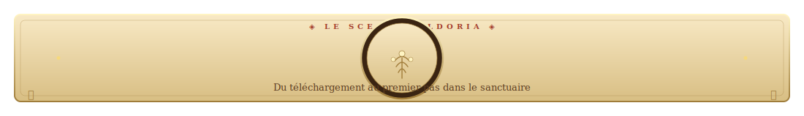
</p>
<p align="center"><sub><em>Du téléchargement au premier pas dans le sanctuaire — toutes les mécaniques sont déjà en place.</em></sub></p>

> 🎮 **[Page officielle itch.io](https://dmzgamingyt.itch.io/eldoria)** — installeurs, cover parchemin, screenshots, thème Cinzel/EB Garamond.
> Guide complet de publication : [`docs/release/itchio-page-guide.md`](docs/release/itchio-page-guide.md).

<details>
<summary>🛠️ <strong>Commandes CLI (avancé, Mac/Linux/Windows)</strong></summary>

```bash
# Linux AppImage (toutes distros) — recommandée
wget https://github.com/DmzGamingYT/Eldoria/releases/latest/download/Eldoria-0.4.0-linux-x64.AppImage
chmod +x Eldoria-0.4.0-linux-x64.AppImage && ./Eldoria-0.4.0-linux-x64.AppImage

# Debian / Ubuntu — installation système
sudo dpkg -i eldoria_0.4.0_amd64.deb

# macOS — contourner Gatekeeper si l'installeur n'est pas signé
xattr -cr /Applications/Eldoria.app
# OU clic droit → "Ouvrir" (procédure unique)
```

Plus de dépannage : [`docs/development/dev-setup.md`](docs/development/dev-setup.md).

</details>

> ⚠️ **Installeurs non signés** (normal pour un indie game) — voir [`docs/release/apple-signing-guide.md`](docs/release/apple-signing-guide.md) pour activer la signature Developer ID + notarisation automatique (5 secrets GitHub requis).

---

## 🎮 Commandes *(cheat sheet)*

| Action | Touche |
|:--|:--|
| Déplacement | `Z Q S D` / `W A S D` |
| Courir | `Maj` |
| Attaque | `Espace` / `J` |
| Caméra | `[` / `]` |
| Dialogue PNJ | `E` |
| Inventaire | `I` |
| Journal de quêtes | `Q` |
| Fiche personnage | `C` |
| **Arbre de Talents** | **`T`** *(multi-rang depuis v0.4.0)* |
| **Sorts (barre rapide)** | **`1`**‑**`4`** *(depuis v0.4.0)* |
| **Potions (barre rapide)** | **`F1`**‑**`F3`** *(depuis v0.4.0)* |
| Sauvegarde rapide | `F5` |
| Aide-mémoire | `H` |
| Pause | `Échap` |

---

## 🔧 Stack technique

| Couche | Tech |
|:--|:--|
| **Rendu 3D** | React Three Fiber 9 · Three.js 0.184 · `@react-three/drei` · `@react-three/postprocessing` |
| **Shell Web** | Next.js 16 (App Router) · React 19 |
| **Style** | Tailwind CSS 4 · Cinzel + EB Garamond |
| **Logique / état** | Zustand 5 · TypeScript 5 strict |
| **Persistance** | `localStorage` (web) · Prisma 6 + SQLite (desktop) |
| **Distribution** | Electron 42 · `electron-builder` 26 (NSIS + DMG + AppImage/deb/rpm) |
| **CI/CD** | GitHub Actions · Bun runtime |

Voir [`docs/development/architecture.md`](docs/development/architecture.md) pour le détail complet des 7 couches.

---

## ⚔️ Eldoria en 30 secondes

> **Un RPG 3D fantasy open-source jouable dès maintenant dans le navigateur ou installable sur Windows / macOS / Linux.**

Vous incarnez un voyageur appelé par **Aldric l'Ancien** pour repousser les sbires de **Mordrak, le Seigneur des Ombres**. Vous parcourez un **monde procédural 200 × 200** avec cycle jour/nuit, combattez **8 espèces d'ennemis** du Slime Vert au Loup du Frost, débloquez **5 sorts** sur une barre rapide, montez un **arbre de 18 talents** répartis en 3 branches, et affrontez le boss final dans une arène dédiée.

🆕 **v0.4.1** — Enrichissement vitrine (docs-only) + récap Frostpeak au nord-ouest avec ice_slime, frost_wolf, quête dédiée et récompense légendaire.

> 🆕 *Si vous êtes pressé :* [⬇ Télécharger `v0.4.1`](https://github.com/DmzGamingYT/Eldoria/releases/latest) · [🎮 Jouer sur itch.io](https://dmzgamingyt.itch.io/eldoria) · [🛠️ Builder en local](docs/development/dev-setup.md)

---

## 🎴 L'essentiel en un coup d'œil

<p align="center">
  
</p>

<p align="center"><em>Six dimensions du sanctuaire — chiffres réels à recouper avec <a href="src/game/data/"><code>src/game/data/</code></a>. <strong>Différence avec les 13 piliers ci-dessous :</strong> les piliers listent <em>ce que le jeu peut faire</em> (« combat, inventaire, craft »), ces 6 carrés quantifient <em>ce qui est déjà en place</em> (« 200×200 cases, 17 objets, 7 coffres, XP = ⌊50 × level<sup>1.6</sup>⌋ »).</em></p>---

## 🚀 Trois chemins pour démarrer

<table align="center">
<tr>
<td width="33%" valign="top" align="center">

### 🎮 **Joueur** — *release desktop*
Installez l'installeur natif adapté à votre OS.

`2 min` · `clic-clic-double-double`

[Page ▸ Releases](https://github.com/DmzGamingYT/Eldoria/releases/latest)

</td>
<td width="33%" valign="top" align="center">

### 🌐 **Joueur navigateur** — *zero install*
Jouez directement dans votre browser.

`30 s` · `Run game`

[Page ▸ itch.io](https://dmzgamingyt.itch.io/eldoria)

</td>
<td width="33%" valign="top" align="center">

### 🛠️ **Contributeur / dev**
Clonez, installez, lancez `bun dev`.

`< 5 min` · `git · bun · dev`

[Guide ▸ dev-setup.md](docs/development/dev-setup.md)

</td>
</tr>
</table>

> ⚠️ **Installeurs non signés par défaut** (normal pour un indie game). Sur macOS : `xattr -cr /Applications/Eldoria.app` ou clic-droit ▸ *Ouvrir*. Guide complet pour signer avec Developer ID : [`docs/release/apple-signing-guide.md`](docs/release/apple-signing-guide.md).

---

## ✨ Les treize piliers d'Eldoria

<p align="center">
  
</p>

<p align="center"><em>Trois strates : fondations (monde 3D, combat, bestiaire, PNJ, quêtes), systèmes du joueur (inventaire, craft, boutique, magie), méta-systèmes (progression, sauvegarde, desktop, direction artistique). Certains piliers ont leur section dédiée ci-dessous.</em></p>

---

## 📜 L'Encyclopédie du héros

<p align="center">
  <table>
    <tr>
      <td align="center" width="50%"></td>
      <td align="center" width="50%"></td>
    </tr>
  </table>
</p>
<p align="center"><em>Qui vous combat face à face ; ce que vous leur répondez en sort. Branche Magie = capstone <strong>Archimage</strong> +35 % dégâts sorts, multi-rang.</em></p>

---

## 🎮 Commandes

<p align="center">
  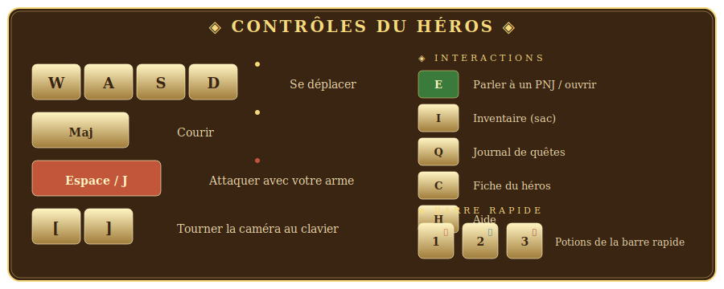
</p>
<p align="center"><em>Mouvement au clavier, inventaire en <kbd>I</kbd>, talents en <kbd>T</kbd>, journal en <kbd>Q</kbd> — aide-mémoire complet en jeu via <kbd>H</kbd>. Camera : <code>[</code> / <code>]</code>.</em></p>

---

## 🌍 Le monde & son lore

<p align="center">
  <table>
    <tr>
      <td align="center" width="50%"></td>
      <td align="center" width="50%"></td>
    </tr>
  </table>
</p>
<p align="center"><em>Du parchemin d'Aldric au Donjon de Mordrak — chaque biome abrite sa créature emblématique. Frostpeak (v0.4.0) ajoute un sixième biome hivernal au nord-ouest (+ quête « Le Passage Gelé » · récompense légendaire 💍 <strong>Anneau de Gel</strong>).</em></p>

---

## 📸 Captures du jeu

<p align="center">
  <table>
    <tr>
      <td align="center" width="33%"><a href="public/screenshots/05-inventory.png">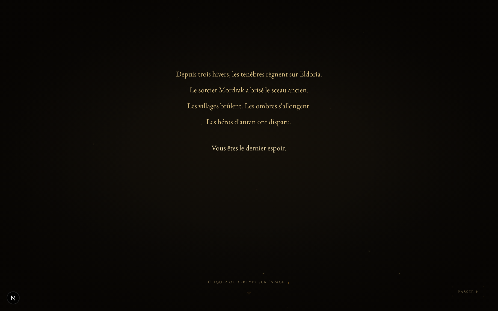</a><br><sub><em>🎒 Inventaire</em></sub></td>
      <td align="center" width="33%"><a href="public/screenshots/06-shop.png">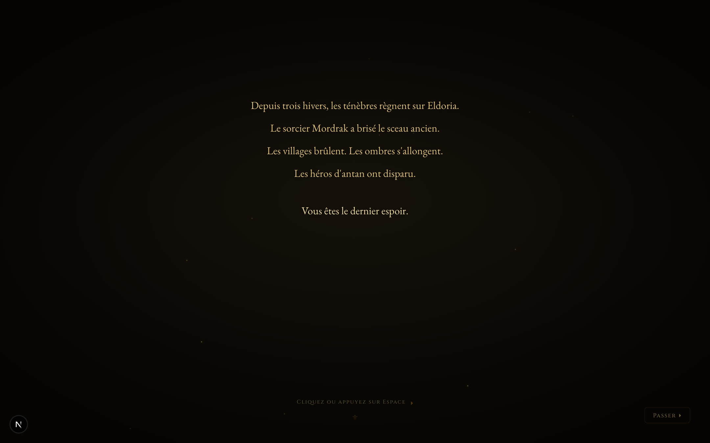</a><br><sub><em>🛒 Boutique</em></sub></td>
      <td align="center" width="33%"><a href="public/screenshots/07-quest-log.png"></a><br><sub><em>📜 Quêtes</em></sub></td>
    </tr>
    <tr>
      <td align="center" width="33%"><a href="public/screenshots/08-character-sheet.png"></a><br><sub><em>🧙 Fiche héros</em></sub></td>
      <td align="center" width="33%"><a href="public/screenshots/09-dialogue.png">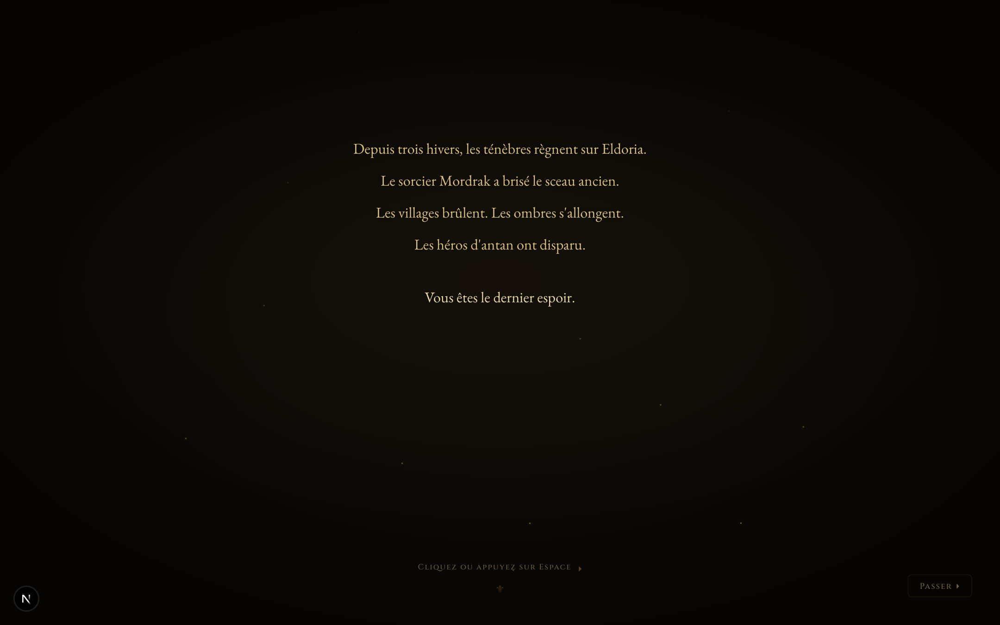</a><br><sub><em>💬 Dialogue PNJ</em></sub></td>
      <td align="center" width="33%"><a href="public/screenshots/10-game-over.png">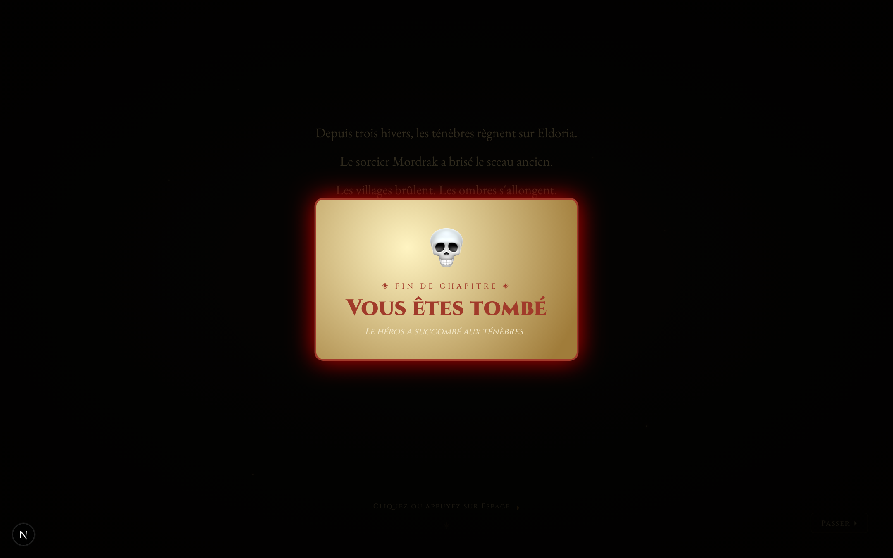</a><br><sub><em>💀 Game Over</em></sub></td>
    </tr>
  </table>
</p>
<p align="center"><sub>11 captures HD — <a href="public/screenshots/">dossier complet</a> · <a href="https://github.com/DmzGamingYT/Eldoria/wiki">Wiki</a> pour le bestiaire et les sorts.</sub></p>

---

## 🛠️ Architecture en sept couches

<p align="center">
  
</p>

<p align="center"><em>Sept strates empilées du joueur vers la persistance. <strong>Game.tsx</strong> est l'orchestrateur en bordure rouge pulsante — chaque flèche pulse au rythme du moteur.</em></p>

Plus de détails dans [`docs/development/architecture.md`](docs/development/architecture.md). Stack concret :

| Couche | Technologie |
|:--|:--|
## 📚 Documentation

| Sujet | Lien |
|:--|:--|
| 📖 **Manuel du jeu** (monde, bestiaire, quêtes, talents, PNJ) | [Wiki GitHub](https://github.com/DmzGamingYT/Eldoria/wiki) |
| 🗺️ **Sommaire de la documentation** (par audience) | [`docs/README.md`](docs/README.md) |
| 🏗️ **Architecture & stack** (7 couches du moteur) | [`docs/development/architecture.md`](docs/development/architecture.md) |
| 🛠️ **Démarrage dev local** (Bun + Prisma + build 3 OS) | [`docs/development/dev-setup.md`](docs/development/dev-setup.md) |
| 🍎 **Signature & notarisation Apple** (5 secrets) | [`docs/release/apple-signing-guide.md`](docs/release/apple-signing-guide.md) |
| 🧪 **Tester la chaîne Apple signing** (RC tags) | [`docs/release/test-apple-signing.md`](docs/release/test-apple-signing.md) |
| 🎮 **Publication itch.io** (cover, screenshots, tags) | [`docs/release/itchio-page-guide.md`](docs/release/itchio-page-guide.md) |
| 🤝 **Contribuer** (conventions Git, types, review) | [`CONTRIBUTING.md`](CONTRIBUTING.md) |
| 🔒 **Politique de sécurité** | [`SECURITY.md`](SECURITY.md) |
| 📜 **Historique des versions** | [`CHANGELOG.md`](CHANGELOG.md) |
| ⚙️ **Workflows CI / GitHub** | [`.github/WORKFLOWS.md`](.github/WORKFLOWS.md) |

---

## 🌱 Feuille de route

<p align="center">
  
</p>

Eldoria est un **projet solo / open-source**, maintenu par [@DmzGamingYT](https://github.com/DmzGamingYT). La version actuelle (`v0.4.0`) est **en vitrine enrichie** : tutoriel → 5 quêtes → boss final **Mordrak** — et le nouveau biome **Frostpeak**.

**Quelques chiffres pour situer :** terrain 200 × 200 procédural · cycle 180 s · 8 espèces d'ennemis · 18 objets / 5 rarités · 7 recettes · 18 talents / 3 branches · 5 sorts · 5 PNJ · 6 quêtes.

Feuille de route indicative :

- **v0.5** — Compagnons PNJ invocables, nouvelles chaînes de quêtes.
- **v0.6** — Mode *New Game+* (talents réinvestissables, ennemis scalés).
- **v0.7** — Multijoueur coopératif local (*split-screen*).
- **v1.0** — Version stable complète, distribution Steam.

💡 Pour suivre les évolutions mineures : [`CHANGELOG.md`](CHANGELOG.md).

---

## 🤝 Contribuer

Les contributions aident énormément sur un projet solo ! Recherchez les issues labellisées **[`invite-to-collaborate`](https://github.com/DmzGamingYT/Eldoria/issues?q=is%3Aissue+label%3Ainvite-to-collaborate)** 🎯 — ce sont des PRs cadrés pour bien débuter.

```bash
bun install           # installe les dépendances
bun run lint          # ESLint
bunx tsc --noEmit     # typecheck TypeScript
bun run build         # build de production Next.js
bun run electron:dev  # lance le jeu en mode desktop (Electron)
```

Conventions du projet (en français, code minimal, qualité > vitesse) : [`CONTRIBUTING.md`](CONTRIBUTING.md).

Pour un changement substantiel, ouvrez d'abord une _issue_ avec votre approche.

---

## 🪧 Le grand sceau d'Eldoria

<p align="center">
  
</p>

<p align="center"><em>Six astres brillent au-dessus du sceau central — chaque rayon pulse vers l'Arbre d'Argent, âme du royaume. Ce médaillon synthétise les chiffres que vous retrouverez éparpillés dans le code : 5+1 créatures, 5 quêtes, 4 mentors, 7 coffres, 7 recettes, 5 sorts (<strong>52+</strong> entités tissées). Pour les humanoïdes, c'est « de quoi parle le projet » ; pour les bots Discord / Twitter / LinkedIn, c'est aussi l'open-graph annexe — la version pleine taille, c'est <a href="public/banner/social-card.png">social-card.png</a>.</em></p>

---

<p align="center">
  
</p>

---

## 📦 Crédits & licence

- **Développement, écriture, direction artistique :** [DmzGamingYT](https://github.com/DmzGamingYT) · © 2026
- **Modèles 3D et animations :** [Quaternius](https://quaternius.com) — **CC0 1.0** (domaine public)
- **Typographies :** [Cinzel](https://fonts.google.com/specimen/Cinzel) + [EB Garamond](https://fonts.google.com/specimen/EB+Garamond) (Google Fonts)
- **Identité visuelle :** bannières et sceaux artisanalement codés en SVG pour ce projet

<p align="center"><sub>Propulsé par React Three Fiber, Zustand, et une solide boucle <code>useFrame()</code>. 🌲 ⚔️ ❄️ 💍</sub></p>
