<!-- TOP-LEVEL HERO BANNER : bannière cinématique dawn -->
<p align="center">
  <a href="public/banner/eldoria-banner.svg">
    <picture>
      
    </picture>
  </a>
</p>

<!-- Animated typing / sub-title SVG -->
<p align="center">
  <svg viewBox="0 0 720 80" xmlns="http://www.w3.org/2000/svg" width="720" style="max-width:100%;height:auto;">
    <defs>
      <linearGradient id="tGold" x1="0" y1="0" x2="0" y2="1">
        <stop offset="0%" stop-color="#fff4c2"/>
        <stop offset="50%" stop-color="#f6d97c"/>
        <stop offset="100%" stop-color="#a07c3a"/>
      </linearGradient>
    </defs>
    <text x="360" y="38" text-anchor="middle"
          font-family="Georgia, 'Times New Roman', serif" font-style="italic" font-size="22" fill="url(#tGold)">
      &gt; Explorez le monde d'Eldoria...
      <animate attributeName="opacity" values="0;1;1;0;1" keyTimes="0;0.4;0.7;0.85;1" dur="4s" repeatCount="indefinite"/>
    </text>
    <text x="360" y="62" text-anchor="middle"
          font-family="Georgia, serif" font-size="12" fill="#a07c3a" letter-spacing="3">
      ◆ AFFRONTEZ LES OMBRES ◆ PURIFIEZ LE SANCTUAIRE ◆
    </text>
  </svg>
</p>

<!-- Tech stack badges row with subtle pulse -->
<p align="center">
  <svg width="0" height="0" style="position:absolute">
    <defs>
      <filter id="badgePulse" x="-20%" y="-20%" width="140%" height="140%">
        <feGaussianBlur stdDeviation="0.6"/>
      </filter>
    </defs>
  </svg>
  
  
  
  
  
  <br/>
  
  
  
  
  
</p>

<br/>

<!-- =====================  LORE  ===================== -->
<div align="center">
  <svg viewBox="0 0 1000 220" xmlns="http://www.w3.org/2000/svg" width="100%" style="max-width:1000px">
    <defs>
      <linearGradient id="paraLore" x1="0" y1="0" x2="0" y2="1">
        <stop offset="0%" stop-color="#f8e9c5"/>
        <stop offset="50%" stop-color="#ead7a8"/>
        <stop offset="100%" stop-color="#d8be83"/>
      </linearGradient>
      <linearGradient id="inkLore" x1="0" y1="0" x2="0" y2="1">
        <stop offset="0%" stop-color="#fff4c2"/>
        <stop offset="100%" stop-color="#a07c3a"/>
      </linearGradient>
    </defs>
    <!-- Parchment background -->
    <path d="M30,20 L970,20 Q980,20 980,30 L980,190 Q980,200 970,200 L30,200 Q20,200 20,190 L20,30 Q20,20 30,20 Z"
          fill="url(#paraLore)" stroke="#a07c3a" stroke-width="2"/>
    <path d="M40,30 L960,30 Q965,30 965,35 L965,185 Q965,190 960,190 L40,190 Q35,190 35,185 L35,35 Q35,30 40,30 Z"
          fill="none" stroke="#a07c3a" stroke-width="0.6" opacity="0.6"/>
    <!-- Corners ornaments -->
    <text x="46" y="50" font-size="22" fill="#a07c3a" font-family="Georgia, serif">❦</text>
    <text x="954" y="50" font-size="22" fill="#a07c3a" font-family="Georgia, serif" text-anchor="end">❧</text>
    <text x="46" y="190" font-size="22" fill="#a07c3a" font-family="Georgia, serif">❧</text>
    <text x="954" y="190" font-size="22" fill="#a07c3a" font-family="Georgia, serif" text-anchor="end">❦</text>
    <!-- Eyebrow -->
    <text x="500" y="68" text-anchor="middle" font-family="Georgia, serif" font-size="13"
          fill="#a13a2a" letter-spacing="6" font-weight="bold">◈ LA LÉGENDE ◈</text>
    <!-- Animated gold line -->
    <line x1="200" y1="78" x2="800" y2="78" stroke="url(#inkLore)" stroke-width="1.4" opacity="0.85"/>
    <circle cx="200" cy="78" r="3" fill="#f6d97c"/>
    <circle cx="800" cy="78" r="3" fill="#f6d97c"/>
    <!-- Lore text -->
    <g font-family="Georgia, 'Times New Roman', serif" fill="#3a2412" text-anchor="middle">
      <text x="500" y="108" font-size="16" font-style="italic">
        Autrefois, le royaume d'Eldoria prospérait sous la lumière de l'<tspan font-weight="bold">Arbre d'Argent</tspan>.
      </text>
      <text x="500" y="132" font-size="16" font-style="italic">
        Mais voici trois hivers, le sorcier <tspan font-weight="bold" fill="#a13a2a">Mordrak</tspan> a brisé le sceau ancien
        et déchaîné ses armées sur les terres des hommes.
      </text>
      <text x="500" y="156" font-size="16" font-style="italic">
        Les héros d'antan ont disparu — <tspan font-weight="bold" fill="#a13a2a">vous êtes le dernier porteur d'espoir</tspan>.
      </text>
      <text x="500" y="180" font-size="15" fill="#5a3a1f">
        Forgez votre légende. Terrassez les ténèbres. Rendez la paix à Eldoria.
      </text>
    </g>
    <!-- Glow dancing circles -->
    <circle cx="500" cy="40" r="3" fill="#f6d97c">
      <animate attributeName="opacity" values="0.2;1;0.2" dur="3.2s" repeatCount="indefinite"/>
    </circle>
    <circle cx="60" cy="110" r="2" fill="#a07c3a">
      <animate attributeName="opacity" values="0.2;0.8;0.2" dur="2.6s" begin="0.6s" repeatCount="indefinite"/>
    </circle>
    <circle cx="940" cy="110" r="2" fill="#a07c3a">
      <animate attributeName="opacity" values="0.2;0.8;0.2" dur="2.6s" begin="1.2s" repeatCount="indefinite"/>
    </circle>
  </svg>
</div>

<br/>

---

## ⚔️ Galerie en action

<p align="center">
  <a href="public/screenshots/01-main-menu.png">
    
  </a>
  <br/>
  <em>🏰 Le portail de l'aventure — fond cinématique, ambres flottants, rayons divins</em>
</p>

<br/>

<table>
  <tr>
    <td align="center" width="49%">
      <a href="public/screenshots/03-game-world.png">
        
      </a>
      <br/>
      <strong>🌍 Le monde d'Eldoria</strong>
      <br/>
      <em>Terrain procédural 200×200, cycle jour/nuit, brouillard atmosphérique</em>
    </td>
    <td width="2%"></td>
    <td align="center" width="49%">
      <a href="public/screenshots/04-gameplay-hud.png">
        
      </a>
      <br/>
      <strong>⚔️ Combat en temps réel</strong>
      <br/>
      <em>HUD parchemin, barres de vie/mana/XP, minimap, barre rapide</em>
    </td>
  </tr>
  <tr>
    <td colspan="3" height="20"></td>
  </tr>
  <tr>
    <td align="center" width="49%">
      <a href="public/screenshots/02-intro-sequence.png">
        
      </a>
      <br/>
      <strong>🎬 Cinématique d'introduction</strong>
      <br/>
      <em>L'histoire de Mordrak et des ténèbres contée en travelling 3D</em>
    </td>
    <td width="2%"></td>
    <td align="center" width="49%">
      <em>🖼️ Plus de captures à venir<strong>…</strong></em>
      <br/>
      <em>(Inventaire, Boutique, Dialogue, Journal — toutes les UI sont entièrement vectorisées&nbsp;!)</em>
    </td>
  </tr>
</table>

---

## 🗡️ Ce qu'Eldoria a sous le capot

<!-- Animated stats grid -->
<table align="center">
  <tr>
    <td align="center" width="16%">
      <svg viewBox="0 0 140 140" xmlns="http://www.w3.org/2000/svg" width="100%">
        <defs><linearGradient id="gA" x1="0" y1="0" x2="0" y2="1"><stop offset="0%" stop-color="#fff4c2"/><stop offset="100%" stop-color="#d8be83"/></linearGradient></defs>
        <rect x="6" y="6" width="128" height="128" rx="14" fill="url(#gA)" stroke="#a07c3a" stroke-width="2"/>
        <rect x="10" y="10" width="120" height="120" rx="11" fill="none" stroke="#a07c3a" stroke-width="0.6" opacity="0.5"/>
        <text x="70" y="70" text-anchor="middle" font-family="Georgia, serif" font-size="38" font-weight="900" fill="#a13a2a">6</text>
        <text x="70" y="98" text-anchor="middle" font-family="Georgia, serif" font-size="14" fill="#5a3a1f" letter-spacing="2">ENNEMIS</text>
        <text x="70" y="116" text-anchor="middle" font-size="12">🟢🟤🐺💀🪨💀</text>
        <circle cx="70" cy="50" r="2.5" fill="#c2563a">
          <animate attributeName="opacity" values="0;1;0" dur="2s" repeatCount="indefinite"/>
        </circle>
      </svg>
    </td>
    <td align="center" width="16%">
      <svg viewBox="0 0 140 140" xmlns="http://www.w3.org/2000/svg" width="100%">
        <defs><linearGradient id="gB" x1="0" y1="0" x2="0" y2="1"><stop offset="0%" stop-color="#fff4c2"/><stop offset="100%" stop-color="#d8be83"/></linearGradient></defs>
        <rect x="6" y="6" width="128" height="128" rx="14" fill="url(#gB)" stroke="#a07c3a" stroke-width="2"/>
        <rect x="10" y="10" width="120" height="120" rx="11" fill="none" stroke="#a07c3a" stroke-width="0.6" opacity="0.5"/>
        <text x="70" y="70" text-anchor="middle" font-family="Georgia, serif" font-size="38" font-weight="900" fill="#a13a2a">5</text>
        <text x="70" y="98" text-anchor="middle" font-family="Georgia, serif" font-size="14" fill="#5a3a1f" letter-spacing="2">QUÊTES</text>
        <text x="70" y="116" text-anchor="middle" font-size="12">📜 📜 📜 📜 ⚔️</text>
        <circle cx="70" cy="50" r="2.5" fill="#c2563a">
          <animate attributeName="opacity" values="0;1;0" dur="2s" begin="0.3s" repeatCount="indefinite"/>
        </circle>
      </svg>
    </td>
    <td align="center" width="16%">
      <svg viewBox="0 0 140 140" xmlns="http://www.w3.org/2000/svg" width="100%">
        <defs><linearGradient id="gC" x1="0" y1="0" x2="0" y2="1"><stop offset="0%" stop-color="#fff4c2"/><stop offset="100%" stop-color="#d8be83"/></linearGradient></defs>
        <rect x="6" y="6" width="128" height="128" rx="14" fill="url(#gC)" stroke="#a07c3a" stroke-width="2"/>
        <rect x="10" y="10" width="120" height="120" rx="11" fill="none" stroke="#a07c3a" stroke-width="0.6" opacity="0.5"/>
        <text x="70" y="70" text-anchor="middle" font-family="Georgia, serif" font-size="38" font-weight="900" fill="#a13a2a">5</text>
        <text x="70" y="98" text-anchor="middle" font-family="Georgia, serif" font-size="14" fill="#5a3a1f" letter-spacing="2">COMPÉTENCES</text>
        <text x="70" y="116" text-anchor="middle" font-size="12">🔥 ✨ ⚡ 🛡️ ❄️</text>
        <circle cx="70" cy="50" r="2.5" fill="#c2563a">
          <animate attributeName="opacity" values="0;1;0" dur="2s" begin="0.6s" repeatCount="indefinite"/>
        </circle>
      </svg>
    </td>
    <td align="center" width="16%">
      <svg viewBox="0 0 140 140" xmlns="http://www.w3.org/2000/svg" width="100%">
        <defs><linearGradient id="gD" x1="0" y1="0" x2="0" y2="1"><stop offset="0%" stop-color="#fff4c2"/><stop offset="100%" stop-color="#d8be83"/></linearGradient></defs>
        <rect x="6" y="6" width="128" height="128" rx="14" fill="url(#gD)" stroke="#a07c3a" stroke-width="2"/>
        <rect x="10" y="10" width="120" height="120" rx="11" fill="none" stroke="#a07c3a" stroke-width="0.6" opacity="0.5"/>
        <text x="70" y="70" text-anchor="middle" font-family="Georgia, serif" font-size="38" font-weight="900" fill="#a13a2a">16+</text>
        <text x="70" y="98" text-anchor="middle" font-family="Georgia, serif" font-size="14" fill="#5a3a1f" letter-spacing="2">OBJETS</text>
        <text x="70" y="116" text-anchor="middle" font-size="12">🗡️ 🛡️ 🧪 🦴 🗝️</text>
        <circle cx="70" cy="50" r="2.5" fill="#c2563a">
          <animate attributeName="opacity" values="0;1;0" dur="2s" begin="0.9s" repeatCount="indefinite"/>
        </circle>
      </svg>
    </td>
    <td align="center" width="16%">
      <svg viewBox="0 0 140 140" xmlns="http://www.w3.org/2000/svg" width="100%">
        <defs><linearGradient id="gE" x1="0" y1="0" x2="0" y2="1"><stop offset="0%" stop-color="#fff4c2"/><stop offset="100%" stop-color="#d8be83"/></linearGradient></defs>
        <rect x="6" y="6" width="128" height="128" rx="14" fill="url(#gE)" stroke="#a07c3a" stroke-width="2"/>
        <rect x="10" y="10" width="120" height="120" rx="11" fill="none" stroke="#a07c3a" stroke-width="0.6" opacity="0.5"/>
        <text x="70" y="70" text-anchor="middle" font-family="Georgia, serif" font-size="38" font-weight="900" fill="#a13a2a">4</text>
        <text x="70" y="98" text-anchor="middle" font-family="Georgia, serif" font-size="14" fill="#5a3a1f" letter-spacing="2">PNJ</text>
        <text x="70" y="116" text-anchor="middle" font-size="12">👴 🛒 🏹 🔮</text>
        <circle cx="70" cy="50" r="2.5" fill="#c2563a">
          <animate attributeName="opacity" values="0;1;0" dur="2s" begin="1.2s" repeatCount="indefinite"/>
        </circle>
      </svg>
    </td>
    <td align="center" width="16%">
      <svg viewBox="0 0 140 140" xmlns="http://www.w3.org/2000/svg" width="100%">
        <defs><linearGradient id="gF" x1="0" y1="0" x2="0" y2="1"><stop offset="0%" stop-color="#fff4c2"/><stop offset="100%" stop-color="#d8be83"/></linearGradient></defs>
        <rect x="6" y="6" width="128" height="128" rx="14" fill="url(#gF)" stroke="#a07c3a" stroke-width="2"/>
        <rect x="10" y="10" width="120" height="120" rx="11" fill="none" stroke="#a07c3a" stroke-width="0.6" opacity="0.5"/>
        <text x="70" y="70" text-anchor="middle" font-family="Georgia, serif" font-size="38" font-weight="900" fill="#a13a2a">7</text>
        <text x="70" y="98" text-anchor="middle" font-family="Georgia, serif" font-size="14" fill="#5a3a1f" letter-spacing="2">COFFRES</text>
        <text x="70" y="116" text-anchor="middle" font-size="12">💰 💰 💰 💰 💰 💰 💰</text>
        <circle cx="70" cy="50" r="2.5" fill="#c2563a">
          <animate attributeName="opacity" values="0;1;0" dur="2s" begin="1.5s" repeatCount="indefinite"/>
        </circle>
      </svg>
    </td>
  </tr>
</table>

---

## 🌍 Le monde d'Eldoria

<p align="center">
  <a href="public/banner/world-map.svg">
    <picture>
      
    </picture>
  </a>
</p>

Un monde ouvert de <strong>200×200 unités</strong> baigné dans une atmosphère de cycle jour/nuit (180 s). Six factions ennemies s'épanouissent dans six territoires distincts, tous reliés au <em>village central</em>.

| Lieu | Biome | Ennemis | Difficulté |
|---|---|---|---|
| 🏘️ **Le Village central** | Plaine, foyer du joueur | (refuge) | — |
| 🌾 **Les Champs de l'Est** | Herbes hautes & rochers | <span style="color:#5fd35f">🟢 Slimes</span> | ★☆☆ |
| 🌲 **La Forêt profonde** | Sapins & brume | <span style="color:#8b5a2b">🟤 Gobelins</span> | ★★☆ |
| 🐺 **Les Bois sinistres** | Loups en meutes | <span style="color:#6b6b6b">🐺 Loups</span> | ★★★ |
| 🏚️ **Les Ruines du Nord** | Cimetière effrité | <span style="color:#e8e8e8">💀 Squelettes</span> | ★★★★ |
| 🪨 **Les Cavernes de l'Ouest** | Antres brumeuses | <span style="color:#7a4f8b">🪨 Ogres</span> | ★★★★★ |
| 🏰 **Le Donjon de Mordrak** | Noirceur abyssale | <span style="color:#ff3344">💀 Mordrak (boss)</span> | ✦✦✦ |

---

## 📜 La Quête du Héros

<p align="center">
  <a href="public/banner/quest-chain.svg">
    <picture>
      
    </picture>
  </a>
</p>

Le destin du porteur d'espoir est tracé en cinq chapitres — chacun se conclut par une récompense rare et la rencontre d'une nouvelle menace.

| # | Quête | Donneur | Objectif | Récompense |
|---|---|---|---|---|
| 1 | 🟢 **Chasse aux Slimes** | Aldric l'Ancien | Tuer 5 slimes | 50 XP, 30 po, Potion |
| 2 | 🟤 **La Menace Gobeline** | Brynn la Marchande | Tuer 6 gobelins | 120 XP, 80 po, Épée de Fer |
| 3 | 🐺 **Chasse aux Loups** | Saela la Chasseuse | Tuer 5 loups | 180 XP, 100 po, Cotte de Mailles |
| 4 | 💀 **Repos des Os** | Mireille la Sage | Tuer 6 squelettes | 300 XP, 200 po, Hache d'Acier |
| 5 | ⚔️ **Le Seigneur des Ombres** | Mireille la Sage | Vaincre Mordrak | 1000 XP, 1000 po, <strong>Tueuse de Dragon</strong> |

---

## ⚡ Les Compétences du Héros

Cinq sorts canalisent votre mana — débloqués au fur et à mesure de votre progression en niveau :

<table>
  <tr>
    <td align="center" width="20%">
      <svg viewBox="0 0 200 220" xmlns="http://www.w3.org/2000/svg" width="100%">
        <defs>
          <radialGradient id="sFire" cx="0.5" cy="0.5" r="0.5">
            <stop offset="0%" stop-color="#fff4a0"/>
            <stop offset="50%" stop-color="#ff5722"/>
            <stop offset="100%" stop-color="#7a1c0a" stop-opacity="0"/>
          </radialGradient>
          <linearGradient id="cardBg" x1="0" y1="0" x2="0" y2="1"><stop offset="0%" stop-color="#fff4c2"/><stop offset="100%" stop-color="#d8be83"/></linearGradient>
        </defs>
        <rect x="6" y="6" width="188" height="208" rx="10" fill="url(#cardBg)" stroke="#a07c3a" stroke-width="2"/>
        <rect x="10" y="10" width="180" height="200" rx="8" fill="none" stroke="#a07c3a" stroke-width="0.5" opacity="0.4"/>
        <!-- Flames -->
        <circle cx="100" cy="80" r="70" fill="url(#sFire)" opacity="0.6">
          <animate attributeName="r" values="60;75;60" dur="2.4s" repeatCount="indefinite"/>
          <animate attributeName="opacity" values="0.4;0.8;0.4" dur="2.4s" repeatCount="indefinite"/>
        </circle>
        <circle cx="100" cy="80" r="30" fill="#ffd24a">
          <animate attributeName="r" values="28;36;28" dur="2.4s" repeatCount="indefinite"/>
        </circle>
        <text x="100" y="92" font-size="40" text-anchor="middle">🔥</text>
        <text x="100" y="148" font-size="18" text-anchor="middle" font-family="Georgia, serif" font-weight="bold" fill="#a13a2a">Boule de Feu</text>
        <text x="100" y="170" font-size="12" text-anchor="middle" font-family="Georgia, serif" fill="#5a3a1f">♦ 15 mana</text>
        <text x="100" y="190" font-size="11" text-anchor="middle" font-family="Georgia, serif" fill="#a07c3a" font-style="italic">dégâts AoE</text>
      </svg>
    </td>
    <td align="center" width="20%">
      <svg viewBox="0 0 200 220" xmlns="http://www.w3.org/2000/svg" width="100%">
        <defs>
          <radialGradient id="sHeal" cx="0.5" cy="0.5" r="0.5">
            <stop offset="0%" stop-color="#fff"/>
            <stop offset="50%" stop-color="#a3e635"/>
            <stop offset="100%" stop-color="#1a4a1a" stop-opacity="0"/>
          </radialGradient>
          <linearGradient id="cardBg2" x1="0" y1="0" x2="0" y2="1"><stop offset="0%" stop-color="#fff4c2"/><stop offset="100%" stop-color="#d8be83"/></linearGradient>
        </defs>
        <rect x="6" y="6" width="188" height="208" rx="10" fill="url(#cardBg2)" stroke="#a07c3a" stroke-width="2"/>
        <rect x="10" y="10" width="180" height="200" rx="8" fill="none" stroke="#a07c3a" stroke-width="0.5" opacity="0.4"/>
        <circle cx="100" cy="80" r="60" fill="url(#sHeal)" opacity="0.7">
          <animate attributeName="r" values="50;65;50" dur="3s" repeatCount="indefinite"/>
        </circle>
        <g transform="translate(100 80)">
          <line x1="0" y1="-32" x2="0" y2="-12" stroke="#1a4a1a" stroke-width="3"><animate attributeName="opacity" values="0;1;0" dur="2s" repeatCount="indefinite"/></line>
          <line x1="0" y1="12" x2="0" y2="32" stroke="#1a4a1a" stroke-width="3"><animate attributeName="opacity" values="0;1;0" dur="2s" begin="0.5s" repeatCount="indefinite"/></line>
          <line x1="-32" y1="0" x2="-12" y2="0" stroke="#1a4a1a" stroke-width="3"><animate attributeName="opacity" values="0;1;0" dur="2s" begin="1s" repeatCount="indefinite"/></line>
          <line x1="12" y1="0" x2="32" y2="0" stroke="#1a4a1a" stroke-width="3"><animate attributeName="opacity" values="0;1;0" dur="2s" begin="1.5s" repeatCount="indefinite"/></line>
          <circle r="8" fill="#a3e635">
            <animate attributeName="r" values="6;10;6" dur="2s" repeatCount="indefinite"/>
          </circle>
        </g>
        <text x="100" y="92" font-size="36" text-anchor="middle">✨</text>
        <text x="100" y="148" font-size="18" text-anchor="middle" font-family="Georgia, serif" font-weight="bold" fill="#3a7a3a">Soin Léger</text>
        <text x="100" y="170" font-size="12" text-anchor="middle" font-family="Georgia, serif" fill="#5a3a1f">♦ 20 mana</text>
        <text x="100" y="190" font-size="11" text-anchor="middle" font-family="Georgia, serif" fill="#a07c3a" font-style="italic">+50 PV instantanés</text>
      </svg>
    </td>
    <td align="center" width="20%">
      <svg viewBox="0 0 200 220" xmlns="http://www.w3.org/2000/svg" width="100%">
        <defs>
          <linearGradient id="cardBg3" x1="0" y1="0" x2="0" y2="1"><stop offset="0%" stop-color="#fff4c2"/><stop offset="100%" stop-color="#d8be83"/></linearGradient>
          <filter id="lyGlow" x="-50%" y="-50%" width="200%" height="200%"><feGaussianBlur stdDeviation="2"/></filter>
        </defs>
        <rect x="6" y="6" width="188" height="208" rx="10" fill="url(#cardBg3)" stroke="#a07c3a" stroke-width="2"/>
        <rect x="10" y="10" width="180" height="200" rx="8" fill="none" stroke="#a07c3a" stroke-width="0.5" opacity="0.4"/>
        <!-- Lightning zigzag -->
        <path d="M70,30 L120,80 L80,100 L130,140" fill="none" stroke="#fbbf24" stroke-width="6" stroke-linejoin="round" filter="url(#lyGlow)">
          <animate attributeName="opacity" values="0.4;1;0.4" dur="1.4s" repeatCount="indefinite"/>
        </path>
        <path d="M70,30 L120,80 L80,100 L130,140" fill="none" stroke="#fff" stroke-width="2.5" stroke-linejoin="round"/>
        <text x="100" y="180" font-size="22" text-anchor="middle">⚡</text>
        <text x="100" y="200" font-size="14" text-anchor="middle" font-family="Georgia, serif" font-weight="bold" fill="#a07c3a">ÉCLAIR</text>
      </svg>
    </td>
    <td align="center" width="20%">
      <svg viewBox="0 0 200 220" xmlns="http://www.w3.org/2000/svg" width="100%">
        <defs>
          <linearGradient id="cardBg4" x1="0" y1="0" x2="0" y2="1"><stop offset="0%" stop-color="#fff4c2"/><stop offset="100%" stop-color="#d8be83"/></linearGradient>
        </defs>
        <rect x="6" y="6" width="188" height="208" rx="10" fill="url(#cardBg4)" stroke="#a07c3a" stroke-width="2"/>
        <rect x="10" y="10" width="180" height="200" rx="8" fill="none" stroke="#a07c3a" stroke-width="0.5" opacity="0.4"/>
        <!-- Shield -->
        <path d="M100,30 L150,55 L150,110 Q150,140 100,162 Q50,140 50,110 L50,55 Z" fill="#38bdf8" opacity="0.85">
          <animate attributeName="opacity" values="0.6;1;0.6" dur="2s" repeatCount="indefinite"/>
        </path>
        <path d="M100,30 L150,55 L150,110 Q150,140 100,162 Q50,140 50,110 L50,55 Z" fill="none" stroke="#0a3a5a" stroke-width="2"/>
        <path d="M76,100 L94,118 L130,80" fill="none" stroke="#fff" stroke-width="6" stroke-linecap="round" stroke-linejoin="round"/>
        <text x="100" y="200" font-size="14" text-anchor="middle" font-family="Georgia, serif" font-weight="bold" fill="#0a3a5a">BOUCLIER</text>
      </svg>
    </td>
    <td align="center" width="20%">
      <svg viewBox="0 0 200 220" xmlns="http://www.w3.org/2000/svg" width="100%">
        <defs>
          <linearGradient id="cardBg5" x1="0" y1="0" x2="0" y2="1"><stop offset="0%" stop-color="#fff4c2"/><stop offset="100%" stop-color="#d8be83"/></linearGradient>
          <radialGradient id="sFrost" cx="0.5" cy="0.5" r="0.5">
            <stop offset="0%" stop-color="#fff"/>
            <stop offset="60%" stop-color="#7dd3fc"/>
            <stop offset="100%" stop-color="#0a3a5a" stop-opacity="0"/>
          </radialGradient>
        </defs>
        <rect x="6" y="6" width="188" height="208" rx="10" fill="url(#cardBg5)" stroke="#a07c3a" stroke-width="2"/>
        <rect x="10" y="10" width="180" height="200" rx="8" fill="none" stroke="#a07c3a" stroke-width="0.5" opacity="0.4"/>
        <circle cx="100" cy="100" r="65" fill="url(#sFrost)" opacity="0.6">
          <animate attributeName="r" values="55;72;55" dur="3s" repeatCount="indefinite"/>
        </circle>
        <!-- Snowflake -->
        <g transform="translate(100 100)" stroke="#0a3a5a" stroke-width="2.5" stroke-linecap="round">
          <line x1="-30" y1="0" x2="30" y2="0"/>
          <line x1="0" y1="-30" x2="0" y2="30"/>
          <line x1="-22" y1="-22" x2="22" y2="22"/>
          <line x1="-22" y1="22" x2="22" y2="-22"/>
          <line x1="-10" y1="0" x2="-15" y2="-5"/>
          <line x1="-10" y1="0" x2="-15" y2="5"/>
          <line x1="10" y1="0" x2="15" y2="-5"/>
          <line x1="10" y1="0" x2="15" y2="5"/>
          <animateTransform attributeName="transform" type="rotate" values="0;360" dur="12s" repeatCount="indefinite" additive="sum"/>
        </g>
        <text x="100" y="200" font-size="14" text-anchor="middle" font-family="Georgia, serif" font-weight="bold" fill="#0a3a5a">GIVRE</text>
      </svg>
    </td>
  </tr>
</table>

---

## 👹 Le bestiaire

<p align="center">
  <svg viewBox="0 0 1100 380" xmlns="http://www.w3.org/2000/svg" width="100%" style="max-width:1100px">
    <defs>
      <linearGradient id="enemyCard" x1="0" y1="0" x2="0" y2="1"><stop offset="0%" stop-color="#fff4c2"/><stop offset="100%" stop-color="#d8be83"/></linearGradient>
      <radialGradient id="slimeGlow" cx="0.5" cy="0.5" r="0.5"><stop offset="0%" stop-color="#5fd35f"/><stop offset="100%" stop-color="#3a8a3a" stop-opacity="0"/></radialGradient>
      <radialGradient id="bossAuraCard" cx="0.5" cy="0.5" r="0.5"><stop offset="0%" stop-color="#ff3344" stop-opacity="0.7"/><stop offset="100%" stop-color="#ff3344" stop-opacity="0"/></radialGradient>
    </defs>

    <!-- Slime -->
    <g transform="translate(80 60)">
      <rect x="-50" y="-20" width="160" height="280" rx="10" fill="url(#enemyCard)" stroke="#a07c3a" stroke-width="2"/>
      <circle r="55" cx="30" cy="60" fill="url(#slimeGlow)" opacity="0.6">
        <animate attributeName="r" values="50;60;50" dur="2s" repeatCount="indefinite"/>
      </circle>
      <ellipse cx="30" cy="60" rx="38" ry="40" fill="#5fd35f" opacity="0.85"/>
      <ellipse cx="30" cy="50" rx="30" ry="10" fill="#fff" opacity="0.6"/>
      <ellipse cx="20" cy="58" rx="6" ry="9" fill="#1a1a1a"/>
      <ellipse cx="40" cy="58" rx="6" ry="9" fill="#1a1a1a"/>
      <ellipse cx="30" cy="80" rx="4" ry="2" fill="#1a1a1a"/>
      <text x="30" y="155" text-anchor="middle" font-family="Georgia, serif" font-size="16" font-weight="bold" fill="#3a7a3a">Slime Vert</text>
      <text x="30" y="180" text-anchor="middle" font-family="Georgia, serif" font-size="11" fill="#5a3a1f">PV 25 • ATQ 4</text>
      <text x="30" y="200" text-anchor="middle" font-family="Georgia, serif" font-size="10" font-style="italic" fill="#a07c3a">★☆☆☆☆</text>
      <text x="30" y="230" text-anchor="middle" font-family="Georgia, serif" font-size="10" fill="#a07c3a">XP 8 • Or 2-5</text>
    </g>

    <!-- Goblin -->
    <g transform="translate(280 60)">
      <rect x="-50" y="-20" width="160" height="280" rx="10" fill="url(#enemyCard)" stroke="#a07c3a" stroke-width="2"/>
      <ellipse cx="30" cy="120" rx="35" ry="80" fill="#8b5a2b"/>
      <ellipse cx="30" cy="55" rx="22" ry="24" fill="#a87f4a"/>
      <polygon points="10,38 18,30 20,45" fill="#a87f4a"/>
      <polygon points="50,38 42,30 40,45" fill="#a87f4a"/>
      <circle cx="22" cy="55" r="3.5" fill="#fff" />
      <circle cx="22" cy="56" r="2" fill="#c00"/>
      <circle cx="38" cy="55" r="3.5" fill="#fff" />
      <circle cx="38" cy="56" r="2" fill="#c00"/>
      <line x1="28" y1="66" x2="36" y2="64" stroke="#3a2412" stroke-width="2"/>
      <rect x="60" y="100" width="6" height="50" fill="#7a6a4a"/>
      <text x="30" y="200" text-anchor="middle" font-family="Georgia, serif" font-size="16" font-weight="bold" fill="#5a3a1f">Pillard Gobelin</text>
      <text x="30" y="222" text-anchor="middle" font-family="Georgia, serif" font-size="11" fill="#5a3a1f">PV 45 • ATQ 8</text>
      <text x="30" y="248" text-anchor="middle" font-family="Georgia, serif" font-size="10" font-style="italic" fill="#a07c3a">★★☆☆☆</text>
    </g>

    <!-- Wolf -->
    <g transform="translate(480 60)">
      <rect x="-50" y="-20" width="160" height="280" rx="10" fill="url(#enemyCard)" stroke="#a07c3a" stroke-width="2"/>
      <ellipse cx="30" cy="100" rx="35" ry="25" fill="#6b6b6b"/>
      <ellipse cx="55" cy="95" rx="22" ry="20" fill="#6b6b6b"/>
      <polygon points="40,80 45,72 50,82" fill="#5a5a5a"/>
      <polygon points="60,78 68,68 72,80" fill="#5a5a5a"/>
      <circle cx="63" cy="92" r="2.5" fill="#fbbf24">
        <animate attributeName="opacity" values="0.6;1;0.6" dur="1.6s" repeatCount="indefinite"/>
      </circle>
      <path d="M70,100 L78,98 L70,104 Z" fill="#1a1a1a"/>
      <line x1="40" y1="125" x2="35" y2="155" stroke="#5a5a5a" stroke-width="4"/>
      <line x1="50" y1="125" x2="55" y2="155" stroke="#5a5a5a" stroke-width="4"/>
      <line x1="20" y1="125" x2="15" y2="155" stroke="#5a5a5a" stroke-width="4"/>
      <line x1="10" y1="125" x2="5" y2="155" stroke="#5a5a5a" stroke-width="4"/>
      <text x="30" y="195" text-anchor="middle" font-family="Georgia, serif" font-size="16" font-weight="bold" fill="#3a3a3a">Loup Sinistre</text>
      <text x="30" y="220" text-anchor="middle" font-family="Georgia, serif" font-size="11" fill="#5a3a1f">PV 60 • ATQ 12</text>
      <text x="30" y="245" text-anchor="middle" font-family="Georgia, serif" font-size="10" font-style="italic" fill="#a07c3a">★★★☆☆</text>
    </g>

    <!-- Skeleton -->
    <g transform="translate(680 60)">
      <rect x="-50" y="-20" width="160" height="280" rx="10" fill="url(#enemyCard)" stroke="#a07c3a" stroke-width="2"/>
      <ellipse cx="30" cy="55" rx="20" ry="22" fill="#e8e8e8"/>
      <circle cx="22" cy="52" r="6" fill="#1a1a1a"/>
      <circle cx="38" cy="52" r="6" fill="#1a1a1a"/>
      <circle cx="22" cy="52" r="2.5" fill="#c2563a">
        <animate attributeName="opacity" values="0.5;1;0.5" dur="1.4s" repeatCount="indefinite"/>
      </circle>
      <circle cx="38" cy="52" r="2.5" fill="#c2563a">
        <animate attributeName="opacity" values="0.5;1;0.5" dur="1.4s" begin="0.3s" repeatCount="indefinite"/>
      </circle>
      <path d="M24,68 L36,68" stroke="#1a1a1a" stroke-width="2"/>
      <rect x="20" y="80" width="20" height="40" fill="#d8d8d8"/>
      <line x1="22" y1="80" x2="22" y2="120" stroke="#a0a0a0"/>
      <line x1="28" y1="80" x2="28" y2="120" stroke="#a0a0a0"/>
      <line x1="34" y1="80" x2="34" y2="120" stroke="#a0a0a0"/>
      <line x1="14" y1="125" x2="46" y2="125" stroke="#a0a0a0" stroke-width="3"/>
      <line x1="22" y1="125" x2="20" y2="155" stroke="#a0a0a0" stroke-width="4"/>
      <line x1="38" y1="125" x2="40" y2="155" stroke="#a0a0a0" stroke-width="4"/>
      <line x1="60" y1="95" x2="80" y2="60" stroke="#a0a0a0" stroke-width="3"/>
      <rect x="78" y="56" width="14" height="14" fill="#a07c3a"/>
      <text x="30" y="195" text-anchor="middle" font-family="Georgia, serif" font-size="16" font-weight="bold" fill="#5a3a1f">Squelette</text>
      <text x="30" y="218" text-anchor="middle" font-family="Georgia, serif" font-size="11" fill="#5a3a1f">PV 80 • ATQ 16</text>
      <text x="30" y="245" text-anchor="middle" font-family="Georgia, serif" font-size="10" font-style="italic" fill="#a07c3a">★★★★☆</text>
    </g>

    <!-- Ogre -->
    <g transform="translate(880 60)">
      <rect x="-50" y="-20" width="190" height="280" rx="10" fill="url(#enemyCard)" stroke="#a07c3a" stroke-width="2"/>
      <ellipse cx="50" cy="100" rx="50" ry="70" fill="#7a4f8b"/>
      <ellipse cx="50" cy="60" rx="28" ry="28" fill="#9b6fc6"/>
      <circle cx="42" cy="58" r="4" fill="#fff"/>
      <circle cx="42" cy="59" r="2.5" fill="#a13a2a"/>
      <circle cx="58" cy="58" r="4" fill="#fff"/>
      <circle cx="58" cy="59" r="2.5" fill="#a13a2a"/>
      <path d="M40,72 L60,72" stroke="#3a2412" stroke-width="2"/>
      <polygon points="48,72 50,80 52,72" fill="#fff"/>
      <rect x="78" y="80" width="10" height="60" fill="#b8860b"/>
      <rect x="78" y="125" width="35" height="14" fill="#5a3e10"/>
      <text x="50" y="200" text-anchor="middle" font-family="Georgia, serif" font-size="16" font-weight="bold" fill="#5a3a1f">Ogre des Cavernes</text>
      <text x="50" y="222" text-anchor="middle" font-family="Georgia, serif" font-size="11" fill="#5a3a1f">PV 160 • ATQ 26</text>
      <text x="50" y="245" text-anchor="middle" font-family="Georgia, serif" font-size="10" font-style="italic" fill="#a07c3a">★★★★★</text>
    </g>

    <!-- Boss Mordrak -->
    <g transform="translate(1050 60)">
      <rect x="-15" y="-20" width="220" height="320" rx="10" fill="#1a0838" stroke="#2b0a3d" stroke-width="3"/>
      <rect x="-12" y="-17" width="214" height="314" rx="8" fill="none" stroke="#ff3344" stroke-width="0.6" opacity="0.5"/>
      <circle cx="100" cy="100" r="100" fill="url(#bossAuraCard)">
        <animate attributeName="r" values="80;110;80" dur="2.2s" repeatCount="indefinite"/>
        <animate attributeName="opacity" values="0.5;1;0.5" dur="2.2s" repeatCount="indefinite"/>
      </circle>
      <!-- Boss robe silhouette -->
      <ellipse cx="100" cy="170" rx="80" ry="100" fill="#2b0a3d"/>
      <ellipse cx="100" cy="100" rx="38" ry="42" fill="#1a0808"/>
      <ellipse cx="100" cy="100" rx="38" ry="42" fill="none" stroke="#ff3344" stroke-width="2"/>
      <!-- Skull -->
      <ellipse cx="100" cy="95" rx="18" ry="22" fill="#f5e6c8"/>
      <ellipse cx="92" cy="93" rx="5" ry="6" fill="#ff3344">
        <animate attributeName="opacity" values="0.5;1;0.5" dur="1.1s" repeatCount="indefinite"/>
      </ellipse>
      <ellipse cx="108" cy="93" rx="5" ry="6" fill="#ff3344">
        <animate attributeName="opacity" values="0.5;1;0.5" dur="1.1s" begin="0.3s" repeatCount="indefinite"/>
      </ellipse>
      <path d="M94,110 L106,110" stroke="#3a2412" stroke-width="2"/>
      <path d="M96,114 L96,120 M100,114 L100,120 M104,114 L104,120" stroke="#3a2412" stroke-width="1.5"/>
      <!-- Hood -->
      <path d="M62,90 Q100,40 138,90 L138,120 L62,120 Z" fill="#1a0808" opacity="0.85"/>
      <text x="100" y="245" text-anchor="middle" font-family="Georgia, serif" font-size="17" font-weight="bold" fill="#ff8a96">⚔ Mordrak ⚔</text>
      <text x="100" y="265" text-anchor="middle" font-family="Georgia, serif" font-size="12" fill="#ff8a96">PV 600 • ATQ 40</text>
      <text x="100" y="285" text-anchor="middle" font-family="Georgia, serif" font-size="11" font-style="italic" fill="#ff5468">✦✦✦ BOSS FINAL ✦✦✦</text>
    </g>
  </svg>
</p>

---

## 👥 Les PNJ d'Eldoria

Quatre marchands, mentors et gardiens du village — chacun avec son dialogue, sa quête, ses marchandises :

| Portrait | Nom | Rôle | Particularité |
|:--:|---|---|---|
| 🎩 | **Aldric l'Ancien du Village** | Mentor | Offre la première quête — Chasse aux Slimes |
| 🛒 | **Brynn la Marchande** | Commerçante | Boutique d'armes, armures & potions + Quête Gobelins |
| 🏹 | **Saela la Chasseuse** | Éclaireuse | Guide des Bois Sinistres + Quête Loups |
| 🔮 | **Mireille la Sage** | Prophétesse | Révèle l'origine de Mordrak + Quêtes Squelettes & Boss |

---

## 🎮 Les commandes du héros

<p align="center">
  <svg viewBox="0 0 900 360" xmlns="http://www.w3.org/2000/svg" width="100%" style="max-width:900px">
    <defs>
      <linearGradient id="kbd" x1="0" y1="0" x2="0" y2="1"><stop offset="0%" stop-color="#fff4c2"/><stop offset="100%" stop-color="#a07c3a"/></linearGradient>
    </defs>
    <rect x="10" y="10" width="880" height="340" rx="14" fill="#3a2412" stroke="#f6d97c" stroke-width="2"/>
    <rect x="14" y="14" width="872" height="332" rx="11" fill="none" stroke="#f6d97c" stroke-width="0.6" opacity="0.6"/>

    <text x="450" y="40" text-anchor="middle" font-family="Georgia, serif" font-size="20" font-weight="bold"
          fill="#f6d97c" letter-spacing="3">◈  CONTRÔLES DU HÉROS  ◈</text>

    <!-- Movement row -->
    <g transform="translate(40 80)">
      <rect x="0"   y="0" width="60" height="44" rx="6" fill="url(#kbd)" stroke="#fff4c2" stroke-width="0.6"/>
      <text x="30"  y="30" text-anchor="middle" font-family="Georgia, serif" font-size="18" font-weight="bold" fill="#3a2412">W</text>
      <rect x="65"  y="0" width="60" height="44" rx="6" fill="url(#kbd)" stroke="#fff4c2" stroke-width="0.6"/>
      <text x="95"  y="30" text-anchor="middle" font-family="Georgia, serif" font-size="18" font-weight="bold" fill="#3a2412">A</text>
      <rect x="130" y="0" width="60" height="44" rx="6" fill="url(#kbd)" stroke="#fff4c2" stroke-width="0.6"/>
      <text x="160" y="30" text-anchor="middle" font-family="Georgia, serif" font-size="18" font-weight="bold" fill="#3a2412">S</text>
      <rect x="195" y="0" width="60" height="44" rx="6" fill="url(#kbd)" stroke="#fff4c2" stroke-width="0.6"/>
      <text x="225" y="30" text-anchor="middle" font-family="Georgia, serif" font-size="18" font-weight="bold" fill="#3a2412">D</text>
      <text x="320" y="30" font-family="Georgia, serif" font-size="14" fill="#ead7a8" font-style="italic">Se déplacer</text>
    </g>

    <!-- Run -->
    <g transform="translate(40 140)">
      <rect x="0" y="0" width="120" height="44" rx="6" fill="url(#kbd)" stroke="#fff4c2" stroke-width="0.6"/>
      <text x="60" y="30" text-anchor="middle" font-family="Georgia, serif" font-size="14" font-weight="bold" fill="#3a2412">Maj</text>
      <text x="180" y="30" font-family="Georgia, serif" font-size="14" fill="#ead7a8" font-style="italic">Courir</text>
    </g>

    <!-- Attack -->
    <g transform="translate(40 200)">
      <rect x="0" y="0" width="160" height="44" rx="6" fill="#c2563a" stroke="#fff4c2" stroke-width="0.6"/>
      <text x="80" y="30" text-anchor="middle" font-family="Georgia, serif" font-size="14" font-weight="bold" fill="#fff4c2">Espace / J</text>
      <text x="220" y="30" font-family="Georgia, serif" font-size="14" fill="#ead7a8" font-style="italic">Attaquer avec votre arme</text>
    </g>

    <!-- Camera -->
    <g transform="translate(40 260)">
      <rect x="0" y="0" width="60" height="44" rx="6" fill="url(#kbd)" stroke="#fff4c2" stroke-width="0.6"/>
      <text x="30" y="30" text-anchor="middle" font-family="Georgia, serif" font-size="18" font-weight="bold" fill="#3a2412">[</text>
      <rect x="65" y="0" width="60" height="44" rx="6" fill="url(#kbd)" stroke="#fff4c2" stroke-width="0.6"/>
      <text x="95" y="30" text-anchor="middle" font-family="Georgia, serif" font-size="18" font-weight="bold" fill="#3a2412">]</text>
      <text x="180" y="30" font-family="Georgia, serif" font-size="14" fill="#ead7a8" font-style="italic">Tourner la caméra au clavier</text>
    </g>

    <!-- Right column -->
    <g transform="translate(520 80)">
      <text x="0" y="-4" font-family="Georgia, serif" font-size="11" fill="#f6d97c" letter-spacing="4">◈ INTERACTIONS</text>
      <rect x="0"   y="8"  width="50" height="34" rx="5" fill="#3a7a3a" stroke="#f6d97c" stroke-width="0.5"/>
      <text x="25"  y="30" text-anchor="middle" font-family="Georgia, serif" font-size="13" font-weight="bold" fill="#fff4c2">E</text>
      <text x="68" y="30" font-family="Georgia, serif" font-size="13" fill="#ead7a8">Parler à un PNJ / ouvrir</text>

      <rect x="0"   y="50" width="50" height="34" rx="5" fill="url(#kbd)" stroke="#fff4c2" stroke-width="0.6"/>
      <text x="25"  y="72" text-anchor="middle" font-family="Georgia, serif" font-size="13" font-weight="bold" fill="#3a2412">I</text>
      <text x="68" y="72" font-family="Georgia, serif" font-size="13" fill="#ead7a8">Inventaire (sac)</text>

      <rect x="0"   y="92" width="50" height="34" rx="5" fill="url(#kbd)" stroke="#fff4c2" stroke-width="0.6"/>
      <text x="25"  y="114" text-anchor="middle" font-family="Georgia, serif" font-size="13" font-weight="bold" fill="#3a2412">Q</text>
      <text x="68" y="114" font-family="Georgia, serif" font-size="13" fill="#ead7a8">Journal de quêtes</text>

      <rect x="0"   y="134" width="50" height="34" rx="5" fill="url(#kbd)" stroke="#fff4c2" stroke-width="0.6"/>
      <text x="25"  y="156" text-anchor="middle" font-family="Georgia, serif" font-size="13" font-weight="bold" fill="#3a2412">C</text>
      <text x="68" y="156" font-family="Georgia, serif" font-size="13" fill="#ead7a8">Fiche du héros</text>

      <rect x="0"   y="176" width="50" height="34" rx="5" fill="url(#kbd)" stroke="#fff4c2" stroke-width="0.6"/>
      <text x="25"  y="198" text-anchor="middle" font-family="Georgia, serif" font-size="13" font-weight="bold" fill="#3a2412">H</text>
      <text x="68" y="198" font-family="Georgia, serif" font-size="13" fill="#ead7a8">Aide</text>
    </g>

    <!-- Hotbar -->
    <g transform="translate(520 270)">
      <text x="0" y="-4" font-family="Georgia, serif" font-size="11" fill="#f6d97c" letter-spacing="4">◈ BARRE RAPIDE</text>
      <rect x="0"   y="8" width="44" height="44" rx="6" fill="url(#kbd)" stroke="#fff4c2" stroke-width="0.6"/>
      <text x="22" y="36" text-anchor="middle" font-family="Georgia, serif" font-size="14" font-weight="bold" fill="#3a2412">1</text>
      <text x="34" y="22" text-anchor="middle" font-family="Georgia, serif" font-size="9" fill="#c2563a">🧪</text>
      <rect x="55"  y="8" width="44" height="44" rx="6" fill="url(#kbd)" stroke="#fff4c2" stroke-width="0.6"/>
      <text x="77" y="36" text-anchor="middle" font-family="Georgia, serif" font-size="14" font-weight="bold" fill="#3a2412">2</text>
      <text x="89" y="22" text-anchor="middle" font-family="Georgia, serif" font-size="9" fill="#3a7aa0">🔵</text>
      <rect x="110" y="8" width="44" height="44" rx="6" fill="url(#kbd)" stroke="#fff4c2" stroke-width="0.6"/>
      <text x="132" y="36" text-anchor="middle" font-family="Georgia, serif" font-size="14" font-weight="bold" fill="#3a2412">3</text>
      <text x="144" y="22" text-anchor="middle" font-family="Georgia, serif" font-size="9" fill="#a13a2a">🍷</text>
      <text x="170" y="36" font-family="Georgia, serif" font-size="12" fill="#ead7a8" font-style="italic">Potions de la barre rapide</text>
    </g>

    <!-- Animated "key press" indicators -->
    <circle cx="320" cy="80" r="3" fill="#f6d97c">
      <animate attributeName="opacity" values="0;1;0" dur="2.5s" repeatCount="indefinite"/>
    </circle>
    <circle cx="320" cy="140" r="3" fill="#f6d97c">
      <animate attributeName="opacity" values="0;1;0" dur="2.5s" begin="0.4s" repeatCount="indefinite"/>
    </circle>
    <circle cx="320" cy="200" r="3" fill="#c2563a">
      <animate attributeName="opacity" values="0;1;0" dur="2.5s" begin="0.8s" repeatCount="indefinite"/>
    </circle>
  </svg>
</p>

---

## 💎 Fonctionnalités

- 🌍 **Monde 3D procédural** de 200×200 unités, cycle jour/nuit (180 s), brouillard exponentiel, ciel animé
- ⚔️ **Combat en temps réel** avec arc d'attaque, combo, invincibilité temporaire et effets de particules
- 👹 **6 types d'ennemis + 1 boss** resurrected toutes les 30 s avec IA de patrouille/chase/attack
- 🎭 **4 PNJ** avec dialogues ramifiés, quêtes, boutique, marqueurs flottants
- 📜 **5 quêtes chainées** + 7 coffres au trésor cachés dans le monde
- 🎒 **Inventaire filtrable** de 16+ objets, avec 5 niveaux de rareté (commun → légendaire)
- ⚒️ **Crafting** : 7 recettes pour forger armes, armures et potions
- 🏪 **Boutique** : achat / vente auprès de Brynn la Marchande (prix d'achat = 50% de la valeur)
- 🔮 **5 compétences magiques** : Boule de Feu, Soin, Éclair, Bouclier, Nova de Givre
- 📈 **Système de niveau** : courbe XP `floor(50 × level^1.6)`, points de statistiques allouables
- 💾 **Sauvegarde** automatique + reprise de partie (localStorage / Prisma + SQLite)
- 🖥️ **Multiplateforme** : navigateur web **+** application desktop Electron (Windows, macOS, Linux)
- 🎨 **Direction artistique parchemin** : typographies Cinzel/EB Garamond, bordures dorées, post-processing Bloom + God Rays + Vignette

---

## 🚀 Démarrage rapide

### Prérequis

- **[Bun](https://bun.sh/) ≥ 1.0** (gestionnaire de paquets et runtime)
- **[Node.js](https://nodejs.org/) ≥ 18** (requis par Next.js et Prisma)

### Installation

```bash
# 1. Cloner le dépôt
git clone https://github.com/DmzGamingYT/Eldoria.git
cd Eldoria

# 2. Installer les dépendances
bun install

# 3. Initialiser la base de données (sauvegardes)
bun run db:generate
bun run db:push

# 4. Lancer le serveur de développement
bun run dev
```

Ouvrez **http://localhost:3000** dans votre navigateur puis cliquez sur
<kbd>Commencer une nouvelle quête</kbd>. Bonne aventure !

### Build desktop (optionnel)

```bash
bun run electron:dev          # Next.js + Electron en parallèle
bun run electron:build        # Build pour la plateforme courante
bun run electron:build:mac    # macOS (DMG + ZIP)
bun run electron:build:win    # Windows (NSIS + portable)
bun run electron:build:linux  # Linux (AppImage + deb + rpm)
```

### Récupérer des captures d'écran automatiquement

```bash
bun run screenshots
# → génère public/screenshots/{01..04}*.png via Playwright
```

---

## 🏗️ Architecture technique

```
eldoria/
├── .github/                       # CI/CD, templates issues/PR
├── electron/                      # Application desktop
│   ├── main.js                    # Process principal
│   └── preload.js
├── public/
│   ├── banner/                    # 🆕 Assets cinématiques du README
│   │   ├── eldoria-banner.svg     # 🆕 Bannière hero animé
│   │   ├── world-map.svg          # 🆕 Carte du monde animé
│   │   ├── quest-chain.svg        # 🆕 Chaîne des quêtes animé
│   │   └── footer-flourish.svg    # 🆕 Footer animé
│   ├── screenshots/               # Captures du jeu pour le README
│   ├── illustrations/             # Illustrations du projet
│   └── assets/characters/         # Modèles 3D Quaternius (CC0)
├── src/
│   ├── app/                       # Routes Next.js (App Router)
│   ├── components/                # Composants UI (shadcn/ui)
│   └── game/                      # 🎮 Cœur du jeu
│       ├── Game.tsx               # Composant racine
│       ├── store.ts               # ⭐ État global Zustand
│       ├── types.ts               # Types TS du domaine
│       ├── constants.ts           # WORLD/PLAYER/XP_CURVE/COLORS
│       ├── audio.ts               # Gestionnaire audio
│       ├── data/                  # Données de jeu (ennemis, skills, items)
│       ├── player/                # Joueur, PNJ, contrôles
│       ├── enemies/               # IA et rendu des ennemis
│       ├── effects/               # Post-processing (Bloom, God Rays)
│       ├── world/                 # Terrain, Sky, cycle jour/nuit
│       └── ui/                    # 🖼️ ParchmentUI (12 panneaux)
│           ├── HUD.tsx
│           ├── Inventory.tsx
│           ├── Shop.tsx
│           ├── QuestLog.tsx
│           ├── CharacterSheet.tsx
│           ├── DialogueBox.tsx
│           ├── MainMenu.tsx
│           ├── Intro.tsx
│           └── parchment.tsx       # Design system commun
├── prisma/                        # Schéma SQLite
└── scripts/
    ├── generate-placeholders.mjs  # Placeholders GLB Quaternius
    └── capture-screenshots.mjs    # Capture auto pour README
```

### Stack technique

| Technologie | Rôle | Pourquoi |
|---|---|---|
| **Next.js 16** | Framework React, SSR, routing | App Router moderne + RSC-ready |
| **React Three Fiber** | Rendu 3D WebGL dans React | Déclaratif, hooks natifs Three |
| **@react-three/drei** | Helpers 3D (`useGLTF`, `OrbitControls`, `Sky`, `Cloud`) | Composants prêts à l'emploi |
| **@react-three/postprocessing** | Bloom, God Rays, Vignette | Pipeline d'effets cinématiques |
| **Three.js** | Moteur 3D sous-jacent | Standard de l'industrie |
| **Zustand** | État global réactif | Boilerplate minimal, performant |
| **Tailwind CSS 4** | Styles utilitaires | Système design prêt à l'emploi |
| **Prisma + SQLite** | Persistance locale (sauvegardes) | Zéro-config, type-safe |
| **Electron 42** | Application desktop | Build Win/Mac/Linux natif |
| **TypeScript 5** | Typage statique | DX + sûreté de typage |

---

## 🗺️ Roadmap

<p align="center">
  <svg viewBox="0 0 1000 200" xmlns="http://www.w3.org/2000/svg" width="100%" style="max-width:1000px">
    <defs>
      <linearGradient id="rl" x1="0" y1="0" x2="1" y2="0">
        <stop offset="0%" stop-color="#3a7a3a"/>
        <stop offset="50%" stop-color="#f6d97c"/>
        <stop offset="100%" stop-color="#ff5468"/>
      </linearGradient>
    </defs>

    <line x1="60" y1="100" x2="940" y2="100" stroke="url(#rl)" stroke-width="6" stroke-linecap="round"/>

    <!-- Phase 1: MVP ✅ shipped -->
    <g transform="translate(110 100)">
      <circle r="22" fill="#3a7a3a" stroke="#fff4c2" stroke-width="2"/>
      <text y="6" text-anchor="middle" font-family="Georgia, serif" font-size="18" fill="#fff4c2">✓</text>
      <text y="-40" text-anchor="middle" font-family="Georgia, serif" font-size="13" font-weight="bold" fill="#3a7a3a">MVP v0.1</text>
      <text y="50"  text-anchor="middle" font-family="Georgia, serif" font-size="11" fill="#5a3a1f" font-style="italic">Monoïde 3D, 6 ennemis,</text>
      <text y="65"  text-anchor="middle" font-family="Georgia, serif" font-size="11" fill="#5a3a1f" font-style="italic">5 quêtes, base Electron</text>
    </g>

    <!-- Phase 2: en cours -->
    <g transform="translate(330 100)">
      <circle r="22" fill="#f6d97c" stroke="#3a2412" stroke-width="2">
        <animate attributeName="r" values="20;25;20" dur="2.4s" repeatCount="indefinite"/>
      </circle>
      <text y="6" text-anchor="middle" font-family="Georgia, serif" font-size="16" font-weight="bold" fill="#3a2412">⚒</text>
      <text y="-40" text-anchor="middle" font-family="Georgia, serif" font-size="13" font-weight="bold" fill="#f6d97c">v0.2 — en cours</text>
      <text y="50"  text-anchor="middle" font-family="Georgia, serif" font-size="11" fill="#5a3a1f" font-style="italic">Modèles Quaternius réels,</text>
      <text y="65"  text-anchor="middle" font-family="Georgia, serif" font-size="11" fill="#5a3a1f" font-style="italic">animations, audio complet</text>
    </g>

    <!-- Phase 3: competences arbre -->
    <g transform="translate(550 100)">
      <circle r="22" fill="#3a2412" stroke="#a07c3a" stroke-width="2"/>
      <text y="6" text-anchor="middle" font-family="Georgia, serif" font-size="14" font-weight="bold" fill="#f6d97c">✦</text>
      <text y="-40" text-anchor="middle" font-family="Georgia, serif" font-size="13" font-weight="bold" fill="#a07c3a">v0.3 — à venir</text>
      <text y="50"  text-anchor="middle" font-family="Georgia, serif" font-size="11" fill="#5a3a1f" font-style="italic">Arbre de compétences,</text>
      <text y="65"  text-anchor="middle" font-family="Georgia, serif" font-size="11" fill="#5a3a1f" font-style="italic">PNJ secondaire, météo</text>
    </g>

    <!-- Phase 4: multijoueur -->
    <g transform="translate(770 100)">
      <circle r="22" fill="#3a2412" stroke="#a07c3a" stroke-width="2"/>
      <text y="6" text-anchor="middle" font-family="Georgia, serif" font-size="14" font-weight="bold" fill="#f6d97c">⚔</text>
      <text y="-40" text-anchor="middle" font-family="Georgia, serif" font-size="13" font-weight="bold" fill="#a07c3a">v1.0 — rêve</text>
      <text y="50"  text-anchor="middle" font-family="Georgia, serif" font-size="11" fill="#5a3a1f" font-style="italic">Multijoueur coopératif,</text>
      <text y="65"  text-anchor="middle" font-family="Georgia, serif" font-size="11" fill="#5a3a1f" font-style="italic">guildes, raids</text>
    </g>

    <!-- Phase 5: monde persistant -->
    <g transform="translate(920 100)">
      <circle r="14" fill="none" stroke="#ff5468" stroke-width="1.5" opacity="0.5"/>
      <text y="4" text-anchor="middle" font-family="Georgia, serif" font-size="12" fill="#ff5468">∞</text>
      <text y="-40" text-anchor="middle" font-family="Georgia, serif" font-size="12" fill="#ff5468">+ loin</text>
    </g>
  </svg>
</p>

---

## 🤝 Contribuer

Les contributions sont les bienvenues ! Consultez [CONTRIBUTING.md](CONTRIBUTING.md) pour les conventions de code, la structure du projet et comment soumettre une Pull Request.

```bash
bun run lint          # Vérifier le style de code
bunx tsc --noEmit     # Vérifier les types TypeScript
bun run build         # Build de production
bun run screenshots   # Régénérer les captures
```

---

## 📦 Assets & Crédits

Les modèles 3D et animations sont fournis par **[Quaternius](https://quaternius.com)** sous licence **CC0 1.0** (domaine public).

| Pack | Statut | Emplacement |
|---|---|---|
| Universal Animation Library | ✅ Téléchargé | `public/assets/characters/animations/` |
| Universal Base Characters | ⚠️ Placeholder | `public/assets/characters/base/` |
| Modular Character Outfits | ⚠️ Placeholder | `public/assets/characters/outfits/` |

Les bannières et illustrations SVG du README sont dérivées de l'identité visuelle du jeu
(parchemin / or / pourpre) et codées artisanalement pour ce projet.

---

<p align="center">
  <a href="public/banner/footer-flourish.svg">
    <picture>
      
    </picture>
  </a>
</p>

<p align="center">
  <a href="#top">
    
  </a>
  <br/>
  <sub>
    Fait avec ❤️, beaucoup de <code>useFrame()</code>, et un soupçon de <em>Three.js</em>.
  </sub>
  <br/>
  <sup>
    <strong>© DmzGamingYT</strong> — <em>« Le code du projet est la propriété de son auteur. Les assets 3D Quaternius sont placés sous CC0 1.0. »</em>
  </sup>
</p>
